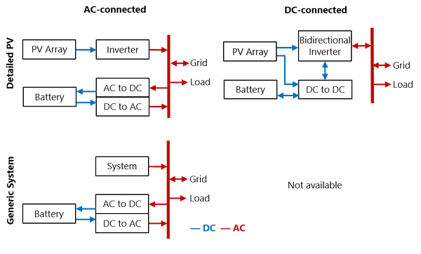
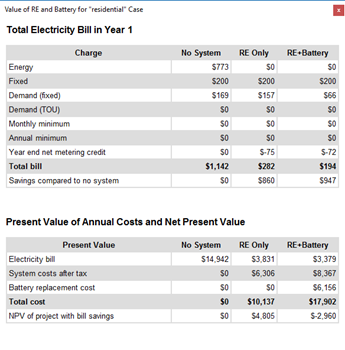

Battery Storage: Behind the Meter
=================================

The Battery Cell and System page displays inputs describing the battery's performance characteristics. For inputs that determine how the system dispatches the battery, see :doc:`Battery Dispatch <battery_dispatch_btm>`. Use the following list to find information about the Battery Cell and System page inputs:

* :ref:`Behind-the-meter (BTM) Batteries <btm>`

* :ref:`Chemistry <btm-chemistry>`

* :ref:`Battery Bank Sizing <btm-sizing>`

* :ref:`Optimal Sizing and Dispatch from REopt <reopt>`

* :ref:`Current and Capacity <btm-currentcapacity>`

* :ref:`Power Converters <btm-powerconverters>`

* :ref:`Battery Voltage <btm-voltage>`

* :ref:`Battery Losses <btm-losses>`

* :ref:`Battery Thermal <btm-thermal>`

* :ref:`Value of RE Macro <btm-macro>`

For a list of publications about SAM's battery model, see https://sam.nlr.gov/battery-storage/battery-publications.html.

.. _btm:

Behind the Meter (BTM) Batteries
~~~~~~~~~~~~~~~~~~~~~~~~~~~~~~~~

The behind-the-meter (BTM) battery model assumes that the battery is used to reduce a residential or commercial building or facility owner's electricity bill. SAM assumes the battery is behind the meter for the Distributed financial models (Residential, Commercial, Third Party Ownership).

.. note:: For a DC-connected PV-storage system, SAM assumes that the inverter on the Inverter page is a bidirectional or hybrid inverter that converts both DC power to AC and AC power to DC whether or not the inverter actually supports bidirectional conversion. You can use the "CEC hybrid" field in the library to help identify bidirectional inverters in the library.

Figure 1: Behind-the-meter Battery Configurations. Standalone battery is the same as Custom Generation Profile but with no system.

.. _btm-chemistry:

Chemistry
~~~~~~~~~

.. include:: ../includes/snip_battery_chemistry.rst

.. _btm-sizing:

Battery Bank Sizing
~~~~~~~~~~~~~~~~~~~

.. include:: ../includes/snip_battery_bank_sizing.rst

.. _reopt:

Optimal Sizing and Dispatch from REopt
~~~~~~~~~~~~~~~~~~~~~~~~~~~~~~~~~~~~~~

.. include:: ../includes/snip_battery_reopt.rst

.. _btm-currentcapacity:

Current and Capacity
~~~~~~~~~~~~~~~~~~~~

.. include:: ../includes/snip_battery_current_capacity.rst

.. _btm-powerconverters:

Power Converters
~~~~~~~~~~~~~~~~

.. include:: ../includes/snip_battery_power_converters.rst

.. _btm-voltage:

Battery Voltage
~~~~~~~~~~~~~~~

.. include:: ../includes/snip_battery_voltage.rst

.. _btm-losses:

Battery Losses
~~~~~~~~~~~~~~

.. include:: ../includes/snip_battery_losses.rst

.. _btm-thermal:

Battery Thermal
~~~~~~~~~~~~~~~

.. include:: ../includes/snip_battery_thermal.rst

.. _btm-macro:

Value of Renewable Energy Macro
~~~~~~~~~~~~~~~~~~~~~~~~~~~~~~~

For residential and commercial PV-battery projects, you can use the Value of Renewable Energy :doc:`macro <../reference/macros>` to help you make an economic comparison between meeting the building electric load from the grid with no renewable energy system or battery, the grid with a renewable energy system, and the grid with a renewable energy system and battery. You can use the macro to analyze rate-switching scenarios where the rate structure for the grid-only scenario is different from the one with the renewable energy system.

To run the macro, set up a PV battery case, and then click **Macros** (in the lower left corner of the SAM window) and click **Value of RE System** to show the macro. Follow the instructions to choose the appropriate rate structures and run the macro.

