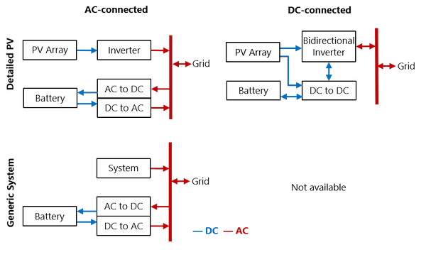

Battery Storage: Front of Meter
===============================

The Battery Cell and System page displays inputs describing the battery's performance characteristics. For inputs that determine how the system dispatches the battery, see :doc:`Battery Dispatch <battery_dispatch_fom>`. Use the following list to find information about the Battery Cell and System page inputs:

* :ref:`Front-of-meter (FOM) Batteries <fom>`

* :ref:`Chemistry <fom-chemistry>`

* :ref:`Battery Bank Sizing <fom-sizing>`

* :ref:`Current and Capacity <fom-currentcapacity>`

* :ref:`Power Converters <fom-powerconverters>`

* :ref:`Battery Voltage <fom-voltage>`

* :ref:`Battery Losses <fom-losses>`

* :ref:`Battery Thermal <fom-thermal>`

For a list of publications about SAM's battery model, see https://sam.nlr.gov/battery-storage/battery-publications.html.

.. _fom:

Front of Meter (FOM) Batteries
~~~~~~~~~~~~~~~~~~~~~~~~~~~~~~

The front-of-meter (FOM) battery model assumes that the battery is used to maximize revenue for a power generation project. The battery in a PV-battery front-of-meter application may be connected either to the AC or DC side of the inverter Figure 1.

Figure 1: Front-of-meter Battery Configurations.  Standalone battery is the same as Custom Generation Profile but with no system.

.. _fom-chemistry:

Chemistry
~~~~~~~~~

.. include:: ../includes/snip_battery_chemistry.rst

.. _fom-sizing:

Battery Bank Sizing
~~~~~~~~~~~~~~~~~~~

.. include:: ../includes/snip_battery_bank_sizing.rst

.. _fom-currentcapacity:

Current and Capacity
~~~~~~~~~~~~~~~~~~~~

.. include:: ../includes/snip_battery_current_capacity.rst

.. _fom-powerconverters:

Power Converters
~~~~~~~~~~~~~~~~

.. include:: ../includes/snip_battery_power_converters.rst

.. _chargelimits:

Charge Limits and Priority
~~~~~~~~~~~~~~~~~~~~~~~~~~

.. include:: ../includes/snip_battery_charge_limits_priority.rst

.. _fom-voltage:

Battery Voltage
~~~~~~~~~~~~~~~

.. include:: ../includes/snip_battery_voltage.rst

.. _fom-losses:

Battery Losses
~~~~~~~~~~~~~~

.. include:: ../includes/snip_battery_losses.rst

.. _fom-thermal:

Battery Thermal
~~~~~~~~~~~~~~~

.. include:: ../includes/snip_battery_thermal.rst

