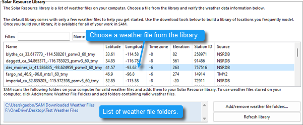
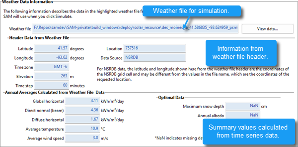

Ambient Conditions
==================

The Ambient Conditions page allows you to choose a weather file to specify ambient conditions for the Steam Rankine Cycle for a biomass power system. The weather file contains solar resource data, but is also suitable for the biomass power model.

The :doc:`biomass power <biopower>` model uses data from a weather file to describe ambient conditions for the :doc:`Rankine steam cycle <biopower_plant_specs>`, and for modeling feedstock drying. It uses separate data set to describe the biomass resource (:doc:`feedstock <biopower_feedstock>`). The geographical coordinates in the weather file determines the location for the :doc:`feedstock <biopower_feedstock>`.

Ambient conditions also affect biomass composition, but on a monthly rather than hourly timescale. SAM calculates average monthly temperature, pressure, and humidity values from the hourly values in the weather file, and uses those values to represent the average ambient conditions for each month of the year. SAM uses the same set of twelve monthly average values for each year of the plant's life.

 

.. note:: The biomass power model requires a weather file with global horizontal irradiance (GHI) and relative humidity data that is not available in all files from the National Solar Radiation Database (NSRDB).

:ref:`Typical meteorological year (TMY) <typicalyear>` files from the NSRDB PSM V3 dataset do not have relative humidity data, but the single year data does. To download a single year file, use the choose year option to download a file as described under "Download Weather Files" below.

.. note:: The legacy NSRDB MTS1 (NSRDB 1961 - 1990 TMY2) weather files have both GHI and relative humidity data, but the MTS1 data is out of date and only has files for a few hundred weather stations in the United States.

.. note:: You can access these legacy files from the `NSRDB archives <https://nsrdb.nlr.gov/data-sets/archives.html>`__.

.. note:: Please contact SAM Support at `sam.support@nlr.gov <mailto:sam.support@nlr.gov>`__ if you need help finding weather data to use for your project.

The Location and Resource page provides access to the solar resource library, which is a collection of weather files stored on your computer. When you first install SAM, it comes with a few default weather files in the library. As you use SAM for your own projects, you should add files to build your own library. Once files are in your library, you can use them for different projects and with different versions of SAM.

There are two ways to add files to your solar resource library:

1. Download a weather file or files from the NLR National Solar Radiation Database (NSRDB)

Use the download weather file options and click **Download and add to library** to get the most up-to-date data for long-term cash flow analysis, single-year analysis, and P50/P90 analysis, or to download legacy data from the NSRDB.

2. Add weather file folders

If you have weather files from a source other than the NSRDB or that you've downloaded yourself from the NSRDB website, put them in a folder, and then click **Add/remove weather file folders** to add the folder to your solar resource library folder list.

See also
........

:doc:`Weather File Formats <../weather-file-formats/weather_format>`

:doc:`Weather Data Elements <../weather-data/weather_data_elements>`

:doc:`Typical and Single Year <../weather-data/weather_typical_single>`

:doc:`Time and Sun Position <../weather-data/weather_time_convention>`

:doc:`Folders and Libraries <../weather-data/weather_manage_folders>`

:doc:`Weather Data and LK <../weather-data/accessing-weather-data-from-lk>`

.. note:: You may want to model your system using weather data from several different sources and locations around your project site to understand how sensitive your analysis results are to the weather assumptions, and how much variation there is in the data from the different weather files.

.. note:: You can compare results for a system using more than one weather file in a single case by using SAM's :doc:`parametric simulation <../simulation-options/parametrics>` option.

.. note:: For more information about weather data, including where to find data for locations outside of the United States, see the `SAM website <https://sam.nlr.gov/weather>`__.

.. note:: For a helpful discussion of weather data and power system simulation, see Sengupta et al., (2015) "Best Practices Handbook for the Collection and Use of Solar Resource Data for Solar Energy Applications," NREL Report No. TP-5D00-63112 (`PDF 8.9 MB <https://docs.nlr.gov/docs/fy15osti/63112.pdf>`__).

.. _bio-ambient-library:

Solar Resource Library
~~~~~~~~~~~~~~~~~~~~~~
SAM's solar resource library displays information from weather files in your solar resource data folders. The default solar resource library that comes with SAM contains weather files for a few locations around the United States for the default configurations. As you use SAM, use **Add/remove weather file folders** to build a library of files for locations you frequently use as described in :doc:`Folders and Libraries <../weather-data/weather_manage_folders>`.

To choose a file from the solar resource library:

* Click the location name in the list. You can type a few letters of the file name in the Search box to filter the list.

The full file name and information about the selected file appears under **Weather Data Information**. To see the data in the file, click **View data**.

**Add/remove weather file folders**
  Use the folder settings to tell SAM what folders on your computer it should scan for weather files to build the solar resource library. SAM adds any files it can identify as valid weather files in each folder you specify to the library.

  Before adding a file to the library, SAM checks the data in the file displays a message if it finds any problems with the data in the file.

  SAM will only add valid weather files to the library. If you add a folder that contains CSV files that are not in the SAM CSV format, it will not add those files to the library.

  The list of solar resource folders are the folders that SAM scans for weather files to build the solar resource library.

**Refresh library**
  Refresh the library after adding files to the weather file folder. In most cases, SAM should automatically refresh the library as needed, but you may need to manually refresh it.

.. _bio-ambient-nsrdb:

Download Weather Files
~~~~~~~~~~~~~~~~~~~~~~

.. include:: ../includes/snip_solar_download.rst

Weather Data Information
~~~~~~~~~~~~~~~~~~~~~~~~

**Weather File**
  The path and name of the active weather file SAM will use for simulation. Download a different file from the NSRDB, or click a different file name in the library to change the file.

**View data**
  Display weather file data in the :doc:`time series data viewer <../reference/time_series_viewer>`  .

.. note:: You can also see the data after running a simulation on the Results page :doc:`data tables <../results/data>` and :doc:`time series graphs <../results/timeseries>`.

Header Data from Weather File
.............................

Header data is information in the weather file that describes the location and type of data in the file. SAM uses the time zone, elevation, latitude and longitude to calculate the sun position during simulations. It does not use the city, state, country, and other descriptive information.

Annual Averages Calculated from Weather File
............................................

When you add a weather file to the solar resource library, SAM reads weather data from the file and calculates the annual averages to display for your reference. It does not use annual averages during simulations.

**Global horizontal, Direct normal (beam), Diffuse horizontal**
  The sum of solar irradiance data (W/m  \ :sup:`2`\   ) in the weather file converted to kW and divided by 365 days/year.

**Average temperature**
  The sum of temperature data (°C) in the weather file divided by the number of records in the file (8760 for hourly data).

**Average wind speed**
  The sum of wind speed data (m/s) in the weather file divided by the number of records in the file (8760 for hourly data).

**Maximum snow depth**
  The maximum value of snow depth data (cm) in the weather file. **NaN** indicates the file does not contain snow depth data.