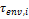
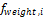

Receivers (HCEs)
================

A receiver (HCE, heat collection element) is a metal pipe contained in a vacuum within glass tube that runs through the focal line of the trough-shaped parabolic collector. Seals and bellows ensure that a vacuum is maintained in each tube. Anti-reflective coatings on the glass tube maximize the amount of solar radiation that enters the tube. Solar-selective radiation absorbing coatings on the metal tube maximize the transfer of energy from the solar radiation to the pipe.

On the Receivers page, you define the characteristics of up to four receiver types. On the :doc:`Solar Field page <troughphysical_solar_field>`, you specify how the different receiver types are distributed in each loop of the field, assuming that the field consists of identical loops. SAM only uses data for receiver types that you have included in the single loop specification on the Solar Field page.

For each receiver type, you also specify up to four variations. You can use the variations to describe different conditions of the receiver type. For example, you may use one variation to describe the receiver type in good condition, and another to describe the receiver type with a damaged glass envelope.

.. note:: For a detailed explanation of the physical trough model, see Wagner, M. J.; Gilman, P. (2011). *Technical Manual for the SAM Physical Trough Model*. 124 pp.; NREL Report No. TP-5500-51825. https://docs.nrel.gov/docs/fy11osti/51825.pdf (3.7 MB)

Receiver Library
~~~~~~~~~~~~~~~~

The physical trough model's receiver :doc:`library <../reference/libraries>` contains a set of collector parameters for several commercially available collectors. You can either use parameters from the library, or type your own parameter values.

To apply values from the library:

#. In the list of receivers at the top of the page, click a collector name. You can click a column heading to sort the list.

#. For the receiver type to which you want to apply the parameters from the library, click **Apply Values from Library**. SAM will replace the receiver geometry, and parameters and variations values from the library.

You can modify the values after you apply the library values.

Receiver Type and Configuration Name
~~~~~~~~~~~~~~~~~~~~~~~~~~~~~~~~~~~~

**Receiver Type**
  Choose the active receiver type (1-4). SAM displays the properties of the active receiver.

**Configuration Name**
  The name of library entry for the receiver type.

**Apply Values from Library**
  Click the button to replace the receiver geometry and parameter and variations inputs with values from the current selection in the library.

Receiver Geometry
~~~~~~~~~~~~~~~~~

**Absorber tube inner diameter (m)**
  Inner diameter of the receiver absorber tube, this surface in direct contact with the heat transfer fluid.

**Absorber tube outer diameter (m)**
  Outer diameter of the receiver absorber tube, the surface exposed to the annular vacuum. 

**Glass envelope inner diameter (m)**
  Inner diameter of the receiver glass envelope tube, the surface exposed to the annular vacuum.

**Glass envelope outer diameter (m)**
  Outer diameter of the receiver glass envelope tube, the surface exposed to ambient air.

**Absorber flow plug diameter (m)**
  A non-zero value represents the diameter of an optional plug running axially and concentrically within the receiver absorber tube. A zero value represents a receiver with no plug. The plug allows for an increase in the receiver absorber diameter while maintaining the optimal heat transfer within the tube heat transfer fluid. For a non-zero value, be sure to use annular flow for the absorber flow pattern option.

**Internal surface roughness**
  The surface roughness of the inner receiver pipe surface exposed to the heat transfer fluid, used to determine flow shear force and the corresponding pressure drop across the receiver.

  Surface roughness is important in determining the scale of the pressure drop throughout the system. As a general rule, the rougher the surface, the higher the pressure drop (and parasitic pumping power load). The surface roughness is a function of the material and manufacturing method used for the piping. A conservative roughness value for extruded steel pipe (the type often used for the absorber pipe) is about 3e-6 meters. The default value of 4.5e-5 is based on this value and the absorber tube inner diameter value of 0.066 m: 3e-6 m / 6.6e-2 m = 4.5e-5.

**Absorber flow pattern (m)**
  Use standard tube flow when the absorber flow plug diameter is zero. Use annual flow with a non-zero absorber flow plug diameter.

**Absorber material type**
  The material used for the absorber tube. Choose from stainless steel or copper.

Parameters and Variations
~~~~~~~~~~~~~~~~~~~~~~~~~

**Variant weighting fraction**
  The fraction of the solar field that consists of the active receiver variation. For each receiver type, the sum of the four variations should equal one. See :ref:`Specifying Receiver Type Variations <physicaltrough_hcevariations>`   for details.

**Absorber absorptance**
  The ratio of radiation absorbed by the absorber to the radiation incident on the absorber.

**Absorber emittance**
  The energy radiated by the absorber surface as a function of the absorber's temperature. You can either specify a table of emittance and temperature values, or specify a single value that applies at all temperatures.

**Envelope absorptance**
  The ratio of radiation absorbed by the envelope to the radiation incident on the envelope, or radiation that is neither transmitted through nor reflected from the envelope. Used to calculate the glass temperature. (Does not affect the amount of radiation that reaches the absorber tube.)

**Envelope emittance**
  The energy radiated by the envelope surface.

**Envelope transmittance**
  The ratio of the radiation transmitted through the glass envelope to the radiation incident on the envelope, or radiation that is neither reflected nor refracted away from the absorber tube.

**Broken glass**
  Option to specify that the envelope glass has been broken or removed, indicating that the absorber tube is directly exposed to the ambient air.

**Annulus gas type**
  Gas type present in the annulus vacuum. Choose from Hydrogen, air, or Argon.

**Annulus pressure (torr)**
  Absolute pressure of the gas in the annulus vacuum, in torr, where 1 torr = 133.32 Pa

**Estimated avg heat loss (W/m)**
  An estimated value representing the total heat loss from the receiver under design conditions. SAM uses the value to calculate the total loop conversion efficiency and required solar field aperture area for the design point values on the :doc:`Solar Field page <troughphysical_solar_field>`  . It does not use the value in simulation calculations.

**Bellows shadowing**
  An optical derate factor accounting for the fraction of radiation lost after striking the mechanical bellows at the ends of the receiver tubes.

**Dirt on receiver**
  An optical derate factor accounting for the fraction of radiation lost due to dirt and soiling on the receiver.

Total Weighted Losses
~~~~~~~~~~~~~~~~~~~~~

The total weighted losses are used in the solar field sizing calculations as an estimate of the optical and thermal losses in the solar field at the design point. SAM does not use the weighted loss variables in hourly simulations.

**Heat loss at design**
  The total thermal loss expected from the active receiver type under design conditions accounting for the weighting fraction of the four receiver variations. SAM uses the value to calculate the design point total loop conversion efficiency and the solar field aperture area shown on the :doc:`Solar Field page <troughphysical_solar_field>`  .

In the following equation, |EQ_TRP-FWeight|   is the weighting fraction for each variation.

  .. image:: ../images/EQ_TRP-HeatLossDesign.png
     :align: center
     :alt: EQ_TRP-HeatLossDesign.png

**Optical derate**
  Represents the total optical losses expected from the active receiver type under design conditions accounting for the weighting fraction of the four receiver variations. SAM uses the value to calculate the design point total loop conversion efficiency and the solar field aperture area shown on the :doc:`Solar Field page <troughphysical_solar_field>`  .

In the following equation, |EQ_TRP_TauEnv|   is the envelope transmittance.

  .. image:: ../images/EQ_TRP-OpticalDerate.png
     :align: center
     :alt: EQ_TRP-OpticalDerate.png

.. _physicaltrough_hcevariations:

Specifying Receiver Type Variations
~~~~~~~~~~~~~~~~~~~~~~~~~~~~~~~~~~~

You can use the receiver variations to model a solar field with receivers in different conditions. If you want all of the receivers in the field to be identical, then you can use a single variation and assign it a variant weighting fraction of 1.

When you use more than one receiver variation, be sure that the sum of the four variant weighting fractions is 1.

Here's an example of an application of the receiver variations for a field that consists of a two receiver types. The first type, Type 1, represents receivers originally installed in the field. Type 2 represents replacement receivers installed as a fraction of the original receivers are damaged over time.

Over the life of the project, on average, 5 percent of the Type 1 receivers have broken glass envelopes, and another 5 percent have lost vacuum in the annulus. We'll also assume that degraded receivers are randomly distributed throughout the field -- SAM does not have a mechanism for specifying specific locations of different variations of a given receiver type. To specify this situation, we would start with Type 1, and use Variation 1 to represent the 90 percent of intact receivers, assigning it a variant weighting fraction of 0.90. We'll use Variation 2 for the 5 percent of receivers with broken glass envelopes, giving it a weighting fraction of 0.05, and Variation 3 for the other 5 percent of lost-vacuum receivers with a weighting fraction of 0.05. We'll assign appropriate values to the parameters for each of the two damaged receiver variations.

Next, we'll specify Type 2 to represent intact replacement receivers. We will us a single variation for the intact Type 2 receivers.

On the Solar Field page, we'll specify the single loop configuration (assuming a loop with eight assemblies), using Type 2 for the first and second assembly in the loop, and Type 1 receivers (with the variant weighting we assigned on the Receivers page) for the remaining six assemblies in the loop

