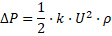
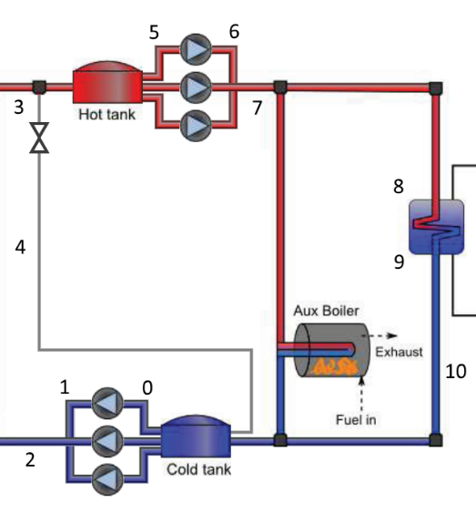
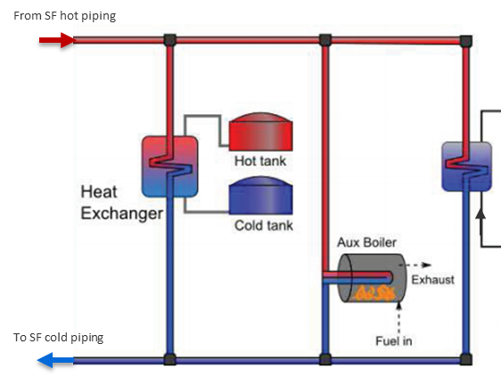
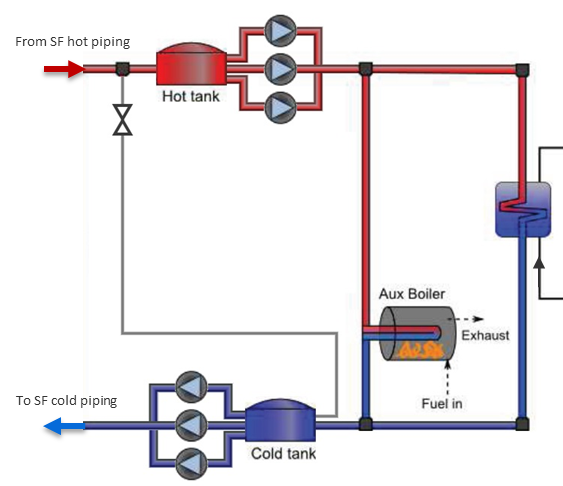

Script-only Parameters
======================

The parameters described in this section can only be accessed using SAM's LK scripting language and are useful for modeling design details and configurations that are not available from the input pages in SAM's user interface.

For more about the LK scripting language, see :doc:`Macros and Scripting <../reference/macros>`.

For a sample script illustrating how to set some of these script-only parameters, see the `molten_salt_trough.lk <https://github.com/NREL/SAM/blob/develop/samples/LK%20Scripts%20for%20SAM/molten-salt-trough.lk>`__ file in the SAM Open Source repository on GitHub.com.

Field Parameters
................

**custom_sf_pipe_sizes  [-]**
  Whether the header and runner diameters, wall thicknesses and lengths should be calculated or input from the parameters:

  * sf_hdr_diams

  * sf_hdr_lengths

  * sf_hdr_wallthicks

  * sf_rnr_diams

  * sf_rnr_lengths

  * sf_rnr_wallthicks

  If this parameter value is true the above values are input; if this parameter value is false the values are calculated. The default value is false.

**L_rnr_per_xpan  [m]**
  The maximum length of straight runner pipe without an expansion loop. Beyond this length an expansion loop is added (without increasing the linear distance). The default value is 70 m.

**L_xpan_hdr  [m]**
  The additional pipe length that an expansion loop in a header adds. The default value is 20 m.

**L_xpan_rnr  [m]**
  The additional pipe length that an expansion loop in a runner adds. The default value is 20 m.

**Min_rnr_xpans  [-]**
  The minimum number of expansion loops in any constant diameter runner pipe section, enforced during pipe sizing. The default value is 1.

**N_hdr_per_xpan  [m]**
  The number of collector loops per header expansion loop. A value of 1 means that there are expansion loops between every collector loop. The default value is 2.

**N_max_hdr_diams  [-]**
  The maximum number of different header pipe diameters in either the cold or hot legs, enforced during pipe sizing. The default value is 10.

**northsouth_field_sep  [m]**
  The distance separating subfields in the north-south direction. If the value is zero, the solar collector assemblies are touching. The default value is 20 m.

**offset_xpan_hdr  [-]**
  The location of the first header expansion loop. A value of 1 means that the first expansion loop is after the first collector loop closest to the runner. The default value is 1.

**sf_hdr_diams  [m]**
  The custom specified header section inside diameters. The values are utilized if the parameter custom_sf_pipe_sizes is set to true. The number of header diameter values needs to match the number of header sections.

**sf_hdr_lengths  [m]**
  The custom specified header section lengths. The values are utilized if the parameter custom_sf_pipe_sizes is set to true. The number of header length values needs to match the number of header sections.

**sf_hdr_wallthicks  [m]**
  The custom specified header section wall thicknesses. The values are utilized if the parameter custom_sf_pipe_sizes is set to true. The number of header wall thickness values needs to match the number of header sections.

**sf_rnr_diams  [m]**
  The custom specified runner section inside diameters. The values are utilized if the parameter custom_sf_pipe_sizes is set to true. The number of runner diameter values needs to match the number of runner sections.

**sf_rnr_lengths  [m]**
  The custom specified runner section lengths. The values are utilized if the parameter custom_sf_pipe_sizes is set to true. The number of runner length values needs to match the number of runner sections.

**sf_rnr_wallthicks  [m]**
  The custom specified runner section wall thicknesses. The values are utilized if the parameter custom_sf_pipe_sizes is set to true. The number of runner wall thickness values needs to match the number of runner sections.

Thermal Energy Storage/ Power Block Parameters
..............................................

**custom_sgs_pipe_sizes  [-]**
  Whether the thermal energy storage and power block pipe diameters and wall thicknesses should be calculated or input from the parameters:

  * sgs_diams

  * sgs_wallthicks

  If this parameter value is true the above values are input; if this parameter value is false the values are calculated. Note that the lengths are always input. The default value is false.

**custom_tes_p_loss  [-]**
  Whether the pressure drops in the thermal energy storage system should be calculated using the associated pipe lengths and minor loss coefficients (k_tes_loss_coeffs) or using the pumping power parameters on the Parasitics page. The default value is false.

**DP_SGS  [bar]**
  The combined pressure drop within the steam generator system. The default value is 0 bar.

**has_hot_tank_bypass  [-]**
  The indicator that specifies the outlet of the solar field bypass pipe. The solar field heat transfer fluid is routed back to the field when the heat transfer fluid is below a specified temperature. If this value is true, the fluid from the field is routed to the cold thermal storage tank. If this value is false, the fluid is routed to the field inlet runners. The default value is false.

**k_tes_loss_coeffs  [-]**
  The combined minor loss coefficients for each section of pipe in the thermal energy storage and power block systems. One coefficient corresponds to each pipe section, where each is an additive combination of the minor loss coefficients of the fittings in that section. These minor loss coefficients (k) are used in the following equation to calculate the pressure drop in the corresponding pipe that is caused by the fittings, where U is the velocity of the heat transfer fluid and ρ is the fluid density. The default values are all zeroes.

**L_rnr_pb  [m]**
  The length of runner pipe in and around the power block, for either the hot or cold lines. The default value is 25 m.

**sgs_diams  [m]**
  The custom specified thermal energy storage and power block pipe section diameters. The values are utilized if the parameter custom_sgs_pipe_sizes is set to true. The number of diameter values needs to match the number of pipe sections.

**sgs_lengths  [m]**
  The custom specified thermal energy storage and power block pipe section lengths. The values are utilized if the parameter custom_sgs_pipe_sizes is set to true. The number of length values needs to match the number of pipe sections. Lengths at indices 0, 1, 5 and 6 are the summed lengths of the multiple individual pump sections. The default values are { 0, 90, 100, 120, 0, 0, 0, 0, 80, 120, 80 }, in meters.

.. list-table::
   :width: 100%
   :align: center
   :header-rows: 1

   * - Number
     - From
     - To
   * - 0
     - Cold thermal storage tank
     - Individual solar field (SF) pump inlet
   * - 1
     - Individual SF pump discharge
     - SF pump discharge header
   * - 2
     - SF pump discharge header
     - SF runners
   * - 3
     - SF runners
     - Hot thermal storage tank
   * - 4
     - SF runners
     - Cold thermal storage tank
   * - 5
     - Steam generator system (SGS) pump suction header
     - Individual SGS pump inlet
   * - 6
     - Individual SGS pump discharge
     - SGS pump discharge header
   * - 7
     - SGS pump discharge header
     - Steam generator supply header
   * - 8
     - Steam generator supply header
     - Inter-steam generator piping
   * - 9
     - Inter-steam generator piping
     - Steam generator outlet header
   * - 10
     - Steam generator outlet header
     - Cold thermal storage tank

**sgs_wallthicks  [m]**
  The custom specified thermal energy storage and power block pipe wall thicknesses. The values are utilized if the parameter custom_sgs_pipe_sizes is set to true. The number of wall thickness values needs to match the number of pipe sections.

**tanks_in_parallel  [-]**
  Whether the thermal energy storage tank are in parallel with the field or in series with the field. Tanks in series with the field are specific to direct storage systems as in this configuration the field heat transfer fluid passes through the tanks before entering and after leaving the power block. The default value is false.

Default (parallel) storage tank configuration:

New series storage tank option:

**T_tank_hot_inlet_min  [°C]**
  The minimum field heat transfer fluid temperature that may enter the hot storage tank. If the storage tanks are in series with the field and the temperature is below this value, the bypass valve will open and the field will recirculate. The default value is 400 °C.

**V_tes_des  [m/s]**
  The design velocity for sizing the diameters of the thermal energy storage and power block piping. The default value is 1.85 m/s.
