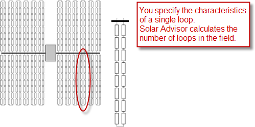
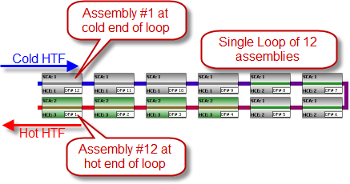
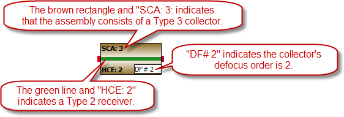

Solar Field
===========

The Solar Field page displays variables and options that describe the size and properties of the solar field, and properties of the heat transfer fluid. It also displays reference design specifications of the solar field.

.. note:: For a detailed explanation of the physical trough model, see Wagner, M. J.; Gilman, P. (2011). *Technical Manual for the SAM Physical Trough Model*. 124 pp.; NREL Report No. TP-5500-51825. https://docs.nlr.gov/docs/fy11osti/51825.pdf (3.7 MB)

Solar Field Design Point
~~~~~~~~~~~~~~~~~~~~~~~~

The design point variables show values at the design-point DNI from the :doc:`System Design <troughphysical_system_design>` page and are values that SAM uses to determine the system capacity in sizing calculations, and for area-based costs on the :doc:`Installation costs <../installation-costs/cc_trough>` page.

**Single loop aperture (m²)**
  The aperture area of a single loop of collectors, equal to the product of aperture width, reflective area, times the structure length times the number of collector assemblies per loop according to the distribution of the up to four collector types in the field. This area does not include non-reflective surface on the collector or non-reflective space between collectors.

*Single Loop Aperture (m²) = Sum of the SCA Reflective Aperture Area (m²) values for each SCA in the loop*

  The SCA reflective aperture area for each SCA type is specified on the :doc:`Collectors (SCAs) <troughphysical_collectors_scas>`   page. The number of each type of SCA in a single loop is specified under **Single Loop Configuration** as described in :ref:`Specifying the Loop Configuration <physical_sfloopconfiguration>`  .

**Loop optical efficiency**
  The optical efficiency when incident radiation is normal to the aperture plane, not including end losses or cosine losses. This value does not include thermal losses from piping and the receivers.

*Loop Optical Efficiency = SCA Optical Efficiency at Design × HCE Optical Derate*

  The SCA and HCE optical efficiency values are from the :doc:`Collectors (SCA) <troughphysical_collectors_scas>`   page and :doc:`Receivers (HCEs) <troughphysical_receivers_hces>`   page, respectively.

**Total loop conversion efficiency**
  The total conversion efficiency of the loop, including optical losses and estimated thermal losses. Used to calculate the required aperture area of the solar field.

*Total Loop Conversion Efficiency = Loop Optical Efficiency × Receiver Heat Loss Efficiency*

**Total required aperture, SM=1 (m²)**
  The exact mirror aperture area required to meet the design thermal output for a solar multiple of 1.0. SAM uses the required aperture to calculate the total aperture reflective area. The total aperture reflective area may be slightly more or less than the required aperture, depending on the collector dimensions you specify on the :doc:`Collectors page <troughphysical_collectors_scas>`  .

*Total Required Aperture at SM of One (m²) = Cycle Thermal Power (MWt) ÷ ( Design Point DNI (W/m²) × Total Loop Conversion Efficiency ) × ( 1E6 W/MW )*

**Required number of loops, SM=1**
  The exact number of loops required to produce the total required aperture at a solar multiple of 1.0.

*Required Number of Loops at SM of One = CEILING( Total Required Aperterture at SM of One ÷ Single Loop Aperture (m²) )*

**Total tracking power (W)**
  Electrical power required for tracking motors in the solar field.

*Total Tracking Power (W) = Number of SCAs per Loop × Actual Number of Loops  × Tracking Power per SCA (W)*

**Actual number of loops**
  The actual number of loops in the field, equal to the solar multiple times the required number of loops at a solar multiple of 1.0. The required number of loops is rounded to the nearest integer to represent a realistic field layout.

**Total aperture reflective area (m²)**
  The actual aperture area based on the actual number of loops in the field, equal to the single loop aperture times the actual number of loops.

*Total Aperture Reflective Area (m²) = Single Loop Aperture (m²) × Actual Number of Loops*

**Actual solar multiple**
  For Option 1 (solar multiple mode), the calculated solar multiple based on the actual (rounded) number of loops in the field. 

  For Option 2 (field aperture mode), the solar multiple value corresponding to the thermal output of the field based at design point: The total aperture reflective area divided by the field thermal output. 

**Actual field thermal output (MWt)**
  The thermal energy delivered by the solar field under design conditions at the actual solar multiple.

*Field Thermal Output (MWt) = Design Point DNI (W/m²) × Total Loop Conversion Efficiency × Total Aperture Reflective Area (m²) ÷ 1E6 W/MW*

**Loop inlet HTF temperature (°C)**
  The design temperature of heat transfer fluid (HTF) at the loop inlet, from the :doc:`System Design <troughphysical_system_design>` page.

**Loop outlet HTF temperature (°C)**
  The design temperature of heat transfer fluid (HTF) at the loop outlet, from the :doc:`System Design <troughphysical_system_design>` page.

Solar Field Parameters
~~~~~~~~~~~~~~~~~~~~~~

**Row spacing (m)**
  The centerline-to-centerline distance in meters between rows of collectors, assuming that rows are laid out uniformly throughout the solar field. Default is 15 meters.

**Header pipe roughness (m)**
  The header pipe roughness is a measure of the internal surface roughness of the header and runner piping. SAM uses this value in calculation of the shear force and piping pressure drops.

  Surface roughness is important in determining the scale of the pressure drop throughout the system. As a general rule, the rougher the surface, the higher the pressure drop (and parasitic pumping power load). The surface roughness is a function of the material and manufacturing method used for the piping.

**HTF pump efficiency**
  The electrical-to-mechanical energy conversion efficiency of the field heat transfer fluid pump. This value accounts for all mechanical, thermodynamic, and electrical efficiency losses.

**Piping thermal loss coefficient (W/m****\ :sup:`2`\****-K)**
  The thermal loss coefficient that is used to calculate thermal losses from piping between receivers, crossover piping, header piping, and runner piping. The coefficient specifies the number of thermal watts lost from the system as a function of the piping surface area, and the temperature difference between the fluid in the piping and the ambient air (dry bulb temperature). The length of crossover piping depends on the row spacing variable on the :doc:`Solar Field <troughphysical_solar_field>`   page, and the piping distance between assemblies on the :doc:`Collectors <troughphysical_collectors_scas>`   page.

**Wind stow speed, m/s**
  When the wind speed in the weather file exceeds this value, the collectors in field defocus and the field thermal power incident on the field goes to zero to model the effect of collectors moving to a safe position to avoid wind damage. When the wind speed falls below the wind stow speed, the field power returns to normal.

**Collector startup energy, kWhe/SCA**
  The electric energy in kilowatt-hours required to move one collector into position. Applies during the startup time.

**Tracking power per SCA, W/SCA**
  The electric power in Watts required by the tracking mechanism of one collector during hours of operation.

**Number of field subsections**
  SAM assumes that the solar field is divided into between two and 12 subsections. Examples of solar field with 2, 4, and 6 subsections are shown below:

  .. image:: ../images/IMG_solar-field-layout-subsections.png
     :align: center
     :alt: IMG_solar-field-layout-subsections.png

  The number of field subsections determine the location and shape of header piping that delivers heat transfer fluid to the power block, which affects the heat loss calculation.

**Allow partial defocusing**
  Partial defocusing assumes that the tracking control system can adjust the collector angle in response to the capacity of the power cycle (and thermal storage system, if applicable). See :ref:`Defining Collector Defocusing <physical_sfcollectordefocusing>`   for details.

Heat Transfer Fluid
~~~~~~~~~~~~~~~~~~~

**Field HTF fluid**
  The heat transfer fluid (HTF) used in the heat collection elements and headers of the solar field. SAM includes the following options in the HTF library: Solar salt, Caloria, Hitec XL, Therminol VP-1, Hitec salt, Dowtherm Q, Dowtherm RP, Therminol 59, and Therminol 66. You can also define your own HTF using the user-defined HTF fluid option.

.. note:: During the simulation, SAM counts the number of instances that the HTF temperature falls outside of the operating temperature limits in the table below. If the number of instances exceeds 50, it displays a simulation :doc:`notice <../results/notices>` with the HTF temperature and time step number for the 50th instance.

.. note:: If you define a custom fluid, SAM disables the minimum and maximum operating temperature variables and displays zero because it does not have information about the operating limits for the fluid you defined. You can check the time series temperature data in the results to ensure that they do not exceed the limits for your custom fluid.

.. include:: ../includes/snip_htf_properties.rst

**User-defined HTF fluid**
  To define your own HTF, choose User-defined for the Field HTF fluid and specify a table of material properties for use in the solar field. You must specify at least two data points for each property: temperature, specific heat, density, viscosity, and conductivity. See :ref:`Custom HTF <troughphysical-customhtf>` for details.

**Field HTF min operating temp (ºC)**
  The minimum HTF operating temperature recommended by the HTF manufacturer.

  In some cases the minimum operating temperature may be the same as the fluid's freeze point. However, at the freeze point the fluid is typically significantly more viscous than at design operation temperatures, so it is likely that the "optimal" minimum operating temperature is higher than the freeze point.

**Field HTF max operating temp (ºC)**
  The minimum HTF operating temperature recommended by the HTF manufacturer.

  Operation at temperatures above this value may result in degradation of the HTF and be unsafe. To avoid this, you may want to include a safety margin and use a maximum operating temperature value slightly lower than the recommended value.

.. note:: SAM displays the operating temperature limits for your reference so you can compare them to the field temperatures reported in the results to ensure that they do not exceed the limits. SAM does not adjust the system's performance to avoid exceeding these operating limits.

.. note:: SAM only displays these limits for fluids that are in SAM's library. If you use a custom HTF instead of one from the SAM library, SAM disables the HTF operating temperature limits. In this case, you should use data from the fluid manufacturer specifications and check the field timestep-averaged inlet and outlet temperatures in the results to ensure the limits are not exceeded.

**Freeze protection temp (ºC)**
  The minimum temperature that the heat transfer fluid is allowed to reach in the field. The temperature at which freeze protection equipment is activated.

  SAM assumes that electric heat trace equipment maintains the fluid at the freeze protection temperature during hours that freeze protection is operating.

**Min single loop flow rate (kg/s)**
  The minimum allowable flow rate through a single loop in the field.

  During time steps that produce a solar field flow rate that falls below the minimum value, the HTF temperature leaving the solar field will be reduced in temperature according to the heat added and minimum mass flow rate.

**Max single loop flow rate (kg/s)**
  The maximum allowable flow rate through a single loop in the field.

  During time steps that produce a solar field flow rate that exceeds the maximum value, the solar field will be defocused according to the strategy selected by the user on the Solar Field page until the absorbed energy and corresponding mass flow rate fall below the maximum value.

**Min field flow velocity (m/s)**
  The minimum allowable HTF flow velocity through the field.

*Minimum Field Flow Velocity (m/s) = Minimum Single Loop Flow Rate (kg/s) × 4 ÷ [ Fluid Density at Inlet Temperature (kg/m³) × π × ( Minimum Absorber Tube Inner Diameter (m) )² ]*

**Max field flow velocity (m/s)**
  The maximum allowable HTF flow velocity through the field.

*Maximum Field Flow Velocity (m/s) = Maximum Single Loop Flow Rate (kg/s) × 4 ÷ [ Fluid Density at Inlet Temperature (kg/m³) × π × ( Minimum Absorber Tube Inner Diameter (m) )² ]*

**Header design min flow velocity (m/s)**
  The minimum allowable HTF flow velocity in the header piping under design conditions, in the cold headers and hot headers, respectively.

**Header design max flow velocity (m/s)**
  The maximum allowable HTF flow velocity in the header piping under design conditions in the cold headers and hot headers, respectively.

  The minimum and maximum header flow velocities are used to determine the diameter of the header piping as flow is diverted to each loop in the field. After flow is distributed (or collected) to/from the loops, System Advisor calculates the flow velocity and resizes the piping to correspond to the maximum velocity if the calculated value falls outside of the user-specified range.

Collector Orientation
~~~~~~~~~~~~~~~~~~~~~

For parabolic trough collectors, SAM assumes that the solar field consists of one-axis trackers that track the daily movement of the sun from east to west about a fixed tracking axis defined by the collector tilt and azimuth angles. The deploy and stow angles determine the tracker rotation angle at the beginning and end of each day, respectively.

**Collector tilt (degrees)**
  The angle between the surface of the earth and the tracker rotation axis. Zero degrees is a horizontal tracking axis. A positive value tilts up the end of the array closest to the equator (the array's south end in the northern hemisphere). A negative value tilts down the end closest to the equator (southern end in the northern hemisphere).

**Collector azimuth (degrees)**
  The angle between the tracker rotation axis and a line perpendicular to the equator. Zero degrees is for a north-south tracking axis. West is 90 degrees, and east is -90 degrees.

**Stow angle (degrees)**
  The tracker rotation angle during the hour of stow at the end of the day. A stow angle of zero for a northern latitude is vertical facing east, and 180 degrees is vertical facing west. Default is 170 degrees.

**Deploy angle (degrees)**
  The collector angle during the hour of deployment at the beginning of the day. A deploy angle of zero for a northern latitude is vertical facing due east. Default is 10 degrees.

Mirror Washing
~~~~~~~~~~~~~~

SAM reports the water usage of the system in the results based on the mirror washing variables. The annual water usage is the product of the water usage per wash and 365 (days per year) divided by the washing frequency.

**Water usage per wash (L/m²,aper)**
  The volume of water in liters per square meter of solar field aperture area required for periodic mirror washing.

**Washes per year**
  The number of washes in a single year.

Plant Heat Capacity
~~~~~~~~~~~~~~~~~~~

The plant heat capacity values determine the thermal inertia due to the mass of hot and cold headers, and of SCA piping, joints, insulation, and other components whose temperatures rise and fall with the HTF temperature. SAM uses the thermal inertia values in the solar field energy balance calculations.

You can use the hot and cold piping thermal inertia inputs as   empirical adjustment factors to help match SAM results with observed plant performance.

**Hot piping thermal inertia (kWht/K-MWt)**
  The thermal inertia of the hot header to account for any thermal inertia not accounted for in the HTF volume calculations: Thermal energy in kilowatt-hours per gross electricity capacity in megawatts needed to raise the hot side temperature one degree Celsius. The default value is 0.2 kWht/K-MWt.

**Cold piping thermal inertia (kWht/K-MWt)**
  The thermal inertia of the cold header to account for any thermal inertia not accounted for in the HTF volume calculations: Thermal energy in kilowatt-hours per gross electricity capacity in megawatts needed to raise the hot side temperature one degree Celsius. The default value is 0.2 kWht/K-MWt.

**Field loop piping thermal inertia (Wht/K-m)**
  The thermal inertia of piping, joints, insulation, and other SCA components: The amount of thermal energy per meter of SCA length required to raise the temperature of piping, joints, insulation, and other SCA components one degree K. The default value is 4.5 Wht/K-m.

.. _troughphysical-landarea:

Land Area
~~~~~~~~~

.. include:: ../includes/snip_land_area_trough.rst

Single Loop Configuration
~~~~~~~~~~~~~~~~~~~~~~~~~

**Number of SCA/HCE assemblies per loop**
  The number of individual solar collector assemblies (SCAs) in a single loop of the field. Computationally, this corresponds to the number of simulation nodes in the loop. See :ref:`Specifying the Loop Configuration <physical_sfloopconfiguration>` for details.

**Edit SCAs**
  Click **Edit SCAs** to assign an SCA type number (1-4) to each of the collectors in the loop. Use your mouse to select collectors, and type a number on your keyboard to assign a type number to the selected collectors. SAM indicates the SCA type by coloring the rectangle representing the collector in the diagram, and displaying the type number after the word "SCA." See :ref:`Specifying the Loop Configuration <physical_sfloopconfiguration>` for details.

**Edit HCEs**
  Click **Edit HCEs** to assign a receiver type number (1-4) to each of the collectors in the loop. Use your mouse to select collectors, and type a number on your keyboard to assign a type number. SAM indicates the HCE type by coloring the line representing the receiver, and displaying the type number after the word "HCE." See :ref:`Specifying the Loop Configuration <physical_sfloopconfiguration>` for details.

**Edit Defocus Order**
  Click **Edit Defocus Order** to manually define the defocus order of the collectors in the field. Click an assembly to assign the defocus order. You should assign each collector a unique defocus order number. See :ref:`Defining Collector Defocusing <physical_sfcollectordefocusing>`   for details.

**Reset Defocus**
  Click to reset the defocus order to the default values, starting at the hot end of the loop and proceeding sequentially toward the cold end of the loop. See :ref:`Defining Collector Defocusing <physical_sfcollectordefocusing>`   for details.

.. _physical_sfloopconfiguration:

Specifying the Loop Configuration
.................................

The solar field consists of loops of collector-receiver assemblies. On the Solar Field page, you specify the characteristics of a single loop in the field.

When you configure a loop, you specify the following characteristics using the single loop configuration diagram:

* Number of assemblies in a single loop.

* Collector (SCA) type of each assembly in the loop.

* Receiver (HCE) type of each assembly in the loop.

* Collector defocusing order, if applicable.

Each rectangle in the diagram represents a collector-receiver assembly. SAM allows you to specify a single loop of up to 35 collector-receiver assemblies, and up to four different receiver and collector types.

.. note:: It is not possible to specify more than one loop configuration. If your field consists of different types of collectors and receivers, you must represent the proportion of different types in a single loop.

Assembly #1, at the cold end of the loop, appears at the top left corner of the diagram. Depending on the collector defocusing option you use, you may need to know each assembly's number to assign a collector defocusing order.  See :ref:`Defining Collector Defocusing <physical_sfcollectordefocusing>` for details.

The color of the rectangle and SCA number indicates the collector type of each assembly. Similarly, the color of the line representing the receiver and the HCE number indicates the receiver type. The "DF" number indicates the collector defocusing order:

The characteristics of each collector type are defined on the :doc:`Collectors page <troughphysical_collectors_scas>`, and of each receiver type on the :doc:`Receivers page <troughphysical_receivers_hces>`.

To specify the loop configuration:

#. In Number of SCA/HCE assemblies per loop, type a number between 1 and 32. SAM displays a rectangle for each assembly in the loop.

#. If the loop has more than one type of collector, define each of up to four collector types on the :doc:`Collectors page <troughphysical_collectors_scas>`. At this stage in your analysis, you can simply make note of the type number for each collector type you plan to include in the loop and define its characteristics on the Collectors page later.

#. Click **Edit SCAs**.

#. Use your mouse to select all of the collectors to which you want to assign a type number. You can use the Ctrl key to select individual collectors.

#. Use your keyboard to type the number corresponding to the collector's type number as defined on the Collectors page. SAM displays the collector (SCA) type number and color in the rectangle representing the collector type.

#. Repeat Steps 4-5 for each collector type in the loop.

#. If the loop includes more than one receiver type, click **Edit HCEs**, and follow Steps 4-6 for each receiver (HCE) type. You can define up to four receiver types on the :doc:`Receivers page <troughphysical_receivers_hces>`.

.. _physical_sfcollectordefocusing:

Defining Collector Defocusing
.............................

During hours when the solar field delivers more thermal energy than the power cycle (and thermal storage system, if available) can accept, or when the mass flow rate is higher than the maximum single loop flow rate defined on the Solar Field page, SAM defocuses collectors in the solar field to reduce the solar field thermal output. Mathematically, the model multiplies the radiation incident on the collector by a defocusing factor. In a physical system, the collector tracker would adjust the collector angle to reduce the amount of absorbed energy.

SAM provides three defocusing options:

* Option 1. No partial defocusing allowed: Collectors are either oriented toward the sun or in stow position. Collectors defocus in the order you specify. You should define a defocusing order as described below for this option.

* Option 2. Partial defocusing allowed with sequenced defocusing: Collectors can partially defocus by making slight adjustments in the tracking angle. Collectors defocus in the order you specify. You should define a defocusing order as described below for this option.

* Option 3. Partial defocusing allowed with simultaneous defocusing: Collectors can partially defocus by making slight adjustments in the tracking angle. All of the collectors in the field defocus by the same amount at the same time. You do not need to define a defocusing order for this option.

To define collector defocusing option:

* In the Solar Field Parameters options, choose a defocusing option (see descriptions above):

Option 1: Clear **Allow partial defocusing**.

Option 2: Check **Allow partial defocusing**, and choose **Sequenced**.

Option 3: Check **Allow partial defocusing**, and choose **Simultaneous**.

If you choose Option 1 or Option 2, you should define the defocus order as described in the next procedure. If you choose Option 3, SAM ignores the defocusing order displayed in the single loop diagram.

To define the defocus order:

#. If you choose Option 1 or 2 for the defocusing option, under Single Loop Configuration, click Edit Defocus Order.

#. Click each collector-receiver assembly in the loop, and type a number in the Defocus Order window. Assemblies are numbered starting at the top right corner of the diagram, at the cold end of the loop. Be sure to assign a unique defocus order number to each assembly.

Click **Reset Defocus** if you want the defocus order to start at the hot end of the loop and proceed sequentially to the cold end of the loop.

.. _troughphysical-customhtf:

Custom HTF
~~~~~~~~~~

.. include:: ../includes/snip_custom_htf.rst

