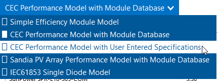
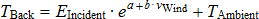
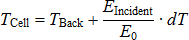
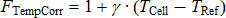
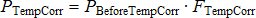
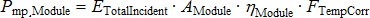

Module
======

The Module page allows you to choose a model to represent the photovoltaic module's performance. For each time step of the simulation, the module model calculates the DC electrical output of a single module based on the design parameters and the incident solar radiation (plane-of-array irradiance) calculated from data in the weather file. 

SAM assumes that the system is made up of an array of identical modules, which can be wired into up to four DC subarrays. The photovoltaic array's electric output depends on the number of modules in the system and the orientation, tracking, shading, and other parameters. The array's electrical output is fed to a bank of one or more inverters, whose characteristics appear on the :doc:`Inverter page <pv_inverter>`. 

SAM displays the name of the active module model at the top of the Module page. Click the model name to choose a different model:

You can choose from five different module performance models:

* :ref:`Simple Efficiency Module Model <module-spe>` is a simple representation of module performance that requires you to provide the module area, a set of conversion efficiency values, and temperature correction parameters. The simple efficiency model is the least accurate of the three models for predicting the performance of specific modules, but is useful for analyses involving explorations of the relationship between module efficiency and the system's performance and cost of energy because it allows you to specify the module efficiency as an input.

* :ref:`CEC Performance Model with Module Database <module-cec-database>` calculates module solar energy-to-electricity conversion efficiency from data stored in a library of module parameters for thousands of commercially available modules. It is an implementation of the six-parameter single-diode equivalent circuit model used in the California Energy Commission New Solar Homes Partnership Calculator, and is an extension of the five-parameter originally developed model developed at the University of Wisconsin.

* :ref:`CEC Performance Model with User Entered Specifications <module-cec-user>` uses the same algorithms as the CEC model with Module Database, but allows you to enter your own module specifications from a manufacturer's data sheet.

* :ref:`Sandia PV Array Performance Model with Module Database <module-sandia>` calculates module conversion efficiency based on data measured from modules and arrays in realistic outdoor operating conditions. The database includes modules with different cell types, including crystalline silicon, and various thin film technologies. It is an empirically-derived model developed by Sandia National Laboratories.

* :ref:`IEC61853 Single Diode Model <module-iec61853>` calculates the module conversion efficiency from a set of detailed parameters describing the module's characteristics, consistent with the International Electrotechnical Commission (IEC) power and rating standard, `IEC 61853 <http://www.solarabcs.org/about/publications/reports/pv-mod-power-rating/>`__, *Irradiance and Temperature Performance Measurements and Power Rating*.

For a complete technical description of SAM's photovoltaic model, see Gilman, P.; Dobos, A.; DiOrio, N.; Freeman, J.; Janzou, S.; Ryberg, D. (2018) SAM Photovoltaic Model Technical Reference Update. 93 pp.; NREL/TP-6A20-67399 available along with other technical documentation from the `SAM website <https://sam.nrel.gov/photovoltaic/pv-sub-page-2.html>`__.

.. note:: You can also model a photovoltaic system using the simpler :doc:`PVWatts model <../pvwatts/pvwatts>`, or a high concentration photovoltaic (HCPV) system using the :doc:`concentrating photovoltaic model <../high-concentration-photovoltaic/hcpv_overview>`. To use these models you must :doc:`choose the models <../getting-started/choose_models>` when you create a new file or case. (You can also :ref:`choose a different <changemodel>` model for the current case.)

.. _module-cec-database:

CEC Performance Model with Module Database
------------------------------------------

The California Energy Commission (CEC) Performance Model uses the University of Wisconsin-Madison Solar Energy Laboratory's five-parameter single-diode model with a database of module parameters for modules from the database of eligible photovoltaic modules maintained by the California Energy Commission (CEC) for the California Solar Initiative.

The five-parameter single-diode model calculates a module's current and voltage under a range of solar resource conditions (represented by an I-V curve) using an equivalent electrical circuit whose electrical properties can be determined from a set of five reference parameters. These five parameters, in turn, are determined from standard reference condition data provided by either the module manufacturer or an independent testing laboratory, such as the Arizona State University Photovoltaic Testing Laboratory. 

.. note:: SAM's CEC module library contains parameters for the modules in the List of Eligible SB1 Guidelines Compliant Photovoltaic Modules at http://www.gosolarcalifornia.org/equipment/pv_modules.php as of the date of the SAM software release for the current version.

   If you represent a module manufacturer and would like to add your module to the CEC database, you should contact the CEC directly. See http://www.gosolarcalifornia.ca.gov/equipment/add.php.

   To model a module that is not in the database, you can use the :ref:`CEC Performance Model with User Entered Specifications <module-cec-user>`.

   To modify library parameters, choose the module you want to model from the library, and then switch the model option at the top of the Module page from **CEC Performance Model with Module Database** to **CEC Performance Model with User Entered Specifications** and click **Copy module specs from currently selected CEC database module**. This will copy the parameter values from the library to inputs that you can edit.

The CEC Module model uses the `air mass model <https://pvpmc.sandia.gov/modeling-guide/2-dc-module-iv/effective-irradiance/spectral-mismatch-models/>`__ for spectral mismatch from the Sandia Array Performance Model with "a" coefficients for polycrystalline modules from Table A1 of De Soto W.; Klein, S.; Beckman, W.; (2006) `Improvement and validation of a model for photovoltaic array performance <https://www.sciencedirect.com/science/article/abs/pii/S0038092X05002410>`__. Solar Energy. Vol 80 Issue 1. pp 78-88.

The five-parameter single-diode model is described in Gilman, P. (2015). SAM Photovoltaic Model Technical Reference. National Renewable Energy Laboratory. 59 pp.; NREL/TP-6A20-64102. (`PDF 840 KB <http://www.nrel.gov/docs/fy15osti/64102.pdf>`__), and in De Soto 2004, `Improvement and Validation of a Model for Photovoltaic Array Performance <http://minds.wisconsin.edu/handle/1793/7602>`__, Master of Science Thesis, University of Wisconsin-Madison.

To use the CEC photovoltaic model:

#. On the Module page, choose **CEC Performance Model**.

#. Choose a module from the list of available modules. SAM displays the model's characteristics and model coefficients.

When you select a module from the CEC database on the Module page, SAM displays module's parameters. You can see the complete set of parameters in the Module library by using SAM's :doc:`library editor <../reference/libraries>`.

Module Characteristics at Reference Conditions
~~~~~~~~~~~~~~~~~~~~~~~~~~~~~~~~~~~~~~~~~~~~~~

The characteristics at reference conditions are module ratings, and as such are nominal values. During a simulation, SAM calculates module parameters under operating conditions, which you can see in the :doc:`Results <pv_results>`.

**Reference conditions**
  The total irradiance and cell temperature at which the rated module characteristics apply.

**Nominal efficiency, %**
  The module's rated efficiency at reference conditions. SAM displays this value for reference only. During a simulation, the model calculates an efficiency value for each hour, which you can see in the time series output data.

**Maximum Power (Pmp), Wdc**
  The module rated power. Equal to the product of the maximum power voltage and maximum power current.

**Max Power Voltage (Vmp), Vdc**
  Reference maximum power voltage at the reference conditions.

**Max Power Current (Imp), Adc**
  Reference maximum power current at the reference conditions.

**Open Circuit Voltage (Voc), Vdc**
  Reference open circuit voltage at the reference conditions.

**Short Circuit Current (Isc), Adc**
  Reference short circuit current at the reference conditions.

**Temperature Coefficients**
  SAM displays the temperature coefficients in %/°C and W/°C at maximum power, open circuit, and short circuit.

  The temperature coefficients are based on data collected from laboratory test results and may not match coefficients provided by the manufacturer on the module's data sheet.

Bifacial Specifications
~~~~~~~~~~~~~~~~~~~~~~~

.. include:: ../includes/snip_pv_bifacial.rst

.. _module-tempcorr-cec-options:

Temperature Correction
~~~~~~~~~~~~~~~~~~~~~~

The CEC model provides two modes for modeling the effect of cell temperature on module performance:

.. _module-tempcorr-noct:

The NOCT Method
~~~~~~~~~~~~~~~

This method determines the cell temperature based on the nominal operating cell temperature (NOCT) specified in the module parameters. In SAM 2010.11.9 and earlier versions, this was the only available temperature correction option for the CEC model. De Soto (2004) listed on the `PV Publications <https://sam.nrel.gov/photovoltaic/pv-sub-page-2.html>`__ page of the SAM website.

**Mounting standoff**
  Choose the option that best describes how the module is mounted: Ground or rack mounted when there is a when there is a lot of space between the module back and the ground or roof surface; For roof-mounted modules, choose a distance between the module back and roof in inches; or choose building-integrated for a module that is part of the building structure.

  For standoff heights less than 0.5 inches, and between 0.5 inches and 3.5 inches, SAM increases the NOCT value by several degrees as the standoff height decreases to account for reduced airflow between the module and roof surface. This is the same approach as is used in the `CECPV Calculator Spreadsheet <https://www.energy.ca.gov/programs-and-topics/programs/new-solar-homes-partnership-program-nshp>`__  .

**Array height**
  Choose the option that best describes the height of the array from the ground.

.. include:: ../includes/snip_pv_transient_thermal_model.rst

.. _module-tempcorr-heat-transfer:

Heat transfer method
~~~~~~~~~~~~~~~~~~~~

The heat transfer method uses a steady state heat transfer model to calculate cell temperatures described in Neises (2010). When the simulation time step is less than 20 minutes and you choose the gap mounting configuration for the heat transfer model, it applies the transient weighted average model for the back surface-temperature described in Prilliman (2020). References to both publications are available under "Module/Cell Temperature Models" on the `PV Publications <https://sam.nrel.gov/photovoltaic/pv-sub-page-2.html>`__   page of the SAM website.

.. note:: The temperature correction algorithms use wind speed and ambient (dry-bulb) temperature data from the weather file, assumed to be measured at 2 meters above the ground. 

   The heat transfer method also uses atmospheric pressure and wet-bulb temperature data, and will generate a simulation error if that data is missing from the weather file.

   When you specify a vertical or horizontal mounting structure option, SAM also uses wind direction data in the cell temperature calculation.

**Mounting configuration**
  Choose the option that best describes how the modules are mounted: Rack when modules are mounted on open racks that allow ambient air to flow freely over the front and back of the modules; Flush when modules are in direct contact with a roof or wall, preventing air from flowing over the back of the module; Integrated when modules form part of the roof or wall so that the back of the module is in contact with the indoor air (when you specify integrated mounting, you must also specify the temperature behind the module); Gap for modules that are mounted with a space between the module and building surface that allows limited air flow over the back of each module (when you specify gap mounting, you must also specify the mounting structure orientation and gap spacing).

  The mounting configuration affects the movement of air around the module and the transfer of heat between the module and the building surface or ground. SAM assumes that all modules in the array use the same mounting configuration.

**Heat transfer dimensions**
  Choose whether you want SAM to calculate the cell temperature based on the module or array dimensions. The Array Dimensions option assumes that modules in the array are in direct contact with each other and results in a higher calculated cell temperatures than the Module Dimensions option. Use the Array Dimensions option for more conservative array output estimates.

**Mounting structure orientation**
  This option is only available for the gap mounting configuration only. Choose how the mounting structure interferes with airflow under the modules for the gap mounting configuration: None if the mounting structure does not impede air flow over the back of the modules; vertical supporting structures if the mounting structures on module back are perpendicular to the roof ridge and impede air flow parallel to the ridge; or horizontal supporting structures if the mounting structures are parallel to the roof ridge and impede air flow perpendicular to the ridge.

**Module width**
  Length of side of module parallel to the ground.

**Module length**
  SAM calculates this value by dividing the module area from the parameter library by the module width that you specify.

*Module Length (m) = Module Area (m²) ÷ Module Width*

When you choose array dimensions for the heat transfer dimensions, you must also specify how modules are physically configured in the array.

**Rows of modules in array (array heat transfer dimensions only)**
  Assuming a rectangular array, the number of rows of modules, where a row is parallel to the line defined by the Module Width variable.

**Columns of modules in array (array heat transfer dimensions only)**
  Assuming a rectangular array, the number of modules along the side perpendicular to the line defined by the module width variable.

**Temperature behind the module (integrated mounting configuration only)**
  The indoor air temperature for the integrated mounting configuration option. SAM assumes a constant indoor air temperature.

**Spacing between module back and roof surface (gap mounting configuration only)**
  The distance between the back of the modules and the roof or wall surface for the gap mounting configuration option.

Physical Characteristics
~~~~~~~~~~~~~~~~~~~~~~~~

**Material**
  A description of the semiconductor technology used in the photovoltaic cells.

  1-a-Si: single-junction amorphous silicon

  2-a-Si: dual-junction amorphous silicon

  3-a-Si: triple-junction amorphous silicon

  a-Si/nc: amorphous silicon - microcrystalline silicon tandem module

  CdTe: cadmium telluride

  CIGS: copper indium gallium sulfide

  CIS: copper indium diselenide

  HIT-Si: amorphous silicon heterojunction

  Mono-c-Si: single-crystal silicon

  Multi-c-Si: multi-crystalline silicon

**Module area**
  The total area of the module, including spaces between cells and the frame.

**Number of cells**
  Number of cells per module.

Additional Parameters
~~~~~~~~~~~~~~~~~~~~~

**T_noct**
  Nominal operating cell temperature

**A_ref**
  Modified ideality factor at reference conditions

**I_L_ref**
  Photocurrent at reference conditions 

**I_o_ref**
  Reverse saturation current at reference conditions 

**R_s**
  Series resistance (constant)

**R_sh_ref**
  Shunt resistance at reference conditions

.. _module-sandia:

Sandia PV Array Performance Model with Module Database
-------------------------------------------------------

The Sandia PV Array Performance model consists of a set of equations that provide values for five points on a module's I-V curve and a database of coefficients for the equations whose values are stored in the Sandia Modules library. The coefficients have been empirically determined based on a set of manufacturer specifications and measurements taken from modules installed outdoors in real, operating photovoltaic systems.

.. note:: SAM's Sandia module library contains parameters for modules involved in `Sandia's Test and Evaluation program <http://energy.sandia.gov/?page_id=279>`__, If you represent a module manufacturer and would like to add your equipment to the Sandia database, you should `contact the program <http://energy.sandia.gov/?page_id=2772>`__.

The Sandia model is described in King et al, 2004. Photovoltaic Array Performance Model. Sandia National Laboratories. SAND2004-3535. (`PDF 1.8 MB <http://prod.sandia.gov/techlib/access-control.cgi/2004/043535.pdf>`__). Also see the `Sandia PV Modeling and Analysis <http://energy.sandia.gov/?page_id=2493>`__ website for more on PV system performance modeling.

Overview
~~~~~~~~

To use the Sandia photovoltaic model:

#. On the Module page, choose **Sandia PV Array Performance Model with Module Database**.

#. Choose a module from the list of available modules. Use the search box to filter the list. Click a column heading in the list to sort by name or parameter value.

SAM displays the module's characteristics and model coefficients.

When you choose a module from the list, SAM displays the module characteristics at reference conditions on the Module page. Internally, the model applies a set of coefficients from the Sandia Modules :doc:`library <../reference/libraries>` to the simulation equations.

#. Choose a module structure from the three available options (displayed as front material / cell / back material). See :ref:`Temperature Correction <module-tempcorr-sandia>` for details. Module manufacturers typically include a description of the front material, and frame or back material in a mechanical characteristics section of module specification sheets.

.. note:: The current version of the Sandia database contains a single low concentration photovoltaic module, listed as Entech 22X Concentrator [1994].

Module Characteristics at Reference Conditions
~~~~~~~~~~~~~~~~~~~~~~~~~~~~~~~~~~~~~~~~~~~~~~

SAM displays the module characteristics so that you can compare modules in the database to manufacturer specifications or to different modules in the database. These are nominal ratings. SAM calculates the operating values of these parameters during a simulation and displays them in the :doc:`Results <pv_results>`.

**Reference conditions**
  The reference conditions describe the incident solar radiation, air mass, ambient temperature, and wind speed that apply to the module characteristics. The module efficiency, power, current, voltage, and temperature coefficients values are those for the module operating at the reference conditions.

**Nominal efficiency (%)**
  The module's rated efficiency at reference conditions. SAM displays this value for reference only. During a simulation, the model calculates an efficiency value for each time step, which you can see in the time series output data on the :doc:`Data tables <../results/data>`   tab on the :doc:`Results page <../getting-started/results_page>`  .

**Maximum power (Pmp), Wdc**
  The module rated power in DC Watts. Equal to the product of the maximum power voltage and maximum power current.

**Max power voltage (Vmp), Vdc**
  Maximum power voltage in DC Volts under reference conditions.

**Max power current (Imp), Adc**
  Maximum power current in DC Amps under reference conditions. Defines the maximum power point on the module's I-V curve.

**Open circuit voltage (Voc), Vdc**
  Open circuit voltage under reference conditions. Defines the open circuit point on the module's I-V curve.

**Short circuit current (Isc), Adc**
  Short circuit current under reference conditions. Defines the short circuit point on the module's I-V curve.

**Temperature coefficients**
  SAM displays the temperature coefficients in %/°C and W/°C at the different points on the power curve.

**Module structure and mounting**
  This option determines the coefficients that SAM uses to calculate the cell temperature in each hour of the simulation. The default option is **Use Database Values**, which displays the coefficients from the measured data at reference conditions. See :ref:`Temperature Correction <module-tempcorr-sandia>`   for details.

Physical Characteristics
~~~~~~~~~~~~~~~~~~~~~~~~

**Material**
  A description of the semiconductor technology used in the photovoltaic cells.

  2-a-Si: dual-junction amorphous silicon

  3-a-Si: triple-junction amorphous silicon

  CdTe: cadmium telluride

  CIS: copper indium diselenide

  HIT-Si: amorphous silicon heterojunction

  c-Si: single-crystal silicon

  mc-Si: multi-crystalline silicon

**Vintage**
  The year that module coefficients were added to the database. 

  The letter "E" indicates that the coefficients were estimated from a combination of published manufacturer specifications and data from the outdoor testing of a similar module. Entries without an "E" are for modules whose coefficients were derived entirely from outdoor tests involving one more or more modules of that type.

  Because the tested modules (listed without an "E") may have had different average power ratings than production versions of the same module, the database typically also includes an "E" entry for each of the tested modules that represents the average power rating specified by the manufacturer.

**Module area, m****\ :sup:`2`\**
  The total area of the module, including spaces between cells and the frame.

**Number of cells**
  Total number of cells in the module, equal to the product of the number of cells in series and number of cell strings in parallel.

**Number of cells in series**
  Number of cells connected in series per cell string.

**Number of cell strings in parallel**
  Number of cell strings connected in parallel per module.

.. _module-tempcorr-sandia:

Sandia Temperature Correction
~~~~~~~~~~~~~~~~~~~~~~~~~~~~~

The Sandia temperature correction algorithm calculates a temperature correction factor that accounts for efficiency losses due to heating of the module during the day when the sun is shining. The algorithm calculates an hourly module temperature as a function of the solar radiation, ambient temperature, and wind speed in a given hour, and a set of properties describing the thermal characteristics of the cell and module.

For more details about the algorithm, see King et al, 2004. *Photovoltaic Array Performance Model*. Sandia National Laboratories. SAND2004-3535. http://prod.sandia.gov/techlib/access-control.cgi/2004/043535.pdf

.. note:: The SAM temperature correction algorithms do not account for cooling strategies used in some innovative photovoltaic systems.

Guidelines for choosing the Module Structure - Mounting (a, b, dT) parameters
~~~~~~~~~~~~~~~~~~~~~~~~~~~~~~~~~~~~~~~~~~~~~~~~~~~~~~~~~~~~~~~~~~~~~~~~~~~~~

The *a*, *b*, and *dT* parameters determine the relationship between ambient temperature and module temperature. See :ref:`Sandia Temperature Correction Equations <module-tempcorr-sandia>` for equation details.

SAM allows you to choose from a set of pre-determined values of the parameters for different module mounting options, or specify your own values for the parameters. For the Concentrating PV model, you can assign a set values to the parameters, or specify your own. 

* For most analyses involving flat-plate modules mounted on open racks, choose **Use Database Values**. These are the values determined empirically during testing of the module. Most of the modules in the database were tested on open racks.

* To see how a flat-plate module might perform under different mounting conditions, choose an appropriate option from the list. Be sure to choose an option that is consistent with the module you are modeling. You may need to refer to the module's specification sheet for information about its structure.

* For the Concentrating PV model, use the default values (click **Default Temperature Inputs**) unless you have a set of *a*, *b*, and *dT* values for your module. 

* If you understand the Sandia model well enough to generate your own temperature correction coefficients, choose **User Defined**, and type your own values for *a*, *b*, and *dT*.

The table bleow describes the module structure and mounting options.

.. list-table::
   :width: 100%
   :align: center
   :header-rows: 1

   * - Module Structure and Mounting
     - Description
   * - Glass/Cell/Polymer Sheet Open Rack
     - Solar cells are between a glass front and polymer back, and the module is mounted on an open rack allowing air to circulate freely around the module.
   * - Glass/Cell/Glass  Open Rack
     - Solar cells are between a glass front and glass back, and the module is mounted on an open rack allowing air to circulate freely around the module.
   * - Polymer/Thin Film/Steel Open Rack 
     - Solar cells are between a transparent polymer front and steel back, and the module is mounted on an open rack allowing air to circulate freely around the module.
   * - Glass/Cell/Polymer Sheet Insulated Back
     - Solar cells are between a glass front and polymer back, and the module is mounted directly to a building surface in a building-integrated PV (BIPV) application preventing air from flowing over the module back.
   * - Glass/Cell/Glass Close Roof Mount
     - Solar cells are between a glass front and glass back, and the module is mounted on a rack with little clearance between the building surface and module back allowing little air to flow over the module back.

.. include:: ../includes/snip_pv_transient_thermal_model.rst

Sandia Temperature Correction Method
~~~~~~~~~~~~~~~~~~~~~~~~~~~~~~~~~~~~

SAM uses the Sandia temperature correction method to calculate a module and cell temperature and temperature correction factor for the Sandia, :ref:`Simple Efficiency Module Model <module-spe>` and :doc:`high concentration photovoltaic (HCPV) <../high-concentration-photovoltaic/hcpv_module>` models. The model uses the temperature correction factor to adjust each hour's module efficiency value: The higher the module's temperature in a given hour, the lower the module's efficiency in that hour.

You can explore temperature effects on the array's performance in the time series output data. The data shows the hourly cell temperature, along with the solar radiation, wind speed, and ambient temperature.

The temperature correction equations use the following input values from the Module page:

* Temperature coefficients. The Sandia model uses the four values listed in the Temperature Coefficients column. The Simple Efficiency and Concentrating PV models use the single temperature coefficient of power value.

* Temperature correction coefficients: *a*, *b*, and *dT*. For the Sandia and Simple Efficiency models, the three values appear under the Module Structure - Mounting option. For the Concentrating PV model, the values appear below the temperature coefficient variable.

The equations use four hourly data sets from the weather file. You can see the hourly data by either viewing the weather data from the :doc:`Location and Resource <pv_location_and_resource>` page, or viewing the time series results data after running a simulation:

* Incident direct normal radiation

* Incident diffuse radiation

* Ambient temperature

* Wind speed

The table below shows the empirically-determined coefficients from the Sandia database for each of the module structure and mounting options available on the Module page.

.. list-table::
   :width: 100%
   :align: center
   :header-rows: 1

   * - Module Structure and Mounting
     -  a 
     -  b 
     - dT ºC
   * - Glass/Cell/Polymer Sheet Open Rack
     - -3.56
     - -0.0750
     - 3
   * - Glass/Cell/Glass  Open Rack
     - -3.47
     - -0.0594
     - 3
   * - Polymer/Thin Film/Steel Open Rack 
     - -3.58
     - -0.113
     - 3
   * - Glass/Cell/Polymer Sheet Insulated Back
     - -2.81
     - -0.0455
     - 0
   * - Glass/Cell/Glass Close Roof Mount
     - -2.98
     - -0.0471
     - 1
   * - Concentrating PV Module
     - -3.2
     - -0.09
     - 17
   * - User Defined
     - -99
     - 0
     - 0

.. note:: The default values for the User Defined option effectively remove temperature correction from the model so that the cell temperature is equal to the ambient temperature.

The following table lists sample temperature coefficient values for different cell types based on an informal survey of manufacturer module specifications.

.. list-table::
   :width: 100%
   :align: center
   :header-rows: 1

   * - Cell Type
     - Maximum Power Temperature Coefficient (%/°C)
   * - Monocrystalline Silicon
     - -0.49
   * - Polycrystalline Silicon
     - -0.49
   * - Amorphous Silicon
     - -0.24
   * - Amorphous Silicon Triple Junction
     - -0.21
   * - Copper Indium Gallium DiSelenide (CIGS)
     - -0.45
   * - Cadmium Telluride (CdTe)
     - -0.25

Sandia Temperature Correction Equations
~~~~~~~~~~~~~~~~~~~~~~~~~~~~~~~~~~~~~~~

The temperature correction algorithm first calculates the module back temperature based on the incident solar radiation, *a* and *b* coefficients, and the ambient temperature and wind speed:

.. note:: SAM assumes that the ambient temperature and wind speed data in the weather file are mid-hour values and that the radiation values are end-of-hour values. SAM interpolates temperature and wind speed values by averaging the current hour value with the previous hour value.

Next, the cell temperature is calculated based on the module back temperature, incident radiation, and dT:

The temperature correction factor *F*\ :sub:`TempCorr`\  is:

In general, the temperature corrected module power is the product of the power calculated by the module model and the temperature correction factor. Each module model (Sandia, Simple Efficiency, Concentrating PV) uses a different algorithm to calculate the module power before temperature correction:

Where,

.. list-table::
   :width: 100%
   :align: center

   * - *E*\ :sub:`Incident`\  (W/m\ :sup:`2`\ )
     - The sum of the direct normal and diffuse radiation for the current hour in the weather data. SAM determines this value based on the data in the weather file.
   * - *E*\ :sub:`0`\  (W/m\ :sup:`2`\ )
     - The reference total incident radiation, equal to 1000 W/m\ :sup:`2`\ .
   * - *T*\ :sub:`ref`\  (°C)
     - The reference temperature in degrees Celsius, equal to 25°C.
   * - *gamma* (%/°C)
     - The maximum power temperature coefficient from Module page.
   * - *a, b*
     - Values from the Module page. They are empirically-determined coefficients accounting for the effect of wind on the module temperature: *a* defines the module temperature upper limit (at low wind speed and high solar radiation levels), and *b* defines the rate at which module temperature decreases as wind speed increases. The values depend on the module's construction, which determines its ability to absorb and shed heat. See the table above for typical values.
   * - *dT*
     - Value from the Module page. The temperature difference between the cell and module back surface at the reference incident radiation of 1000 W/m\ :sup:`2`\ . The value depends on how the module is mounted in the system, which determines how much air comes into contact with the module back surface. See the table above for typical values.
   * - *v*\ :sub:`Wind`\  (m/s)
     - Wind speed from the weather file in meters per second.
   * - *T*\ :sub:`Ambient`\  (°C)
     - Ambient temperature from weather file.
   * - *F*\ :sub:`TempCorr`\ 
     - Temperature correction factor
   * - *P*\ :sub:`BeforeTempCorr`\ 
     - Module power before temperature correction
   * - *P*\ :sub:`TempCorr`\ 
     - Temperature-corrected module power

.. _module-spe:

Simple Efficiency Module Model
------------------------------

The flat-plate photovoltaic simple efficiency module model calculates the module's hourly DC output assuming that the module efficiency varies with radiation incident on the module as defined by the radiation level and efficiency table. The model makes an adjustment for cell temperature using the :ref:`Sandia Temperature Correction Model <module-tempcorr-sandia>`.

Overview
~~~~~~~~

To use the simple efficiency module model:

#. On the Module page, choose **Simple Efficiency Module Model**.

#. Enter a temperature coefficient. This is the number typically reported on manufacturer specification sheets as the maximum power coefficient. See :ref:`Sandia Temperature Correction Model <module-tempcorr-sandia>` for suggested values.

#. Enter the module's total cell area in square meters, equivalent to the product of the cell area and number of cells.

#. Type values for the module's maximum power and open circuit voltages. SAM uses these values for array sizing on the :doc:`pv_system_size` page.

#. Choose a module structure from the three available options (displayed as front material / cell / back material). See :ref:`Sandia Temperature Correction <module-tempcorr-sandia>` for details.

Module manufacturers typically include a description of the front material, and frame or back material in a mechanical characteristics section of module specification sheets.

#. In the Radiation Level and Efficiency Table, enter an efficiency value for each of the five incident global radiation reference values in increasing order. If you are defining the efficiency curve with fewer than five efficiency values, *you must include five radiation values*, but you can assign the same efficiency value to more than one radiation value. For example, to represent a module with 13.5% constant efficiency, you would assign the value 13.5 to each of the five radiation values 200, 400, 600, 850, 1000.

#. Choose the radiation level that represents the reference value, often 1000 W/m\ :sup:`2`\  for flat-plate modules.

SAM uses the reference value to calculate the module's rated power, displayed as the Power variable on the Module page.

Characteristics
~~~~~~~~~~~~~~~

The module characteristics define the module's capacity, efficiency, and thermal characteristics.

**Maximum power (Pmp), Wdc**
  The module's rated maximum DC power at the reference radiation indicated in the radiation level and efficiency table. SAM uses this value to calculate the costs on the Installation costs and Operating costs pages, but not in simulation calculations. The module power is the product of the reference radiation, reference efficiency, and area.

**Temperature coefficient (Pmp), %/C**
  The rated maximum-power temperature coefficient as specified in the module's technical specifications. See :ref:`Sandia Temperature Correction Model <module-tempcorr-sandia>` for details.

**Area, m\ :sup:`2`**
  The module collector area in square meters. To calculate the area for a given module power rating at a given reference radiation level, divide the power rating by the module efficiency and radiation level. For example, a module with a 100 W rating and 13.5% efficiency at 1000 W/m  \ :sup:`2`\    would requires an area of 100 W / (0.135 × 1000 W/m  \ :sup:`2`\   ) = 0.74074 m  \ :sup:`2`\   .

**Maximum power voltage (Vmp)**
  The voltage at the module's maximum power point.

**Open circuit voltage (Voc)**
  The module's open circuit voltage.

**Module structure and mounting**
  The module's front and back materials (front material/cell/back material) used in the :ref:`Sandia Temperature Correction Equations <module-tempcorr-sandia>`.

Bifacial Specifications
~~~~~~~~~~~~~~~~~~~~~~~

.. include:: ../includes/snip_pv_bifacial.rst

Radiation Level and Efficiency Table
~~~~~~~~~~~~~~~~~~~~~~~~~~~~~~~~~~~~

**Irradiance (W/m2)**
  The plane-of-array total (beam and diffuse) irradiance level at which the given efficiency value applies.

**Efficiency (%)**
  The module conversion efficiency at a given incident global radiation level. SAM calculates an efficiency value for each hour in the simulation using linear extrapolation to determine the value based on radiation data from the weather file. The efficiency values represent the efficiency of conversion from incident global radiation to DC electrical output.

**Reference Condition**
  Indicates the value to use to calculate the nominal maximum power value.

**Diffuse utilization factor**
  This advanced input allows you to adjust the diffuse component of the radiation incident on the module. For most applications, you should use the default value of 1. For modules that do not use all of the diffuse radiation, such as low-x concentrator, you can use a value less than one.

During a simulation, the single-point efficiency model calculates the module DC output reported in the :doc:`Results <pv_results>` as the product of the total incident global radiation, module area, and temperature correction factor:

Where,

.. list-table::
   :width: 100%
   :align: center

   * - *E*\ :sub:`TotalIncident`\  (W/m\ :sup:`2`\ )
     - Total incident radiation from the weather data processor.
   * - *A*\ :sub:`Module`\  (m\ :sup:`2`\ )
     - The module area in square meters.
   * - *n*\ :sub:`Module`\ 
     - Module efficiency at a given incident global radiation level, calculated by extrapolating values from the Radiation Level and Efficiency Table.
   * - *F*\ :sub:`TempCorr`\ 
     - Temperature correction factor. See :ref:`Sandia Temperature Correction <module-tempcorr-sandia>` for details.

.. _module-cec-user:

CEC Performance Model with User Entered Specifications
------------------------------------------------------

The CEC Performance Model with User Entered Specifications allows you to run the CEC module model with module specifications from a module manufacturer's data sheet.

Overview
~~~~~~~~

When you use the model, you first enter a set of specifications to generate a set of coefficients for the module on the Module page, and then run a simulation of the PV system after specifying the rest of the system on the :doc:`pv_system_size`, :doc:`Inverter <pv_inverter>`, and other input pages.

SAM uses the module specifications you provide to calculate a set of parameters at reference conditions for the CEC module model. During a simulation, the model adjusts temperature and incident irradiance coefficients to calculate the module efficiency at operating conditions other than STC. Note that the model does not account for all non-linear effects in the relationship of module power and irradiance.

The calculations involve a combination of empirical regressions and heuristic methods to automatically solve a multidimensional set of non-linear equations. An error checking algorithm ensures that the model can find solutions for most modules.

.. note:: SAM stores the calculated parameters with the case in your .sam file. It does not store them in a library that you can use in other files or cases. To use a module in a different file or case, use the Save / Load Data buttons to save the parameters to a text file that you can use to load into another file or case.

If you use specifications from a manufacturer's data sheet for a module that exists in the CEC Performance Model with Module Database, SAM may calculate a different set of parameters than those in the CEC library. That is because the specifications used to generate parameters in the CEC library are based on specifications provided by third party testing facilities, which may differ from data on the manufacturer data sheet.
 
The CEC Module model uses the `air mass model <https://pvpmc.sandia.gov/modeling-guide/2-dc-module-iv/effective-irradiance/spectral-mismatch-models/>`__ for spectral mismatch from the Sandia Array Performance Model with "a" coefficients for polycrystalline modules from Table A1 of De Soto W.; Klein, S.; Beckman, W.; (2006)` Improvement and validation of a model for photovoltaic array performance <https://www.sciencedirect.com/science/article/abs/pii/S0038092X05002410>`__. Solar Energy. Vol 80 Issue 1. pp 78-88.

To use the CEC Performance Model with User Entered Specifications:

#. On the Module page, choose **CEC Performance Model with User Entered Specifications**.

#. Enter the required module specifications.

**Module description** is an optional field you can use for the module name or other description.

#. Click **Calculate and plot**.

After solving the module model equations, SAM displays a current-voltage (I-V) curve at STC.

.. note:: In some rare cases, SAM may not be able to find a solution for the set of specifications you provide. (It performs a series of internal checks that should ensure that it finds a solution in most cases.) If SAM displays an error message, first verify that the specifications you entered are correct. If the specifications are correct, you may be able to generate an I-V curve by making small adjustments to the specifications, such as slightly increasing the Isc value.

#. Under **Mounting Configuration**, choose the standoff height and array's height above ground.

General Information
~~~~~~~~~~~~~~~~~~~

**Module description**
  An optional string describing the module.

**Cell type**
  A description of the semiconductor technology used in the photovoltaic cells. This parameter is used to guide the solution of normalized module coefficients, but is not directly used for power calculations once the coefficients are determined.

  monoSi: Single-crystal silicon

  multiSi: Multi-crystalline silicon

  CdTe: Cadmium telluride

  CIS: Copper indium diselenide

  CIGS: Copper indium gallium sulfide

  amorphous: Amorphous silicon

**Module area, m²**
  The surface area of the entire module.

**Nominal operating cell temperature, °C**
  The nominal operating cell temperature (NOCT) of the module is the measured cell temperature of the module at NOCT test conditions: 800 W/m² incident irradiance, 20 degrees Celsius ambient temperature, and 1 m/s wind speed. The mounting configuration under test conditions is typically open rack, except building-integrated (BIPV) modules which are tested in a building-integrated configuration.

Electrical Specifications
~~~~~~~~~~~~~~~~~~~~~~~~~

**Maximum power point voltage (Vmp), V**
  The reference maximum power point voltage at STC.

**Maximum power point current (Imp), A**
  The reference maximum power point current at STC.

**Open circuit voltage (Voc), V**
  The open circuit voltage at STC.

**Short circuit current (Isc), A**
  The short circuit current at STC.

**Temperature dependence of Voc, V/°C or %/°C**
  The absolute change in Voc per degree change in temperature, also called alpha.

**Temperature dependence of Isc, A/°C or %/°C**
   The absolute change in Isc per degree change in temperature, also called beta.

**Temperature dependence of Pmp, %/°C**
   The percentage change in the maximum power point Pmp per degree change in temperature, also called gamma. To convert units from W/ºC to %/ºC, divide the %/ºC value by Pmp.

**Number of cells in series**
  The number of cells wired together in series inside the module.

**Copy module specs from currently selected CEC database module**
  Use this button to overwrite inputs with values copied from the current selection in the module library for the CEC Performance Model with Module Database model option: Choose **CEC Performance Model with Module Database** from the list of model options at the top of the page, choose the module whose parameters you want to copy from the library list, and then switch back to **CEC Performance Model with User Entered Specifications** and click **Copy module specs from currently selected CEC database module**.

Bifacial Specifications
~~~~~~~~~~~~~~~~~~~~~~~

.. include:: ../includes/snip_pv_bifacial.rst

Mounting Configuration
~~~~~~~~~~~~~~~~~~~~~~

SAM's CEC Performance Model with User Entered Specifications uses the :ref:`The NOCT Method <module-tempcorr-noct>` from the CEC Performance Model with Module Database model.

**Standoff height**
  The standoff height is the distance between the back of the module and surface of the roof for roof-mounted modules. For modules integrated with the building (BIPV), or for ground mounted modules, choose the appropriate option.

.. note:: SAM does not make NOCT adjustments for the **Building integrated**, **Greater than 3.5 in**, or **Ground or rack mounted** options. For these options, the **Nominal operating cell temperature** value you provide should be at conditions appropriate for those types of installations.

**Approximate installation height**
  SAM uses the installation height option to make an adjustment to the effect of wind speed on the cell temperature calculation. SAM assumes that an array with an installation height of one story or lower experiences lower wind speeds than those in the weather file because of the effect of nearby trees and structures. For the two story building or higher option, the wind is less impeded.

Nominal Maximum Power Ratings at STC
~~~~~~~~~~~~~~~~~~~~~~~~~~~~~~~~~~~~

**Power, Wdc**
   The module’s rated maximum power point power at STC. This is equal to the product of the maximum power point voltage and maximum power point current.

**Efficiency, %**
  The module’s rated efficiency at STC 1000 W/m² irradiance. SAM displays this value for reference only. During a simulation, the model calculates an efficiency value for each hour, which you can see in the :doc:`Tables <../results/data>`   on the :doc:`Results <../getting-started/results_page>`   page.

.. include:: ../includes/snip_pv_transient_thermal_model.rst

Save / Load Data
~~~~~~~~~~~~~~~~

Use the **Save to file** and **Load from file** buttons to save the module parameters to a text file that you can use to share data between different SAM files. SAM saves a list of variable name, values, and labels in a simple comma-separated format.

.. _module-iec61853:

IEC 61853 Single Diode Model
----------------------------

The IEC-61853 Single Diode model is a detailed method for predicting the performance of flat plate photovoltaic modules. 

Overview
~~~~~~~~

The model uses data from modules tested according to the International Electrotechnical Commission (IEC) power and rating standard, `IEC 61853 <http://www.solarabcs.org/about/publications/reports/pv-mod-power-rating/>`__, *Irradiance and Temperature Performance Measurements and Power Rating*. The standard describes requirements for testing PV module performance at maximum power operation for a set of 23 operational conditions, denoted by an asterisk (\*) in the table below.

.. list-table::
   :width: 100%
   :align: center
   :header-rows: 1

   * - Irradiance (W/m²)
     - Tmodule = 15ºC
     - Tmodule= 25ºC
     - Tmodule = 50ºC
     - Tmodule = 75ºC
   * - 1100
     - N/A
     - \*
     - \*
     - \*
   * - 1000
     - \*
     - \*
     - \*
     - \*
   * - 800
     - \*
     - \*
     - \*
     - \*
   * - 600
     - \*
     - \*
     - \*
     - \*
   * - 400
     - \*
     - \*
     - \*
     - N/A
   * - 200
     - \*
     - \*
     - \*
     - N/A
   * - 100
     - \*
     - \*
     - N/A
     - N/A

At each test condition, the module’s Pmp, Vmp, Voc, and Isc are measured.  SAM uses this data to calibrate parameters for an extended single diode model that is used to predict the module’s performance at any operating condition.  The details of the underlying model and parameter extraction method are detailed in Dobos, A.; MacAlpine, S. (2014). `Procedure for Applying IEC-61853 Test Data to a Single Diode Model <https://ieeexplore.ieee.org/document/6925525>`__. Proc. IEEE 40th PVSC Conf. Denver CO.

In addition to the test data, the module area (m²), nominal operating cell temperature (NOCT) (°C), number of cells in series, and cell type are required inputs.

**To use the IEC 61853 Single Diode model:**

#. Obtain test data for your PV module from a testing laboratory or a manufacturer. SAM does not include a library of test result parameters for this model.

#. Enter the data into SAM’s input table.  The table structure is a little different from the matrix above.  Each row in SAM’s table corresponds to a test condition.  The columns are: irradiance (W/m2), module temperature (C), maximum power (W), maximum power voltage (V), open circuit voltage (V), and short circuit current (A).

.. note:: Some test labs are not able to test up to 75°C as defined by the standard, and may provide measurements only at 60°C or 65°C.  In other cases, some test conditions may be missing.  In this situation, enter all of the data that you have available, and SAM will do its best to extract model parameters.  Data at standard test conditions (1000 W/m², 25°C) is always required.

#. Enter the number of cells in series, and select a cell type.  The module area and NOCT cell temperature are also required.

#. Click **Calculate parameters**.

SAM displays a message details about how it determines the STC, Rsh, Rs, and temperature coefficient parameters for the model.

#. If the parameter estimation was successful, click **OK** and the model parameter inputs will be filled in automatically, along with the I-V curves on the graph.

#. Choose a mounting configuration, including a standoff height and an approximate mounting height.

#. Choose the type of module cover: standard glass, or anti-reflective coating (AR) glass.

#. If you have data available, you can change the spectral response by adjusting the air mass modifier polynomial coefficients. 

Thermal Behavior
~~~~~~~~~~~~~~~~

The thermal model is the same as the CEC module model's `NOCT cell temperature option <https://pvpmc.sandia.gov/modeling-guide/2-dc-module-iv/cell-temperature/noct-cell-temperature/>`__, and is described in De Soto, W.L. (M.S. 2004). Improvement and Validation of a Model for Photovoltaic Array Performance. University of Wisconsin-Madison. (`ZIP 1.8 MB <http://sel.me.wisc.edu/publications/theses/desoto04.zip>`__). 

**Nominal operating cell temp, °C**
  The nominal operating cell temperature (NOCT) of the module is the measured cell temperature of the module at NOCT test conditions: 800 W/m² incident irradiance, 20 degrees Celsius ambient temperature, and 1 m/s wind speed. The mounting configuration under test conditions is typically open rack, except building-integrated (BIPV) modules which are tested in a building-integrated configuration.

**Standoff height**
  The standoff height is the distance between the back of the module and surface of the roof for roof-mounted modules. For modules integrated with the building (BIPV), or for ground mounted modules, choose the appropriate option.

.. note:: SAM does not make NOCT adjustments for the **Building integrated**, **Greater than 3.5 in**, or **Ground or rack mounted** options. For these options, the **Nominal operating cell temperature** value you provide should be at conditions appropriate for those types of installations.

**Approximate mounting height**
  The thermal model uses the mounting height option to make an adjustment to the effect of wind speed on the cell temperature calculation. SAM assumes that an array with an installation height of one story or lower experiences lower wind speeds than those in the weather file because of the effect of nearby trees and structures. For the two story building or higher option, the wind is less impeded.

Optical and Spectral Behavior
~~~~~~~~~~~~~~~~~~~~~~~~~~~~~

To account for reflection losses in the module cover, the IEC 61853 module model applies an angle-of-incidence correction to the direct normal irradiance. It uses the module cover model from PVWatts V5 described in Section 8 of Dobos, A. (2014). PVWatts Version 5 Manual. 20 pp.; NREL Report No. TP-6A20-62641. (`PDF 714 KB <http://www.nrel.gov/docs/fy14osti/62641.pdf>`__), which is adapted from the DeSoto `Physical IAM model <https://pvpmc.sandia.gov/modeling-guide/1-weather-design-inputs/shading-soiling-and-reflection-losses/incident-angle-reflection-losses/physical-iam-model/>`__.

It accounts for spectral effects by applying an air mass modifier to the plane-of-array (POA) irradiance from the `Sandia Array Performance Model air mass model <https://pvpmc.sandia.gov/modeling-guide/2-dc-module-iv/effective-irradiance/spectral-mismatch-models/>`__ as described in King, D.L.; Boyson, W.E.; and Kratochvil, J.A. (2004). `Photovoltaic Array Performance Model <https://www.osti.gov/biblio/919131/>`__. 41 pp.; Sandia Report No. 2004-3535.

**Module cover**
  The **Standard glass option** uses the IAM model for a single slab of glass.

  The **Anti-reflective (AR) coating** option uses the IAM model twice, once for the AR coating and once for the glass.

**Air mass modifiers**
  These are the five air mass modifier equation coefficients (a0...a4) from the equation for    from Page 14 of King (2004):

  The default values are from the Sandia module model's library for the First Solar FS-267 module.