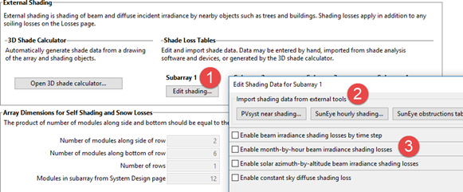

Soiling Shading Snow
====================

The inputs on the Soiling Shading Snow page determine how SAM calculates the effect of reductions in the irradiance incident on each subarray caused by module soiling, shadows, or snow.

Subarrays
~~~~~~~~~

To enable and disable subarrays, use the check boxes under "Subarrays" on the :doc:`pv_system_size` page.

Soiling Losses
~~~~~~~~~~~~~~

Soiling losses account for the reduction in incident solar irradiance caused by dust or other seasonal soiling of the module surface. SAM models soiling as a uniform reduction in the total irradiance incident on each subarray. 

You can see the effect of soiling losses in hourly results by comparing values of the nominal POA irradiance with the "after shading only" and "after shading and soiling" values. The radiation incident on the subarray is the POA total irradiance after shading and soling value (W/m²).

**Monthly soiling loss**
  Click **Edit values** to specify a set of monthly soiling losses. To apply a single soiling loss to all months, in the Edit Values window, type a value for **Enter single value** and then click **Apply**.

  For example, a soiling loss of 5% for January would reduce the plane-of-array irradiance for the front of the array by 5% for all time steps in January.

**Average annual soiling loss**
  SAM shows the average of the twelve monthly soiling loss values for your reference so you can tell if there are soiling losses without clicking the **Edit values** button. SAM does not use the average annual value for simulations.

Rear-side Shading and Soiling for Bifacial Modules
--------------------------------------------------

When you enable the bifacial model on the :doc:`Module <pv_module>` page, SAM enables two additional irradiance losses to account for soiling on the rear side of the array that differ from front-side soiling. SAM reduces the irradiance incident on the rear-side of the array by the bifacial rear soiling and bifacial rack shading percentage. The bifacial soiling losses are constant and do not change from month to month.

Peláez, S.; Deline, C.; Stein, Joshua.; Marion, B.; Anderson, K; Muller, M. (2019) Effect of torque-tube parameters on rear-irradiance and rear-shading loss for bifacial PV performance on single-axis tracking systems. IEEE 46th Photovoltaic Specialists Conference (PVSC), vol. 2, pp. 1-6. IEEE. (`PDF 835 KB <https://www.nlr.gov/docs/fy20osti/73203.pdf>`__  )

**Bifacial rear soiling (%)**
  A percentage of the irradiance incident on the rear-side of the bifacial array to account for soiling on the rear side of the array.

**Bifacial rack shading (%)**
  A percentage of the irradiance incident on the rear-side of the bifacial array to account for shadows of racking equipment on the rear side of the array.

The following results show the effect of these losses, which you can see on the :doc:`Losses <../results/losses>`, :doc:`Data Tables <../results/data>`, and :doc:`Time Series <../results/timeseries>` tabs on the Results page. See :doc:`Detailed PV model Results <pv_results>` for descriptions of these and other variables.

* **POA blocked by rear soiling (kWh/yr)**

* **POA rear-side rack shaded loss (%)**

* **Array POA rear-side radiation blocked by rear soiling (kW)**

* **Array POA rear-side radiation blocked by racks (kW)**

.. _pvexternalshading:

External Shading
~~~~~~~~~~~~~~~~

External shading is shading of the photovoltaic subarray by trees, buildings, roof protrusions and other nearby objects. SAM represents a shadow on the subarray in a given time step by a single **beam irradiance shading loss** for that time step, which it determines from data you provide in the beam shade loss tables in the :doc:`Edit Shading Data window <../window-reference/win_edit_shading_data>`. SAM reduces the plane-of-array beam irradiance by the shading loss percentage. For example, if a shadow occupies 25% of the subarray's surface area at 11 am, the beam shading loss for 11 am would be 25%. A shading loss of 0 means there is no shade on the subarray, and a loss of 100% means that no beam irradiance reaches the subarray.

When you specify beam irradiance shading losses by time step, you can use SAM's partial shading model to estimate the impact of partial shading on the array's electrical output. The partial shading model does not work with the month-by-hour or solar azimuth-by-altitude beam shade loss tables. For more information about the partial shading model, see MacAlpine, S.; Deline, C. (2015) Simplified Method for Modeling the Impact of Arbitrary Partial Shading Conditions on PV Array Performance. National Renewable Energy Laboratory. 8 pp.; NREL/CP-5J00-64570. (`PDF 699 KB <https://docs.nlr.gov/docs/fy15osti/64570.pdf>`__)

SAM accounts for the effect of external shading on the plane-of-array diffuse irradiance using a single **sky diffuse shading loss** for the entire year.

You can generate beam and diffuse irradiance shading loss data using SAM's :doc:`3D Shade Calculator <../shade-calculator-reference/sc-overview>` or outside of SAM. SAM can :ref:`import beam and diffuse shading data <importshadingdata>` from files created by PVSyst, and beam shading data from files created by the Solmetric Suneye, and Solar Pathfinder software.

To model external shading of a subarray in SAM, you provide a set of beam shading loss percentages in one of the beam shade loss tables, and a single sky diffuse shading loss.

To enable the external shading:

#. Click **Edit Shading** for the subarray for which you want to enable external shading to open the :doc:`Edit Shading Data <../window-reference/win_edit_shading_data>` window. (Define the subarrays on the :doc:`pv_system_size` page.)

#. If you are working with a shading file from PVsyst, Solmetric Suneye, or Solar Pathfinder software, in the Edit Shading window, click the appropriate button under **Import shading data from external tools** to :ref:`import the file <importshadingdata>`.

#. If you are using a :ref:`beam shade loss table <beamshadelosstables>` to specify shading factors (you can type, import, or paste values into the table), check the appropriate **Enable** box in the Edit Shading window to display the table.

SAM does not prevent you from enabling more than one beam shade loss table even if that results in an unrealistic shading model. Be sure to verify that you have enabled the set of shade loss tables you intend before running a simulation.

Use the following output variables to explore the effect of external shading (see :doc:`Results <pv_results>` for descriptions of the variables):

* **Subarray [1..4] External shading and soiling beam irradiance factor (frac)** (except for partial shading model)

* **Subarray [1..4] Partial external shading DC factor (frac)** (for partial shading model only)

* **Subarray [1..4] POA total irradiance after shading only (W/m2)**

* **Array POA beam radiation after shading only (kW)**

.. _pvselfshading:

Self Shading for Fixed Subarrays and One-axis Trackers
~~~~~~~~~~~~~~~~~~~~~~~~~~~~~~~~~~~~~~~~~~~~~~~~~~~~~~

Self shading is caused by row-to-row shading of modules within a subarray, where shadows from modules in neighboring rows of the array block sunlight from parts of other modules in the array during certain times of day. SAM can estimate self shading for fixed subarrays and subarrays with one-axis tracking, assuming that each subarray consists of modules in parallel rows with the same number of modules per row.

For a description of the self-shading model implemented in SAM, see Gilman, P.; Dobos, A.; DiOrio, N.; Freeman, J.; Janzou, S.; Ryberg, D. (2018) SAM Photovoltaic Model Technical Reference Update. 93 pp.; NREL/TP-6A20-67399 available along with other technical documentation from the `SAM website <https://sam.nlr.gov/photovoltaic/pv-publications.html>`__.

Use the following output variables to explore the effect of self shading (see :doc:`Results <pv_results>` for descriptions of the variables):

* **Subarray [1..4] Self-shading linear beam irradiance factor** (thin film linear only)

* **Subarray [1..4] Self-shading non-linear DC factor** (standard non-linear only)

* **Subarray [1..4] Self-shading non-linear sky diffuse irradiance factor** (thin film linear and standard non-linear)

* **Subarray [1..4] Self-shading non-linear ground diffuse irradiance factor** (thin film linear and standard non-linear)

The response of a real photovoltaic module to shading is complex, and depends on several factors, including photovoltaic cell material, shape and layout of cells in the module, and configuration of bypass diodes in the module. SAM's self-shading model makes the following simplifying assumptions.

For the **Standard (non-linear)** option:

* The cell material is crystalline silicon, either mono-crystalline or poly-crystalline. The self-shading model does not work for modules with thin film cells. SAM indicates the cell material on the :doc:`Module <pv_module>` page under Physical Characteristics.

* Each module in the array consists of square cells arranged in a rectangular grid with three bypass diodes.

* The array uses the fixed or one-axis tracking option on the :doc:`pv_tracking_layout_land` page. The self-shading model does not work for two-axis or azimuth-axis tracking.

For the **Thin film (linear)** option, the subarray's DC output responds linearly to the reduction in plane-of-array irradiance.

.. note:: Self shading is only available for fixed subarrays, or for subarrays with one-axis tracking.

   Self shading is not available with the :ref:`Simple Efficiency Module Model <module-spe>` on the Module page.
 
For one-axis tracking subarrays with backtracking and/or with non-linear self-shading, you can use the terrain inputs on the :doc:`pv_tracking_layout_land` page to specify the slope of the ground.

Self Shading Inputs
-------------------

The self-shading inputs consist of the :ref:`row dimensions and spacing inputs <arraydimensions>` on the Tracking Layout Land page and the self-shading inputs described below.

**Self shading**
  **None** uses the approach of versions of SAM before SAM 2014.1.14. Because this option does not account for any self-shading, it tends to overestimate the array's production. We included this option to allow for comparison between the different options to see the effect of the self-shaded and backtracking options, and for comparison between results from this version and older versions of SAM.

  **Standard (non-linear)** is appropriate for most types of modules with crystalline silicon cells. It estimates losses from self-shading caused by shading of modules in one row by modules in neighboring rows based on the GCR value you specify.

  **Thin film (linear)** is for modules with thin-film cells or for specially-designed modules with cells and bypass diodes wired in such a way that the modules output varies linearly with shaded area of the module.

.. _pvsnowlosses:

Snow Losses
~~~~~~~~~~~

SAM can estimate snow losses in the array's output caused by snow covering the modules in the subarray when snow depth data is available. You can use snow depth data from the weather file on the Location and Resource page, download snow depth data for U.S. locations, or provide your own snow depth data.

SAM's snow model estimates the loss in system output during time steps when the array is covered in snow using snow depth data, the subarray's tilt angle, plane-of-array irradiance, and ambient temperature. The model assumes that the subarray is completely covered with snow when the snow depth data indicates a snowfall, and that snow slides off the array as the ambient temperature increases. For a detailed description of the snow model, see the following publications available from the from the SAM website's `PV Publications page <https://sam.nlr.gov/photovoltaic/pv-publications.html>`__.:

* Gilman, P.; Dobos, A.; DiOrio, N.; Freeman, J.; Janzou, S.; Ryberg, D. (2018) SAM Photovoltaic Model Technical Reference Update. 93 pp.; NREL/TP-6A20-67399

* Ryberg, D.; Freeman, J. (2017). Integration, Validation and Application of a PV Snow Coverage Model in SAM. National Renewable Energy Laboratory. 33 pp. TP-6A20-68705 available along with other technical documentation from the `SAM website <https://sam.nlr.gov/photovoltaic/pv-publications.html>`__.

.. note:: The Ryberg (2017) paper includes a United States map of annual average snow loss values that could be used to estimate snow loss using inputs on the Losses page instead of the snow model when snow depth data is not available.

Use the following output variables to explore the effect of snow cover (see :doc:`Results <../detailed-photovoltaic-model/pv_results>` for descriptions of the variables):

* **Array DC power loss due to snow (kW)**

* **Weather file snow depth file (cm)**

**Estimate snow losses**
  Check this box to model snow losses. The snow loss inputs are disabled unless this box is checked.

**Enter or download time series snow data**
  Choose this option to download snow data from an online database or to enter your own snow depth data.

**Use snow data from weather file**
  Choose this option to use snow depth data from the weather file on the :doc:`pv_location_and_resource` page when the file contains snow depth data.

**Download Snow Data**
  Enabled for the **Enter or download time series snow data** option. Click this button to find online databases with snow depth data for a given location.

**Edit array**
  Enabled for the **Enter or download time series snow data** option. Click this button to enter or view your own snow depth data, or to view downloaded data.