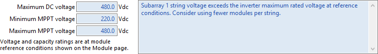
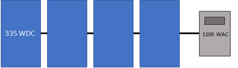
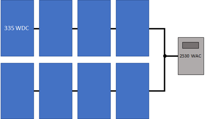
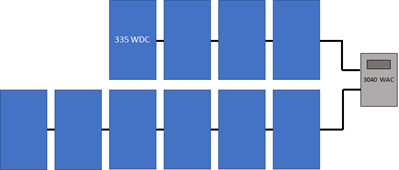
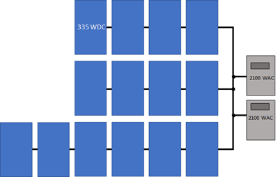
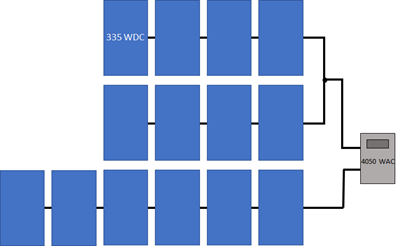
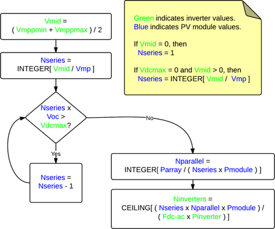

System Design
=============

Use the System Design variables to size the photovoltaic system and choose tracking options. If your system includes battery storage, configure the battery bank on the :doc:`Battery Storage <../battery-storage/battery_storage_btm>` page.

 

.. note:: See :ref:`PV Sizing and Configuration <pv-sizing>` for configuration examples and sizing tips.

Run the **System Sizing**:doc:`macro <../reference/macros>` to generate a report to help you ensure the system is sized correctly.
 
.. note:: SAM can only model systems with one type of module and one type of inverter.

.. note:: Choosing an appropriate module and inverter for your system depends on many factors, some of which are outside of the scope of SAM. Finding the right combination of inverter and module to model for your system in SAM will probably require some trial and error and iteration.

.. note:: Reference conditions depend on the conditions used to define the parameters on the :doc:`Module <pv_module>` page. For the Sandia and CEC module models, reference conditions are 1,000 W/m² incident radiation and 25ºC cell temperature

Basic Sizing Steps:

#. Choose a :doc:`module <pv_module>` and :doc:`inverter <pv_inverter>`.

#. Type a value for **Number of inverters** under **AC Sizing**.

#. For each subarray in the system, type a value for **Modules per string in subarray**, ensuring that the string's rated open-circuit voltage (Voc) does not exceed the inverter maximum MPPT voltage rating.

#. For each subarray, type a value for **Number of strings in parallel** to achieve the desired DC to AC ratio.

Alternatively, if you are modeling a system with one subarray, you can have SAM attempt to size the array automatically by clicking **Estimate Subarray 1 configuration** and entering a desired array size and DC to AC ratio.

AC Sizing
~~~~~~~~~

The AC Sizing inputs determine the AC rating of the system.

**Number of inverters**
  The total number of inverters in the system. The number of inverters determines the total AC capacity.

  SAM assumes that all inverters operate at the same voltage. This effectively assumes that for systems with multiple inverters, the inverters are connected in parallel so that the system's MPPT voltage limit ratings are the same as those of a single inverter.

.. note:: If you are modeling a system with microinverters, see :ref:`Modeling Microinverters <microinverters>` for instructions. For systems with multiple power point trackers, see :ref:`Systems with Multiple Power Point Trackers <multiplemppt>`.

**DC to AC ratio**
  The ratio of total inverter DC capacity to total AC capacity. This is a value that SAM calculates and displays for reference.

  High DC to AC ratios may result in inverter power clipping.

**Estimate Subarray 1 configuration**
  This option allows you to type a desired value for the system nameplate capacity and a desired DC to AC ratio. When you check this option, for **Desired Array Size**, type the DC capacity, and for **DC to AC Ratio**, type the ratio of nameplate capacity (DC kW) to total inverter capacity (AC kW) you want for your system.

  SAM calculates the number of modules and inverters to get as close as possible to the desired size. Use this option for a rough estimate of an array layout. For a more about sizing the system, see :ref:`PV Sizing and Configuration <pv-sizing>`  .

.. note:: The desired array size and DC to AC ratio is likely to be different from the actual nameplate capacity and DC to AC ratio because the desired array size is typically not an even multiple of the module capacity.

Sizing Summary
~~~~~~~~~~~~~~

The sizing summary variables are values SAM calculates based on the inputs you specify. Use these values to verify that the system is sized correctly.

**Nameplate DC capacity, kWdc**
  The maximum DC power output of the array at the reference conditions shown on the :doc:`Module <pv_module>`   page:

*Nameplate Capacity (kWdc) = Module Maximum Power (Wdc) × 0.001 (kW/W) × Total Modules*

  The module's maximum power rating is from the :doc:`Module <pv_module>`   page. The number of modules is the value listed under **Actual Layout**.

**Total AC capacity, kWac**
  The total inverter capacity in AC kilowatts:

*Inverter Total Capacity (kWac) = Inverter Maximum AC Power (Wac) × 0.001 (kW/W) × Number of Inverters*

  The inverter's nominal AC power rating is from the :doc:`Inverter <pv_inverter>`   page.

**Total inverter DC capacity, kWdc**
  The total inverter capacity in DC kilowatts:

*Inverter Total Capacity (kWdc) = Inverter Maximum DC Input Power (Wdc) × 0.001 (kW/W) × Number of Inverters*

  The inverter's maximum DC input power is from the the :doc:`Inverter <pv_inverter>`   page.

**Number of modules**
  The number of modules in the array:

*Total Modules = Modules per String × Strings in Parallel*

  The numbers of modules and strings are the values listed under **Actual Layout**.

**Number of strings**
  The number of strings of modules in the array.

**Total module area, m²**
  The total area in square meters of modules in the array, not including space between modules:

*Total Area (m²) = Module Area (m²) × Number of Modules*

  The area of a single module is from the :doc:`Module <pv_module>`   page.

DC Sizing and Configuration
~~~~~~~~~~~~~~~~~~~~~~~~~~~

The DC Sizing and Configuration inputs determine the size and configuration of the photovoltaic array and its orientation and tracking. The array may consist of up to four subarrays, each of which may have different string lengths, orientation, and tracking.

For more about sizing and configuration, see :ref:`PV Sizing and Configuration <pv-sizing>`.

Electrical Configuration
........................

**Enable**
  If your system has a single subarray, you do not need to enable additional subarrays. Subarray 1 is always enabled.

  If your system has more than one subarray, for example, for different sections of a roof-top array with different orientations, then you should check **Enable** for each of up to four subarrays.

**Modules per string in subarray**
  The number of modules connected in series in a single string for each subarray.

  The number of modules per string determines the subarray's open circuit string voltage (Voc) and maximum power rated string voltage (Vmp):

*Subarray Voc (V) = Module Voc (V) × Modules Per String in Subarray*

*Subarray Vmp (V) = Module Vmp (V) × Modules Per String in Subarray*

  As an initial rule of thumb, choose a number of modules per string so that the string Voc is less than the inverter's maximum DC voltage rating, and the string Vmp is between the inverter's minimum and maximum MPPT voltage rating. You can run a simulation and look at the operating voltages in the results to see how they compare to the voltage ratings. You can also use the System Sizing :doc:`macro <../reference/macros>`   to refine your design.

**Strings in parallel in subarray**
  The number of strings of modules connected in parallel to form a subarray.

  Once you specify the number of modules per string to determine the subarray's string voltage, the number of strings in parallel and number of subarrays determine the system  nameplate DC capacity in kilowatts:

*Modules per Subarray = Modules per String in Subarray × String in Parallel in Subarray*

*Total Number of Modules = Modules per Subarray × Number of Subarrays*

*Nameplate DC Capacity (kW) =  Total Number of Modules × Module Maximum Power (W) ÷ 1000 (W/kW)*

  For each subarray that has more than one string in parallel, SAM calculates the subarray voltage using the :ref:`PV subarray voltage <mismatch>`   mismatch method you choose.

**Number of modules in subarray**
  The number of modules in each subarray depends on the number of modules per string, and number of strings in parallel in each subarray:

*Number of Modules in Subarray = Modules per String in Subarray × Strings in Parallel in Subarray*

*Total Number of Modules = Sum of Number of Modules in Subarrays 1 - 4*

**String Voc at reference conditions, V**
  The open circuit DC voltage of each string of modules at the module reference conditions shown on the :doc:`Module <pv_module>`   page:

*String Voc (V) = Module Open Circuit Voltage (V) × Modules per String*

**String Vmp at reference coinditions, V**
  The DC voltage at the module maximum power point of each string of modules at the module reference conditions shown on the :doc:`Module <pv_module>`   page:

*String Vmp (Vdc) = Module Max Power Voltage (Vdc) × Modules per String*

.. _multiplemppt:

Inverter Inputs for Multiple MPPT
.................................

For systems with one inverter, when you enable more than one subarray, SAM calculates a separate operating voltage for each subarray.

By default, SAM assumes a single operating voltage at the inverter input. For systems with more than one subarray, each subarray operates at its own voltage, and the inverter input voltage is either the average of the subarray voltages or calculated using an  iterative method, depending on the method you choose for :ref:`PV Subarray Voltage Mismatch <mismatch>`.

If your system has one inverter and supports multiple maximum power point tracking, you can set **Number of MPPT inputs** on the :doc:`Inverter <pv_inverter>` page to the number of MPPTs, and assign an inverter MPPT input to each subarray so that the operating voltage at each inverter input is the same as its assigned subarray operating voltage. This feature is makes it possible to model systems with up to four subarrays with different orientations, shading, or tracking options, such as a rooftop system with groups of modules facing in different directions.

.. note:: The term "MPPT input" refers to the electrical connection to a maximum power point tracker (MPPT). The MPPT electrical circuit(s) in your system may be integrated with the inverter or in one or more separate devices. In either case, use the Number of MPPT inputs on the :doc:`Inverter <pv_inverter>` page to represent the number of MPPT circuits in your system.

To assign multiple MPPTs:

#. On the System Design page, set the number of inverters to one.

#. On the :doc:`Inverter <pv_inverter>` page, set **Number of MPPT inputs** to the number of inputs (up to four).

#. On System Design page, click **Set MPPT inputs** to automatically enable a subarray for each inverter input and assign an input number. 

There should be the same number of enabled subarrays as inverter MPPT inputs, and each subarray should have a different inverter input number. 

For example, if your system has two MPPTs, then set the number of MPPT inputs (on the Inverter page) to 2, enable two subarrays, and assign the number 1 to Subarray 1, and 2 to Subarray 2. The numbers you assign do not have to match the subarray number, but each subarray should have a unique number.

#. For each enabled subarray, set the number of modules per string and other parameters.

.. _trackingorientation:

Tracking & Orientation
......................

The tracking options allow you specify whether and how modules in each subarray follow the movement of the sun across the sky.

.. note:: SAM does not adjust installation or operating costs on the Installation costs or Operating costs pages based on the tracking options you specify. When you change the tracking option, be sure to also change costs as appropriate.

Use the following output variables to explore the effect of tracking and orientation inputs (see :doc:`Results <pv_results>` for detailed descriptions):

* **Subarray [n] Angle of incidence**

* **Subarray [n] Angle of incidence modifier**

* **Subarray [n] Axis of rotation for 1 axis trackers**

* **Subarray [n] Axis rotation ideal for 1 axis trackers**

* **Subarray [n] Surface azimuth**

* **Subarray [n] Surface tilt**

SAM also reports the sun angles, which can be helpful for comparing the array orientation to the position of the sun:

* **Sun altitude angle**

* **Sun azimuth angle**

* **Sun zenith angle**

**Fixed**
  The subarray is fixed at the tilt and azimuth angles defined by the values of **Tilt** and **Azimuth** and does not follow the sun's movement.

  .. image:: ../images/IMG_PVArray-fixed-tilt.png
     :align: center
     :alt: IMG_PVArray-fixed-tilt.png

**1 Axis**
  The subarray is fixed at the angle from the horizontal defined by the value of **Tilt** and rotates about the tilted axis from east in the morning to west in the evening to track the daily movement of the sun across the sky. **Azimuth** determines the array's orientation with respect to a line perpendicular to the equator. For a horizontal subarray with one-axis tracking and a north-south axis of rotation that rotates from east to west, use a **Tilt** value of zero and **Azimuth** value of 180 degrees.

  .. image:: ../images/IMG_PVArray-one-axis.png
     :align: center
     :alt: IMG_PVArray-one-axis.png

**2 Axis**
  The subarray rotates from east in the morning to west in the evening to track the daily movement of the sun across the sky, and north-south to track the sun's seasonal movement throughout the year. For two-axis tracking, SAM ignores the values of the **Tilt** and **Azimuth** inputs.

  .. image:: ../images/IMG_PVArray-two-axis.png
     :align: center
     :alt: IMG_PVArray-two-axis.png

**Azimuth Axis**
  The subarray rotates in a horizontal plane to track the daily movement of the sun. SAM ignores the value of the **Azimuth** input.

  .. image:: ../images/IMG_PVArray-azimuth-axis.png
     :align: center
     :alt: IMG_PVArray-azimuth-axis.png

**Tilt = Latitude**
  Assigns the latitude value stored in the weather file and displayed on the :doc:`Location and Resource <pv_location_and_resource>`   page to the tilt angle. Note that SAM does not display the tilt value on the System Design page, but does use the correct value during the simulation.

  The value of the Tilt input must be positive, so for southern latitudes, SAM sets the tilt angle to the negative value of the latitude.

   Use the **Subarray [n] Surface tilt (degrees)** output variable to confirm the behavior of the the Tilt=Latitude option. 

**Tilt, degrees**
  The array's tilt angle in degrees from horizontal, where zero degrees is a horizontal array, and 90 degrees is a vertical array. The tilt value must be between zero and 90 degrees, inclusive.

  As a rule of thumb, system designers sometimes use the location's latitude (shown on the Location and Resource page) as the optimal array tilt angle. The actual tilt angle will vary based on project requirements. You can run a :doc:`parametric analysis <../simulation-options/parametrics>`   on tilt to find its optimal value.

  The effect of the tilt angle depends on the tracking option:

* **Fixed**: The tilt angle is the angle formed between the surface of the array and a horizontal line parallel to the azimuth. An array with an azimuth angle of 180° and a tilt angle of 20° would be tilted from the horizontal at 20° facing south. An array with an azimuth angle of 0° and a tilt angle of 20° would be tilted from the horizontal at 20° facing north. For a horizontal array, use a tilt angle of zero.

* **1 Axis**: The tilt angle is the angle between the axis of rotation and the horizontal. One-axis trackers typically have a tilt angle of zero for a horizontal tracking axis.

* **2 Axis**: The Tilt input is disabled because the tracker sets the tilt and azimuth angle so the array follows the movement of the sun.

* **Azimuth Axis**: The tilt angle is fixed, and is the angle formed between the surface of the array and a line perpendicular to the bottom edge of the array.

* **Seasonal Tilt**: You can specify a fixed tilt angle for each month of the year.

**Azimuth, degrees**
  The azimuth angle in degrees determines the array's east-west orientation, where 0 = North, 90 = East, 180 = South, and 270 = West, regardless of whether the array is in the northern or southern hemisphere. The azimuth value must be greater than or equal to zero and less than 360.

  The effect of the azimuth angle depends on the tracking option:

* **Fixed**: The azimuth angle determines the direction the array faces. North of the equator, the azimuth for a south-facing array is 180 degrees. South of the equator, the azimuth for a north-facing array is 0 degrees.

* **1 Axis**: The azimuth angle determines the orientation of the rotation axis. An azimuth of 180 is for a tracker with a North-South rotation axis that rotates from East to West. When the azimuth angle is 180°, the rotation angles reported in the results are negative when the tracker faces east and positive when it faces west. When the azimuth angle is 0°, rotation angles are positive when the tracker faces east and negative when it faces west.

* **2 Axis**, **Azimuth Axis**: The Azimuth input is disabled because the tracker sets the azimuth angle so the array follows the movement of the sun.

* **Seasonal Tilt**: The azimuth definition is the same as for the Fixed option. The azimuth angle does not change for the seasonal tilt option.

**Ground coverage ratio (GCR)**
  The ratio of the photovoltaic array area to the ground area occupied by the array. For an array configured in rows of modules, the GCR is the length of the side of one row divided by the distance between the bottom of one row and the bottom of its neighboring row. Increasing the GCR decreases the spacing between rows.

  The ground coverage ratio must be a value greater than 0.01 and less than 0.99.

  SAM uses the GCR to estimate :ref:`self-shading losses <selfshading>`   for fixed and one-axis trackers, determine when to backtrack for one-axis trackers with backtracking enabled, and to estimate the array's land requirement for :doc:`installation cost <../installation-costs/cc_pv>`   calculations.

  For bifacial modules, SAM also uses the GCR to calculate irradiance on the rear of the array .

  To see the effect of the ground coverage ratio on the system's performance, after running a simulation, you can compare the time series results Nominal POA total irradiance (kW/m  \ :sup:`2`\   ) and POA total irradiance after shading only (kW/m  \ :sup:`2`\   ). You can also run a :doc:`parametric analysis <../simulation-options/parametrics>`   on the ground coverage ratio value to find its optimal value.

**Tracker Rotation Limit, degrees**
  For one-axis trackers, the maximum and minimum allowable rotation angle. A value of 45 degrees would allow the tracker to rotate 45 degrees about the center line in both directions from the horizontal.

.. _backtracking:

**Backtracking**
  Backtracking is a one-axis tracking strategy that avoids row-to-row shading.

  Without backtracking, a one-axis tracker points the modules toward at the sun. For an array with closely spaced rows, modules in adjacent rows will shade each other at certain sun angle. With backtracking, under these conditions, the tracker orients the modules away from the sun to avoid shading.

  The following diagram illustrates how backtracking avoids row-to-row shading for a simple array with two rows:

  .. image:: ../images/IMG_PVBacktracking-Description.png
     :align: center
     :alt: IMG_PVBacktracking-Description.png

Terrain Angles
..............

The terrain slope and azimuth angles describe the inclination of the ground with respect to horizontal, assuming the subarray is installed on uniformly sloped, flat land. Terrain inputs are only enabled for systems with one-axis tracking. Their effect depends on the self shading options on the :doc:`Shading and Layout <pv_shading>` page:

* Backtracking enabled: Backtracking algorithm takes the terrain angles into consideration to calculate the tracker rotation angle. 

* Linear self shading enabled: Self-shading algorithm accounts for terrain angles to calculate the shaded fraction of the array.

* Non-linear self shading enabled with no backtracking: Terrain angles do not affect the self-shading calculations.

.. note:: The terrain angles are not available for fixed (no tracking) subarrays, or subarrays with two axis, azimuth axis, or seasonal tilt tracking options.

The terrain slope model is described in Anderson, K.; Mikofski, M. (2020) Slope-aware Backtracking for Single-axis Trackers. National Renewable Energy Laboratory. 24 pp. NREL/TP-5K00-76626. (`PDF 783 KB <https://www.nrel.gov/docs/fy20osti/76626.pdf>`__), also listed at https://sam.nrel.gov/photovoltaic/pv-publications.html.

**Terrain slope, degrees (0 to 90 degrees)**
  The grade slope angle, defined as the angle between the slope plane and the horizontal plane. Zero is for horizontal ground with no slope.

**Terrain azimuth, degrees (0 to 360 degrees)**
  Grade azimuth angle, defined as the angle clockwise from north of the horizontal projection of falling slope. Zero is for a north-facing slope, or ground that slopes down toward the north.

Electrical Sizing Information and System Sizing Messages
........................................................

**Maximum DC voltage, Vdc**
  The inverter's maximum rated input DC voltage from the :doc:`Inverter <pv_inverter>`   page.

  For systems with more than one inverter, SAM assumes that inverters are connected in parallel so that the rated voltages of the inverter bank are the same as those of a single inverter.

**Minimum MPPT voltage****and****Maximum MPPT voltage, Vdc**
  The inverter minimum and maximum operating voltages, as specified by the manufacturer, from the :doc:`Inverter <pv_inverter>`   page.

The sizing messages do not prevent you from running a simulation.

The sizing messages display the following information for each subarray:

* DC to AC ratio based on the array and inverter capacities:

*Actual DC to AC Ratio = Total Nameplate Array Capacity in DC kW ÷ Total Nameplate Inverter Capacity in DC kW × 100%*

* Array string open circuit voltage exceeds inverter maximum DC voltage:

*String Voc > Inverter Maximum DC Voltage*

* Array string maximum power voltage exceeds the inverter maximum MPPT voltage:

*String Vmp > Maximum Inverter MPPT Voltage*

* Array string maximum power voltage is less than the inverter minimum MPPT voltage:

*String Vmp < Minimum Inverter MPPT Voltage*

.. _pv-landarea:

Land Area
~~~~~~~~~

.. include:: ../includes/snip_land_area_pv.rst

.. _mismatch:

PV Subarray Voltage Mismatch
~~~~~~~~~~~~~~~~~~~~~~~~~~~~
The subarray mismatch option is an advanced option that calculates the effect of voltage mismatch between subarrays for systems with two or more subarrays.

Because the number of modules per string is the same for all subarrays in the system, the subarrays have the same nominal string voltage. However, during operation each subarray is exposed to different radiation levels and wind speeds, which causes the cell temperatures in each subarray to differ. Because cell voltage depends on cell temperature, each subarray will have slightly different voltages. This voltage mismatch causes electrical losses so that the inverter input voltage is less than the array's maximum power voltage.

SAM uses two methods to estimate the inverter input voltage.

**Averaging Method (check box clear)**
  SAM calculates each subarray's output at its maximum power point voltage (Vmp), and assumes that the inverter DC input voltage is the average of the subarray Vmp values.

  This method is fast and works with both the Sandia and CEC module option.

**Iterative Method (check box checked)**
  SAM tries many string voltages to find the value that results in the maximum power from the array.  For each test voltage, it finds the current from each subarray, and adds up the currents. Then the power is the summed current times the test voltage. The test voltage that yields the maximum power is used for each subarray to calculate the total output power, and this voltage is also the inverter DC input voltage.

  This method takes on the order of 10-30 seconds for a system with two or more subarrays.

 

.. note:: The subarray mismatch option is only active with the CEC model option on the :doc:`Module <pv_module>` page.

.. note:: The iterative method typically results in lower system output over the year than the averaging method. The averaging method is a reasonable approximation of mismatch losses, and is suitable for simulations where the main metric of interest is the system's total annual output for financial analysis. The difference in annual output between the two methods is often less than one percent.

Working with Subarrays
~~~~~~~~~~~~~~~~~~~~~~
When you create a new case for the Detailed Photovoltaic model, SAM creates a system with one subarray. If you are modeling a system as a single array, you do not need to enable any other subarrays.

To model a system that consists of multiple subarrays, check **Enable** for each additional Subarray 2, 3, or 4.

For example, to configure strings for a 10 MW system consisting of SunPower SPR-305 modules, and Advanced Energy Solaron 333 inverters with two subarrays of 5 MW each with different azimuth angles:

#. On the :doc:`Module <pv_module>` and :doc:`Inverter <pv_inverter>` pages, choose the SunPower module and Solaron inverter, respectively.

#. On the :doc:`System Design <pv_system_design>` page, under **AC Sizing**, type 4 for **Number of inverters**.

#. Clear **Estimate Subarray 1 configuration**. It is not possible for SAM to automatically size a system with more than one subarray.

#. Under **DC Sizing and Configuration**, for **Subarray 1**, specify 8 modules per string and 220 strings in parallel, and an azimuth angle of 180.

#. Enable Subarray 2, and specify 8 modules per string and 220 strings in parallel for Subarray 2, and an azimuth angle of 170.

 

.. note:: You can enable any combination of subarrays. For example, you can model a system with two subarrays by enabling Subarrays 1 and 3, and disabling Subarrays 2 and 4.

.. note:: SAM can only model systems with one type of module, and one type of inverter. You cannot use subarrays to model a system that combines different types of modules or inverters.

Modeling multiple subarrays may be useful for the following applications:

* A residential or commercial rooftop system with modules installed on different roof surfaces with different orientations or string lengths.

* A ground-mounted system with groups of modules installed at different orientations, with different string lengths, DC wiring lengths, or exposed to different shading scenes or soiling conditions.

* A system that combines different tracking systems

.. _pv-sizing:

PV Sizing and Configuration
~~~~~~~~~~~~~~~~~~~~~~~~~~~
To size the system for the Detailed Photovoltaic model, you choose a module and inverter, and then specify the number of modules in a string, and number of strings in the array. You can also divide the array into sections called subarrays to model an array with modules oriented in different directions, or that use different tracking options. Sizing the system in the Detailed Photovoltaic model requires more effort, because you have to choose a appropriate module and inverter for the system, and determine the number of modules and inverters you need for a given DC capacity and DC to AC ratio while ensuring that the array voltages are within the inverter's voltage limits.

Sizing the System in the Detailed Photovoltaic Model
~~~~~~~~~~~~~~~~~~~~~~~~~~~~~~~~~~~~~~~~~~~~~~~~~~~~

SAM provides two options on the :doc:`System Design <pv_system_design>` page for specifying the numbers of modules and inverters in the PV system:

* The best way is to :ref:`specify the number of modules and inverters <manual>` yourself.

* If you are modeling a system with one subarray, you can check :ref:`Estimate Subarray 1 configuration <autosize>`, and see what values SAM calculates for the number modules per string and number of strings in parallel.

For information about how SAM models inverter clipping losses, see :ref:`Inverter Clipping Loss <clipping>`. You can run the System Sizing :doc:`macro <../reference/macros>` to generate a detailed report about clipping losses and the inverter's MPPT performance.

The following examples show how to design common system configurations in SAM. The examples show a few modules for a small system for clarity, but the same approach can be used for large systems with thousands of modules and multiple inverters. See :ref:`Microinverters <microinverters>` for a microinverter configuration example.

Example 1: One string, one inverter, one MPPT
.............................................

.. list-table::
   :width: 100%
   :align: center
   :header-rows: 1

   * - Number of MPPT inputs
     - 1
   * - Number of inverters
     - 1
   * - Modules per string in subarray 1
     - 4
   * - Strings in parallel in subarray 1
     - 1

Example 2: Two identical strings, one inverter, one MPPT
........................................................

.. list-table::
   :width: 100%
   :align: center
   :header-rows: 1

   * - Number of MPPT inputs
     - 1
   * - Number of inverters
     - 1
   * - Modules per string in subarray 1
     - 4
   * - Strings in parallel in subarray 1
     - 2

Example 3: Two different strings, one inverter, one MPPT
........................................................

.. list-table::
   :width: 100%
   :align: center
   :header-rows: 1

   * - Number of MPPT inputs
     - 1
   * - Number of inverters
     - 1
   * - Modules per string in subarray 1
     - 4
   * - Strings in parallel in subarray 1
     - 6

Example 4: Two different strings, one inverter, two MPPTs
.........................................................

.. list-table::
   :width: 100%
   :align: center
   :header-rows: 1

   * - Number of MPPT inputs
     - 2
   * - Number of inverters
     - 1
   * - Modules per string in subarray 1
     - 4
   * - Strings in parallel in subarray 1
     - 6
   * - Inverter MPPT input for subarray 1
     - 1
   * - Inverter MPPT input for subarray 2
     - 2

Example 5: Three strings (two identical), two inverters, one MPPT
.................................................................

.. list-table::
   :width: 100%
   :align: center
   :header-rows: 1

   * - Number of MPPT inputs
     - 1
   * - Number of inverters
     - 2
   * - Modules per string in subarray 1
     - 4
   * - Strings in parallel in subarray 1
     - 2
   * - Modules per string in subarray 2
     - 6
   * - Strings in parallel in subarray 2
     - 1

Example 6: Three strings (two identical), one inverter, two MPPTs
.................................................................

.. list-table::
   :width: 100%
   :align: center
   :header-rows: 1

   * - Number of MPPT inputs
     - 2
   * - Number of inverters
     - 1
   * - Modules per string in subarray 1
     - 4
   * - Strings in parallel in subarray 1
     - 2
   * - Modules per string in subarray 2
     - 6
   * - Strings in parallel in subarray 2
     - 1

.. _manual:

Specify Numbers of Modules and Inverters
~~~~~~~~~~~~~~~~~~~~~~~~~~~~~~~~~~~~~~~~
The following instructions explain one approach for choosing optimal values for the numbers of modules and inverters based on the array's expected DC output instead of its nameplate capacity.

.. note:: The System Sizing macro generates a report that you can use to compare the system's operating characteristics to design values, and generates a list of alternative modules that might work with the inverter you chose.

To specify numbers of modules and inverters by hand:

#. Choose an inverter for the system or specify its parameters on the :doc:`Inverter <pv_inverter>` page. (For microinverters, see :ref:`Modeling Microinverters <microinverters>`.). If you do not have a specific inverter in mind, either choose one with a rated maximum DC power close to the array size you want to model, or choose one with a maximum AC power that is your desired array DC capacity divided by your desired DC to AC ratio.

#. Choose a module or specify its parameters on the :doc:`Module <pv_module>` page. If you do not have a specific module in mind, use the default module.

#. On the :doc:`System Design <pv_system_design>` page, under **AC Sizing**, for **Number of Inverters**, type 1.

#. Under **DC Sizing and Configuration**, for Subarray 1, type a value for **Modules per string in subarray** that results in a string open circuit voltage (**String Voc**) less than but as close as possible to the inverter's maximum DC input voltage, and greater than the inverter's minimum MPPT voltage. For an initial estimate, you can try an integer value less than:

*Modules per String = [ ( Minimum MPPT Voltage + Maximum MPPT Voltage ) ÷ 2 ] ÷ Module Maximum Power Voltage*

If the resulting string open circuit DC voltage (**String Voc**) is greater than the inverter's maximum DC voltage, reduce the number of modules per string. You may also want to try a similar module or inverter with slightly lower or higher maximum power.

#. For **Strings in Parallel in subarray**, type a value that results in an array nameplate capacity that is close to your desired system DC capacity. You can choose an integer value close to the value:

*Strings in Parallel = Array Nameplate Capacity (kWdc) × 1000 (W/kW) ÷ Module Maximum Power (Wdc) ÷ Modules Per String*.

#. Depending on the inverter you chose, you may need to modify the number of inverters to match the array size.

*Number of Inverters = ( Modules per String × Strings in Parallel × Module Maximum Power (Wdc) ) ÷ ( DC-to-AC Ratio × Inverter Maximum AC Power (Wac) )*

You may need to experiment with different sizes of modules and inverters within the same family to find a combination that works for your system.

#. Under **Tracking & Orientation**, specify the tracking and orientation and ground coverage ratio as appropriate.

#. On the :doc:`Losses <pv_losses>` page, specify any losses.

#. :doc:`Run a simulation <../getting-started/run_simulations>`. See below for details about any simulation :doc:`notices <../results/notices>`.

#. On the :doc:`Results <../getting-started/results_page>` page, check the :doc:`energy yield <../performance-metrics/mtp_kwhkwyear1>` (kWh/kW) in the :doc:`Metrics table <../results/summary>` to make sure it is a reasonable value. (For example, the energy yield for the default system based on mono-crystalline modules in Phoenix, Arizona is about 1,850 kWh/kW.) If it seems too low, check that the total inverter capacity is not too low and limiting the system's AC output. If it is, you may want to try using a larger inverter, fewer modules, or a module from the same family with slightly lower capacity.

#. Also on the Results page, click the :doc:`Time Series <../results/timeseries>` tab.

Display the Hourly Energy variable. This is the system's AC output in kWh/h. You can use this information to decide whether to reduce the inverter capacity. For example if you specified a 400 kW inverter capacity, but the time series data indicates the system rarely operates at that level, you could try reducing the number of inverters to model a system with 315 kW of inverter capacity to reduce the system's installation cost.

Display the Subarray 1 open circuit voltage and operating voltage variables. You can use these to verify that the array voltage does not exceed your design voltage limits.

#. Adjust the numbers of inverters, modules per string, and strings in parallel, and run more simulations until you are satisfied with the cost and performance of the system.

.. _autosize:

Estimate Subarray 1 Configuration
~~~~~~~~~~~~~~~~~~~~~~~~~~~~~~~~~
This option is appropriate for very preliminary analyses to get a rough idea of a system's annual output, or as a first step in determining the number of modules per string, strings in parallel, and number of inverters for your system.

.. note:: SAM's array sizing calculator works best for systems with a nameplate DC capacities of greater than about 20 kW. In only works for systems with one subarray (Subarray 1).

The array sizing calculator estimates the number of modules and inverters required for the array size and DC-to-AC ratio that you specify. It uses the nominal specifications of the modules and inverters from the :doc:`Module <pv_module>` and :doc:`Inverter <pv_inverter>` pages to calculate values for the numbers of modules per string, strings in parallel, and inverters. Because SAM makes the calculation before running a simulation, it has no information about the expected output of the array for these calculations. However, SAM does display :doc:`notices <../results/notices>` based on the expected output of the photovoltaic array and inverter that you can use to refine the array size.

To size the photovoltaic array with the array sizing assistant:

#. Choose an inverter or specify its parameters on the :doc:`Inverter <pv_inverter>` page. (For microinverters, see :ref:`Modeling Microinverters <microinverters>`.)

#. Choose a module or specify its parameters on the :doc:`Module <pv_module>` page.

#. On the :doc:`System Design <pv_system_design>` page, under **AC Sizing**, check **Estimate Subarray 1 configuration**..

#. Type the array DC capacity value in kilowatts for **Desired array size**.

#. Type the ratio of DC array capacity to AC inverter capacity for **Desired DC to AC ratio**.

SAM calculates and displays values for **Modules per String**, **Strings in Parallel**, and **Number of Inverters**

#. Verify that **Nameplate Capacity** under **Modules** and **Total capacity** under **Inverters** are acceptably close to the desired values, and check the sizing messages for any information to help you adjust your assumptions.

If the capacity is not as close to the desired value, you can try choosing a slightly smaller or larger module or inverter to get closer to the desired capacity. Because these capacity values are based on a multiple of the module and inverter capacities, SAM will probably not be able to suggest a system with your exact nameplate capacity value.

#. If the values for the inverter maximum DC voltage, or inverter minimum MPPT voltage and maximum MPPT voltage are zero, see the note below.

#. Under **Tracking & Orientation**, choose options to specify the module tracking, orientation and ground coverage ratio as applicable.

#. On the Losses page, specify any DC or AC losses. You can use default values if you do not have specific loss values for your system design.

.. _pv-sizingalgorithm:

PV Array Sizing Calculator Algorithm
....................................

The array sizing calculator uses the following algorithm to determine the number of modules and inverters in the array:

#. Choose an initial number of modules per string that results in a string maximum power voltage close to the midpoint between the inverter minimum MPPT voltage and maximum MPPT voltage.

#. If the resulting string open circuit voltage exceeds the inverter maximum DC input voltage, reduce the number of modules per string by one until the string voltage is less than the inverter limit.

#. Calculate the number of strings in parallel required to meet the desired array capacity.

#. Calculate the number of inverters required to meet the DC-to-AC ratio you specify.

The algorithm uses the following rules to size the array:

* The string open circuit voltage (Voc) is less than the inverter's maximum DC voltage.

* The ratio of the array's nameplate capacity in DC kW to the inverter total capacity in AC kW is close to the DC-to-AC ratio that you specify.

For the inverters in the CEC database with missing voltage limits:

* If the inverter minimum MPPT voltage and maximum MPPT voltage values are not available, then the number of modules per string is one.

* If the inverter maximum DC voltage is not available, but the minimum and maximum MPPT voltage values are, then the number of modules in series is determined from the MPPT voltage limits and the module maximum power voltage (see flowchart for details).

Where

.. list-table::
   :width: 100%
   :align: center

   * - *Vdcmax*
     - Inverter maximum DC voltage
   * - *Vmppmin*
     - Inverter minimum MPPT voltage
   * - *Vmppmax*
     - Inverter maximum MPPT voltage
   * - *Vmid*
     - Midpoint between inverter minimum and maximum MPPT voltages
   * - *Pinverter*
     - Inverter maximum AC power
   * - *Fdc-ac*
     - DC-to-AC ratio
   * - *Voc*
     - String open circuit voltage
   * - *Vmp*
     - String maximum power voltage
   * - *Pmodule*
     - Module maximum DC power
   * - *Nseries*
     - Number of modules in series
   * - *Nparallel*
     - Number of strings in parallel   * - 