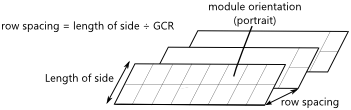
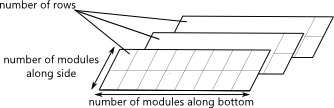

Tracking Layout Land
====================

The Tracking Layout Land inputs are for array tracking and orientation, physical layout, and land area calculations.

.. note:: SAM does not adjust installation or operating costs on the Installation costs or Operating costs pages based on the Tracking and Orientation, Row Dimensons and Spacing, or Terrain Slope inputs, so you should adjust the cost inputs as appropriate. For example, if you change the tracking option from **Fixed** to **One-axis tracking**, you should also change installation and operating costs to account for differences in equipment, labor, and maintenance costs.

   If you specify land-related costs in $/acre on the Installation Costs page, the land area estimate does affect the total installed cost. Similarly, if you specify or land lease costs on the Operating Costs page (available for front-of-meter financial models), the land area estimate affects project operating expenses.

Subarrays
~~~~~~~~~

To enable and disable subarrays, use the check boxes under "Subarrays" on the :doc:`pv_system_size` page.

.. _trackingorientation:

Tracking and Orientation
~~~~~~~~~~~~~~~~~~~~~~~~

The tracking options allow you specify whether and how modules in each subarray follow the movement of the sun across the sky.

.. tip:: Use the following output variables to explore the effect of tracking and orientation inputs (see :doc:`pv_results` for detailed descriptions):

   * **Subarray [n] Angle of incidence**
   * **Subarray [n] Angle of incidence modifier**
   * **Subarray [n] Axis of rotation for 1 axis trackers**
   * **Subarray [n] Axis rotation ideal for 1 axis trackers**
   * **Subarray [n] Surface azimuth**
   * **Subarray [n] Surface tilt**

   SAM also reports the sun angles, which can be helpful for comparing the array orientation to the position of the sun:

   * **Sun altitude angle**
   * **Sun azimuth angle**
   * **Sun zenith angle**

**Fixed**
  The subarray is fixed at the tilt and azimuth angles defined by the values of **Tilt** and **Azimuth** and does not follow the sun's movement.

  .. image:: ../images/IMG_PVArray-fixed-tilt.png
     :align: center
     :alt: IMG_PVArray-fixed-tilt.png

**One-axis tracking**
  The subarray is fixed at the angle from the horizontal defined by the value of **Tilt** and rotates about the tilted axis from east in the morning to west in the evening to track the daily movement of the sun across the sky. **Azimuth** determines the array's orientation with respect to a line perpendicular to the equator. For a horizontal subarray with one-axis tracking and a north-south axis of rotation that rotates from east to west, use a **Tilt** value of zero and **Azimuth** value of 180 degrees.

  .. image:: ../images/IMG_PVArray-one-axis.png
     :align: center
     :alt: IMG_PVArray-one-axis.png

**Two-axis tracking**
  The subarray rotates from east in the morning to west in the evening to track the daily movement of the sun across the sky, and north-south to track the sun's seasonal movement throughout the year. For two-axis tracking, **Tilt** and **Azimuth** are disabled.

  .. image:: ../images/IMG_PVArray-two-axis.png
     :align: center
     :alt: IMG_PVArray-two-axis.png

**Azimuth tracking**
  The subarray rotates in a horizontal plane to track the daily movement of the sun. **Azimuth** is disabled.

  .. image:: ../images/IMG_PVArray-azimuth-axis.png
     :align: center
     :alt: IMG_PVArray-azimuth-axis.png

**Seasonal tilt**
  Equivalent to **Fixed**, but allows you to set a different tilt angle for each month of the year. See **Seasonal tilt angles** below.

**Tilt=latitude**
  Assigns the latitude value stored in the weather file and displayed on the :doc:`pv_location_and_resource` page to the tilt angle. Note that SAM does not display the tilt value on the System Design page, but does use the correct value during the simulation.

  The value of the Tilt input must be positive, so for southern latitudes, SAM sets the tilt angle to the negative value of the latitude.

  Use the **Subarray [n] Surface tilt (degrees)** output variable to confirm the behavior of the the Tilt=Latitude option. 

**Tilt angle, degrees**
  The array's tilt angle in degrees from horizontal, where zero degrees is a horizontal array, and 90 degrees is a vertical array. The tilt value must be between zero and 90 degrees, inclusive.

  As a rule of thumb, system designers sometimes use the location's latitude (shown on the Location and Resource page) as the optimal array tilt angle. The actual tilt angle will vary based on project requirements. You can run a :doc:`parametric analysis <../simulation-options/parametrics>` on tilt to find its optimal value.

  The effect of the tilt angle depends on the tracking option:

  * Fixed and seasonal tilt: The tilt angle is the angle formed between the surface of the array and a horizontal line parallel to the array azimuth. An array with an azimuth angle of 180° and a tilt angle of 20° would be tilted from the horizontal at 20° and face south. An array with an azimuth angle of 0° and a tilt angle of 20° would be tilted from the horizontal at 20° and face north. For a horizontal array, use a tilt angle of zero.

  * One-axis tracking: The tilt angle is the angle between the tracker's axis of rotation and the horizontal. One-axis trackers typically have a tilt angle of zero for a horizontal tracking axis.

  * Two-axis tracking: The tilt angle input is disabled. SAM calculates the tilt and azimuth angle in each simulation time step based on sun angles.

  * Azimuth tracking: The tilt angle is fixed, and is the angle formed between the surface of the array and a horizontal line perpendicular to the bottom edge of the array.

**Seasonal tilt angles, degrees**
  Enabled for the **Seasonal tilt** option. Click **Edit values** to enter a tilt angle value for each month of the year. (The azimuth angle does not change by month.)

**Azimuth angle, degrees**
  The azimuth angle in degrees determines the array's east-west orientation, where 0 = North, 90 = East, 180 = South, and 270 = West, regardless of whether the array is in the northern or southern hemisphere. The azimuth value must be greater than or equal to zero and less than 360.

  The effect of the azimuth angle depends on the tracking option:

  * Fixed and seasonal tilt: The azimuth angle determines the direction the array faces. North of the equator, the azimuth for a south-facing array is 180 degrees. South of the equator, the azimuth for a north-facing array is 0 degrees.

  * One-axis tracking: The azimuth angle determines the orientation of the rotation axis. An azimuth of 180 is for a tracker with a North-South rotation axis that rotates from East to West. When the azimuth angle is 180°, the rotation angles reported in the results are negative when the tracker faces east and positive when it faces west. When the azimuth angle is 0°, rotation angles are positive when the tracker faces east and negative when it faces west.

* Two-axis tracking and azimuth tracking: The Azimuth input is disabled. SAM calculates the tilt and azimuth angle in each simulation time step based on sun angles.

**Tracker Rotation Limit, degrees**
  For one-axis trackers, the maximum and minimum allowable rotation angle. A value of 45 degrees would allow the tracker to rotate 45 degrees about the center line in both directions from the horizontal. The tracker rotation limit must be between 0 and 85 degrees.

.. _backtracking:

**Backtracking**
  Backtracking is enabled for one-axis tracking only.

  Without backtracking, a one-axis tracker points the modules toward at the sun. For an array with closely spaced rows, modules in adjacent rows will shade each other at certain sun angles. With backtracking, under these conditions, the tracker orients the modules away from the sun to avoid shading.

  The following diagram illustrates how backtracking avoids row-to-row shading for a simple array with two rows:

  .. image:: ../images/IMG_PVBacktracking-Description.png
     :align: center
     :alt: IMG_PVBacktracking-Description.png

.. _arraydimensions:

Row Dimensions and Spacing
~~~~~~~~~~~~~~~~~~~~~~~~~~

SAM needs basic information about the arrangement of modules and rows in each subarray to model the effects of self shading and snow cover, and to calculate irradiance on the back of the array for bifacial modules.

The number of modules in the array and its electrical layout is defined on the :doc:`pv_system_size` page.

SAM assumes that each subarray is a rectangle of modules. For a subarray with more than one row, it assumes that rectangular rows have the same dimensions and row spacing. 

Dimensions from Module Page
---------------------------

The module dimensions from the :doc:`pv_module` page are shown here to help you determine values for row dimensions or row spacing.

**Module width, m**
  The width of the short side of a single module.

**Module length, m**
  The length of the long side of a single module.

**Module area, m²**
  The area of a single module.

**Module aspect ratio**
  The ratio of the module length to module width. 

Row Dimensions
--------------

The row dimension inputs determine the physical layout of each subarray. They are used for self shading, snow loss, and bifacial module calculations.

Row dimension inputs are disabled for the **Specify GCR** option.

.. note:: For a residential rooftop system or other system with modules in a single plane that are not arranged in rows, set the number of modules along side and bottom of row so that the number of rows is one.

**Module orientation**
  The module orientation determines whether the short or long side of the module is parallel to the ground, or at the bottom of the array.

  * Portrait: The short end of the module is parallel to the ground.

  * Landscape: The long end of the module is parallel to the ground.

**Number of modules in subarray**
  The total number of modules in each subarray, the product of the number of modules per string and strings in parallel in the subarray from the :doc:`pv_system_size` page.

**Number of modules along side of row**
  The number of modules along the edge of the row perpendicular to the row's bottom as defined below.

**Number of modules along bottom of row**
  The number of modules along the bottom of a row. For a tilted row, the bottom is the edge of the row nearest to the ground.

  For fixed arrays, the bottom edge is perpendicular to the azimuth angle. For example, for a fixed array in the northern hemisphere and an azimuth angle of 180 degrees, the bottom of the row is the southernmost edge of the row.

  For arrays with one-axis tracking, the bottom edge is parallel to the tracking axis, which is determined by the azimuth angle. For example, for a one-axis tracking array with an azimuth angle of 180 degrees, the bottom of each row is the edge closest to the east in the morning.

**Number of rows**
  The number of rows given the number of modules in the subarray and the number of modules along the side and bottom of row.

  *Number of Rows = Number of Modules in Subarray ÷ Number of Modules along Side ÷ Number of Modules along Bottom*

  To model a realistic rectangular arrangement of modules, the number of rows should be an integer. If the number of is not an integer, SAM generates a simulation message but  still runs and generate results.

.. note:: A subarray with only one row will not experience any self shading.

Row Spacing
-----------

The row spacing inputs determine the distance between rows of modules in each subarray. You can either specify the row spacing explitly or use the ground coverage ratio (GCR) to specifiy row spaing.

SAM uses row spacing to estimate :ref:`self-shading losses <pvselfshading>` for fixed and one-axis trackers, determine when to backtrack for one-axis trackers with backtracking enabled, and to estimate the array's land requirement for :doc:`installation cost <../installation-costs/cc_pv>` calculations.

For bifacial modules, SAM also uses row spacing to calculate irradiance on the rear of the array .

To see the effect of row spacing on the system's performance, after running a simulation, you can compare the time series results Nominal POA total irradiance (kW/m²) and POA total irradiance after shading only (kW/m²). You can also run a :doc:`parametric analysis <../simulation-options/parametrics>` on the ground coverage ratio value to find its optimal value.

**Specify row spacing**
  Choose this option to specify the row spacing in meters. SAM calculates the GCR.

**Specify GCR**
  Choose this option to specify the row spacing using the GCR. SAM calculates the row spacing.

**GCR**
  The ratio of the subarray area to the ground area occupied by the subarray. Increasing the GCR decreases the spacing between rows.

  The ground coverage ratio must be a value greater than 0.01 and less than 0.99.

  SAM assumes that the subarray consists of uniform recangular rows of modules, so the GCR is the length of the side of a row divided by the distance between the bottom of the row and the bottom of its neighboring row.

  *row spacing estimate = length of side ÷ GCR*

  **Row spacing, m**
  The distance in meters between the bottom of any two rows in the subarray.

**Length of side, m**
  The length of the side of a row. The bottom of the row is parallel to the ground, and the side is perpendicular to the bottom.

  For portrait module orientation:

  *length of side = module length × number of modules along side of row*

  For landscape module orientation:

  *length of side = module width × number of modules along side of row*

Terrain Slope
~~~~~~~~~~~~~

The terrain slope and azimuth angles describe the inclination of the ground with respect to horizontal, assuming the subarray is installed on uniformly sloped, flat land. Terrain inputs are only enabled for systems with one-axis tracking. Their effect depends on the self shading options on the :doc:`pv_soiling_shading_snow` page:

* Backtracking enabled: Backtracking algorithm takes the terrain angles into consideration to calculate the tracker rotation angle. 

* Linear self shading enabled: Self-shading algorithm accounts for terrain angles to calculate the shaded fraction of the array.

* Non-linear self shading enabled with no backtracking: Terrain angles do not affect the self-shading calculations.

.. note:: The terrain angles are not available for fixed (no tracking) subarrays, or subarrays with two-axis, azimuth, or seasonal tilt tracking options.

The terrain slope model is described in Anderson, K.; Mikofski, M. (2020) Slope-aware Backtracking for Single-axis Trackers. National Renewable Energy Laboratory. 24 pp. NREL/TP-5K00-76626. (`PDF 783 KB <https://www.nlr.gov/docs/fy20osti/76626.pdf>`__), also listed at https://sam.nlr.gov/photovoltaic/pv-publications.html.

**Terrain slope, degrees (0 to 90 degrees)**
  The grade slope angle, defined as the angle between the slope plane and the horizontal plane. Zero is for horizontal ground with no slope.

**Terrain azimuth, degrees (0 to 360 degrees)**
  Grade azimuth angle, defined as the angle clockwise from north of the horizontal projection of falling slope. Zero is for a north-facing slope, or ground that slopes down toward the north.

.. _pv-landarea:

Land Area Estimate
~~~~~~~~~~~~~~~~~~

.. include:: ../includes/snip_land_area_pv.rst
