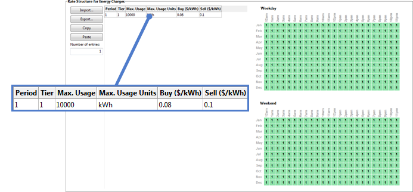
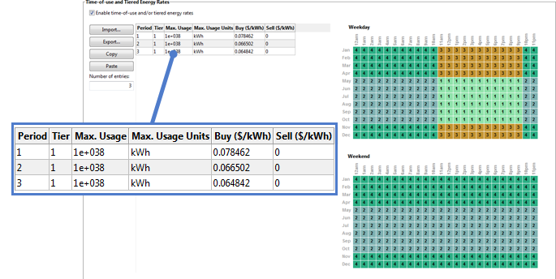
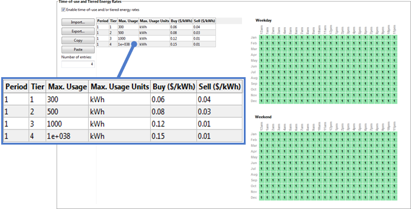
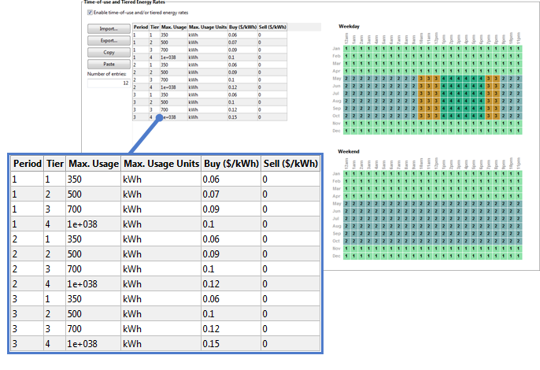

Electricity Rates
=================

The electricity rate inputs determine how the project is compensated for electricity generated by the renewable energy system for the residential, commercial, and third party ownership financial models.

For the **residential and commercial** financial models, SAM assumes that the electricity customer owns and operates the system. Electricity generated by the system reduces the customer's electricity bill by offsetting purchases of electricity from an electric service provider to meet a building or facility's :doc:`electric load <electricity_load>`. For these models, it reports the :doc:`electricity bill savings <../financial-metrics/mtf_revenues>` and the project's :doc:`net present value (NPV) <../financial-metrics/mtf_npv>`.

For the **third party ownership model**, SAM assumes that a third party owns and operates the renewable energy system. The host is the electricity customer and benefits from the reduction in the electricity bill. SAM reports the value of these savings, accounting for the cost of the third party agreement as the project's :doc:`NPV <../financial-metrics/mtf_npv>`.

In order to calculate the electricity bill savings, SAM calculates the both the electricity bill required to meet the electric load without the renewable energy system and the bill with the system, assuming the same rate structure for both cases. For details, see :doc:`electricity bill results <electricity_bill_results>`.

.. note:: If you are modeling a rate switching scenario, where the electricity rate structure for the electricity bill without the system is different from the rate structure for the bill with the system, you can use the **Value of RE** :doc:`macro <../reference/macros>` to specify two different electricity rates and calculate key metrics based on the results of two separate simulations.

Electricity Rates and Self Consumption
......................................

For photovoltaic systems with inverters that consume power at night or concentrating power systems (CSP) with night-time parasitic loads, the system may generate net negative power at night or during other times that the system is not generating power. For behind-the-meter projects, the cost of this power is included in the energy charge portion of the monthly electricity bill. For front-of-meter projects with or without batteries, the cost of this power is treated as a tax-deductible operating expense at prices determined by inputs on the :doc:`Electricity Purchases <electricity_purchases>` page.

.. _electricity-rates-overview:

Overview
~~~~~~~~

SAM's rate structure model is designed to have enough detail to model most features found on electricity service providers' rate sheets, but not so many details to make it too complicated to use. For example, SAM has a single fixed monthly charge input, while a rate sheet might have several fixed charges. To model those charges in SAM, you would add them up to a single value. SAM's rate structure model is also designed to be compatible with the OpenEI Utility Rate Database, so the inputs for fixed charges, energy and demand rates follow the data structure of the online database. There may be some features of your service provider's rate structure that SAM cannot model.
 
.. note:: SAM can import retail electricity rate data from the online `OpenEI Electric U.S. Utility Rate Database <http://en.openei.org/wiki/Utility_Rate_Database>`__ database.

.. note:: All rates and charges on the Electricity Rates page are in Year 1 dollars. SAM applies both the inflation rate from the :doc:`Financial Parameters <../financial-parameters/fin_overview>` page and the optional electricity bill escalation rate to calculate the electricity bill in Years 2 and later.

.. note:: The electricity rate calculations work with the data from the :doc:`Electric Load <electricity_load>` page. Be sure to specify a load that is appropriate for your project. Choose the No Load option on the Electric Load page only if your project sells all of the power it generates at the sell rates specified on the Electricity Rates page. The No Load option in combination with net metering results in a project that sells no power because the sell rate is set to zero for net metering.

.. note:: The electricity bill does not affect the project's :doc:`levelized cost of energy (LCOE) <../financial-metrics/mtf_lcoe>`, because the LCOE accounts for the cost of installing and operating the renewable energy system, but not the cost supplying electricity to the building or facility. The electricity bill does affect the project :doc:`net present value (NPV) <../financial-metrics/mtf_npv>`, :doc:`payback period <../financial-metrics/mtf_payback>`, and :doc:`net savings <../financial-metrics/mtf_revenues>`.

.. note:: SAM assumes that the first day of the year is Monday, January 1 and does not account for leap years or for daylight savings time. (The last day is Monday, December 31).

.. _electricity-rates-glossary:

Electricity Rates Glossary
~~~~~~~~~~~~~~~~~~~~~~~~~~

The language used to describe electricity rate structures and compensation for electricity generated by renewable energy systems depends on context. For example, some documents use the terms "net metering" and "net billing" to describe policies for compensating system owners for excess generation, while others use them to describe meter reading and billing processes. Those terms are also sometimes used to describe the same type of policy, and sometimes to differentiate between policies. This glossary defines terms as they are used in this documentation and in the SAM user interface.

**Consumption**
  Electricity delivered by the grid to the load and to meet system power requirements when the system is not generating power, such as for inverter standby power. For systems with battery storage, consumption includes electricity delivered by the grid to charge the battery bank.

**Billing demand**
  A value in kW representing the billable peak demand over a given period. The billing demand may be the maximum consumption over a month, over a time-of-use period and tier within a month, or over a lookback period of more than one month. The billing demand may equal to the actual maximum consumption over the period, or calculated as a percentage of the actual maximum consumption.

**Excess generation**
  Generation in excess of the load delivered to the grid over some period of time. Depending on the option you choose, excess generation for each month may be calculated by subtracting the total monthly load from the total monthly generation, or by subtracting the load from generation in each hourly (or subhourly) time step. For rate structures with time-of-use rates, excess generation is calculated for each time-of-use period in a given month. 

  SAM reports excess generation for the net energy metering option as **Excess generation** in kilowatt-hours per month. For the net billing options that calculate excess generation on a time step basis, SAM reports excess generation as **Electricity to grid from system** in kilowatts for each time step.

.. note:: SAM reports both **Excess generation** and **Electricity to grid from system** regardless of the billing option. Keep in mind that **Excess generation** is only used in the bill calculation for the net energy metering option and **Electricity to grid from system** is only used for the net billing options.

**Flat rate**
  A constant rate that does not change with hour of day or month of year.

**Generation**
  Electricity delivered by the power system to the load, grid, or both. For systems with batteries, generation includes electricity discharged to the grid and/or load from the battery bank.

**Grid**
  Source of electricity delivered by the electricity service provider.

**Load**
  Electricity used by a residential or commercial building (or commercial facility). It may be supplied by the renewable energy system, grid, or both. For systems with battery storage, the load may also be supplied by the battery.

**Tiered rate**
  A rate that changes with cumulative consumption over a month or time-of-use period. For example, an energy rate with two monthly tiers might charge $0.10/kWh for the first 500 kWh consumed in a month, and $0.20/kWh for any kWh in excess of 500 kWh.

**Time-of-use (TOU) rate**
  A rate that changes with hour of day and/or month of year.

Rate Structure Definitions
~~~~~~~~~~~~~~~~~~~~~~~~~~

SAM's monthly electricity bill calculator includes the features listed below. The total monthly bill is the sum of fixed, energy, and demand charges for each month.

* **Fixed charge**: A fixed amount in dollars that the project pays each month. This amount is added to any other charges to calculate the monthly bill.

* **Minimum charge**: When the total monthly or annual bill amount falls below the minimum monthly charge or minimum annual charge, the minimum charge applies instead of the smaller amount.

* **Flat, time-of-use, and tiered energy rates**: Energy rates in dollars per kilowatt-hour ($/kWh) that may vary with hour of day and month of year, cumulative consumption, or both.

* **Flat, time-of-use, and tiered demand rates**: Monthly fees in dollars per kilowatt ($/kW) paid by the project for the billing demand. Demand charges may be flat (constant), vary with hour of day and month of year, or vary with monthly cumulative consumption.

* **Annual escalation rate**: Applies to the total annual electricity bill in Years 2 and later of the project cash flow in addition to the inflation rate from the :doc:`Financial Parameters <../financial-parameters/fin_overview>` page. Note that all rates and charges on the Electricity Rates page are in Year 1 dollars.

.. _electricity-rates-meteringbilling:

Metering and Billing Definitions
~~~~~~~~~~~~~~~~~~~~~~~~~~~~~~~~

SAM can model five different methods for compensating the system owner for excess generation. These methods are suitable for modeling net metering, net billing, and feed-in tariff policies. Those policies are defined differently in different jurisdictions. You can use the descriptions below to determine which method is best for your application.

To see how the metering and billing options affect the monthly bill calculation, use the :doc:`Data Tables <../results/data>` tab on the Results page to display the monthly output variables **shown in bold** in the descriptions below.

The terms used in the descriptions below are defined in the :ref:`Electricity Rates Glossary <electricity-rates-glossary>` above. The metering and billing category names are from Zinamen, O. et al. (2017) Grid-Connected Distributed Generation: Compensation Mechanism Basics. NREL/BR-6A20-68469. (`PDF 861 KB <https://www.nrel.gov/docs/fy18osti/68469.pdf>`__)

**Net energy metering**

* Excess generation in kilowatt-hours, **Excess generation (kWh/mo)**, is   the difference between total monthly generation and total monthly load.

* For months with excess generation, the excess is "rolled over" to the next month's bill, effectively reducing the billable kilowatt-hours in that month.

* For a month when the excess generation rolled over from the previous month exceeds the total consumption in the current month, the remaining excess generation rolls over to the next month.

* If time-of-use periods apply to the energy rates, for excess generation that rolls over to a month with different periods, such as from a winter month to a summer month, SAM uses the period numbers at 12 a.m., 6 a.m., 12 p.m. and 6 p.m. for the current month to determine how to assign the excess generation to periods in the next month. See the **Electricity exports** data in the Electricity Rate by Tier and Period tables in the :doc:`electricity bill results <electricity_bill_results>`.

* Net excess generation at the end of the annual true-up period is credited to the electricity bill for the month at the end of the period, and shown as **Net annual true-up payments ($/mo)** in the monthly :doc:`electricity bill results <electricity_bill_results>`. The true-up payment amount is determined by the compensation rate for net excess generation and the **Net metering cumulative credit for annual-true-up (kWh)** in the true-up month. For the purpose of annual net excess compensation, monthly excess generation is calculated from the monthly total generation and load, regardless of time-of-use (TOU) periods. When **Roll over net excess compensation to future bills** is enabled, the true-up amount is credited to future bills as **Net metering credit ($/mo)** instead of treated as a payment in the true-up month.

**Net energy metering with $ credits**

* Excess generation in kilowatt-hours   is the difference between total monthly generation and total monthly load.

* For months with excess generation, the dollar value of the excess generation, **Net metering credit ($/mo)**, is credited to the energy charge portion of next month's bill, reducing the bill amount in that month. The net metering credit may not exceed the energy charge amount.

* The value of the credit is determined by the sell rate(s) for energy charges. If time-of-use or tiered rates apply, excess generation accumulates over the month by time-of-use period and tier, and SAM applies the appropriate sell rate to the total excess generation for each period and tier.

* For a month when the credit exceeds the energy charge amount in the current month, the remaining credit is applied to the next month's bill.

* If time-of-use periods apply to the energy rates, when the periods for next month are different than for this month, such as going from a winter month to a summer month, SAM uses the period numbers at 12 a.m., 6 a.m., 12 p.m. and 6 p.m. for the current month to determine how to assign the credit to periods in the next month.

* Any credit remaining at the end of the true-up period is credited to the electricity bill for the month at the end of the period and shown as **Net annual true-up payments ($/mo)**.

**Net billing**

* Excess generation is the sum of differences between generation and load in each time step over the month. Positive values of **Electricity to/from grid (kWh)** time series (hourly or subhourly) results on the Data Tables tab of the Results page show excess generation.

* For months with excess generation, the dollar value of the excess generation, **Net billing credit ($/mo)** is credited to the energy charge portion of each month's bill.

* The value of the credit is determined by the sell rate. If time-of-use or tiered rates apply, excess generation accumulates over the month by time-of-use period and tier, and SAM applies the appropriate sell rate to the monthly total excess generation for each period and tier. Buy and sell rates can be defined on an hourly or subhourly basis instead of using hour-by-month schedules.

* For a month when the credit exceeds the total billable amount, the bill is negative, representing a cash payment to the system owner.

**Net billing with carryover to next month**

* Excess generation is the sum of differences between generation and load in each time step over the month. Positive values of **Electricity to/from grid (kWh)** time series (hourly or subhourly) results on the Data Tables tab of the Results page show excess generation.

* For months with excess generation, the **Net billing credit ($/mo)** is credited to next month's bill except when **Apply earned credits to current month before rollover** is enabled.. 

* If **Apply earned credits to current month before rollover** is enabled, the credit earned this month and any remaining credit rolled over from previous month is applied to the energy charge portion of the bill for the current month. Any credit in excess of the energy portion of the bill is credited to the next month's bill, except when the current month is at the end of the true-up period, in which case the credit expires and is not applied.

* The value of the credit is determined by the sell rate. If time-of-use or tiered rates apply, excess generation accumulates over the month by time-of-use period and tier, and SAM applies the appropriate sell rate to the monthly total excess generation for each period and tier.

* For a month when the credit from the previous month exceeds the total billable amount for the current month, the remaining amount is credited to the next month.

* Any credit remaining at the end of the true-up period is the **Net annual true-up payments ($/mo)** credited to the electricity bill for the month at the end of the period unless **Accrued credits expire at the end of true-up month** is enabled, in which case the remaining credit expires and is not applied.

* If time-of-use periods apply to the energy rates, when the periods for next month are different than for this month, such as going from a winter month to a summer month, SAM uses the period numbers at 12 a.m., 6 a.m., 12 p.m. and 6 p.m. for the current month to determine how to assign the credit to periods in the next month.

**Buy all / sell all**

* All generation is sold to the grid and all consumption is purchased from the grid. There is no excess generation.

* The monthly electricity bill is the sum of hourly (or subhourly) purchases. See **Electricity sales/purchases with system ($)** in the hourly :doc:`electricity bill results <electricity_bill_results>`.

* **Buy all sell all electricity sales to grid ($/mo)** in the monthly electricity bill results is the value of generation sold to the grid at the appropriate sell rate(s).

* **Energy charge with system ($/mo)** is the value of consumption purchased from the grid at the appropriate buy rate(s).

* If tiers apply, generation and consumption accumulate separately to determine the buy and sell rate that applies to each block of electricity.

OpenEI Utility Rate Database
~~~~~~~~~~~~~~~~~~~~~~~~~~~~

NREL's Open Energy Information (OpenEI) `Utility Rate Database (URDB) <https://openei.org/wiki/Utility_Rate_Database>`__ hosts a database of retail electricity rate structures for electric service providers in the United States and some other countries. SAM allows you to search the database and import rate structure data from the database to the input variables on the Electricity Rates page. SAM accesses `Version 8 of the URDB API <https://openei.org/services/doc/rest/util_rates/?version=8>`__.

**Search for Rates**

  Click to search the OpenEI database for a rate structure and import the structure into SAM. This feature requires a :doc:`web connection <../reference/configure_proxy_server>`  :

  #. In the OpenEI Utility Rate Database window, once the list of electric service providers appears, type either a zip code in **Zip code** or a few letters of the service provider's name in **Filter** to show providers who meet the criteria you typed.

     Some service providers have shortcut or alternative names that SAM may recognize, for example, "PG&E" for Pacific Gas and Electric or Wisconsin Public Service Co for Alliant Energy. The OpenEI database uses a lookup table for many of these shortcut and alternative names, but you may need to use the provider's full name to find it in the list.

  #. Click the name of the service provider to display a list of rate schedules available for that provider.

  #. Click the rate structure name to choose it and display summary information.

     By default, SAM only shows active rate structures for the sector suggested by the financial model of the case (commercial and residential), but you can change the option by clicking **Residential Only**, **Commercial Only**, or **All Schedules** in the upper right corner of the window. (**Lighting** shows rate schedules for street lighting that are not typically applicable to SAM.) "Active" rates are current rates that do not have an end date. Clear the **Show active** check box to show a list of all rates, including old rates with end dates.

  #. Click **Download and apply utility rate** to download the data and populate the inputs on the Electricity Rates page.

.. note:: SAM does not use location information from the weather file to determine the utility service provider for your analysis. You can type a zip code in the OpenEI Utility Rate Database window to list service providers for a particular address.

.. note:: In some cases, the data in the OpenEI database may be incorrect. This is especially true for rates structures with **ratcheting demand rates**. Be sure to compare the data you import to the information on the utility service provider's rate sheet. You can provide feedback to the database team: Join the database community at http://en.openei.org/community/group/utility-rate.

.. note:: Some rate structures have elements or use units that SAM cannot model, such as a fixed charge in $/day units. In this case, SAM displays a red message "This rate from the URDB contains items that SAM's electricity bill calculator does not consider. See Unused Items below. If you see that message, expand the Unused Items panel at the bottom of the page to see the unused information, and if necessary, modify the rate inputs to approximate the item. For example, you could multiply the $/day fixed charge by 365 days/yr ÷ 12 months/yr to estimate a value to add to SAM's fixed monthly charge input.

Save / Load Rate Data
~~~~~~~~~~~~~~~~~~~~~

You can save and load utility rate structure data from SAM to a text file of comma-separated values (CSV). This is useful for sharing electricity rate data between SAM project files or with other people. The utility rate data file format is a comma-separated list of input variables and their values.

.. note:: To see what the file format looks like, save the current rate to a file and open it with a spreadsheet program or text editor.

.. note:: You can import and export each individual time-of-use rate table separately using the **Import** and **Export** buttons next to each table.

**Save rate to file**
  Save the values of all input variables on the Electricity Rates to a text file. Use the .csv   file extension when you save the file.

**Load rate from file**
  Import data from a properly-formatted text file to the inputs on the Electricity Rates page. To create a file to use as a template, click **Save rate to file**, and then replace the data in the template with your own rate data.

Metering and Billing
~~~~~~~~~~~~~~~~~~~~

The metering and billing options determine how SAM calculates the monthly electricity bill from the energy charges.

.. note:: This section describes how to use the different metering and billing options. For detailed descriptions of each option see :ref:`Metering and Billing Definitions <electricity-rates-meteringbilling>` above.

**Net energy metering**
  For this option, specify the buy rate(s) in the Energy Charges table and use the weekday/weekend schedules to define any time-of-use periods as described below. (Sell rates are not available for net energy metering.)

  If an annual true-up payment applies, specify the **Compensation rate for excess generation** and choose a **Month for end of true-up period**. If the true-up amount is rolled over to future months instead of treated as a monthly payment to the electricity customer, check **Roll over net excess compensation to future bills**.

**Net energy metering with $ credits**
  For this option, specify the buy rate(s) and sell rate(s) in the Energy Charges table and use the weekday/weekend schedules to define any time-of-use periods as described below.

  Choose a **Month for end of true-up period** when the annual true-up payment applies.

**Net billing**
  For the net billing option, specify the buy rate(s) and sell rate(s) in the Energy Charges table and use the weekday/weekend schedules to define any time-of-use periods as described below.

  Alternatively, you can provide time series buy and sell rates to use instead of the rates in the Energy Charges table. Note that you can combine time series buy rates with TOU sell rates and vice versa: 

  Check **Use hourly (subhourly) sell rates instead of TOU rates** and click **Edit array** to enter or import time series sell rates in $/kWh. This disables the sell rate column in the Energy Charges table.

  Check **Use hourly (subhourly) buy rates instead of TOU** rates and click **Edit array** to enter or import time series buy rates $/kWh. This disables the buy rate column in the Energy Charges table.

**Net billing with carryover to next month**
  Net billing with carryover to next month is similar to net billing, except that the dollar value of excess generation is credited to the next month's bill. Specify buy and sell rates as describe above for the Net Billing option, and choose a **Month for end of true-up period**.

  Check **Accrued credits expire at end of true-up period** if credits expire at the end of the true-up period.

  Check **Apply earned credits to current month before rollover** if credits apply to the energy portion of the current month's bill, and only credits in excess of the energy charge are credited the next month. See description in :ref:`Metering and Billing Definitions <electricity-rates-meteringbilling>` above for details.

**Buy all /sell all**
  For the buy all / sell all option, specify the buy rate(s) and sell rate(s) in the Energy Charges table and use the weekday/weekend schedules to define any time-of-use periods as described below.

.. note:: For front-of-meter system electricity purchases, the sell rate is disabled because all electricity sales are at the power price on the Revenue or Financial Parameters page.

  Alternatively, you can provide time series buy and sell rates to use instead of the rates in the Energy Charges table. Note that you can combine time series buy rates with TOU sell rates and vice versa: 

  * Check **Use hourly (subhourly) sell rates instead of TOU rates** and click **Edit array** to enter or import time series sell rates in $/kWh. This disables the sell rate column in the Energy Charges table.

  * Check **Use hourly (subhourly) buy rates instead of TOU** rates and click **Edit array** to enter or import time series buy rates $/kWh. This disables the buy rate column in the Energy Charges table.

Fixed Charge
~~~~~~~~~~~~

A fixed monthly charge is a fee that the project pays to the electric service provider and does not depend on the quantity of electricity consumed or generated by the project.

**Fixed monthly charge, $**
  A fixed dollar amount that applies to all months.

Minimum Charges
~~~~~~~~~~~~~~~

Minimum charges apply when either the monthly or annual electricity bill falls below a minimum value.

**Monthly minimum charge, $**
  If the monthly electricity bill with system for a given month is less than the monthly minimum, the bill for that month is the monthly minimum charge.

.. note:: If the monthly bill is negative due to the value of excess generation, the monthly minimum charge decreases the value of excess generation. SAM does not force the negative bill amount to the minimum charge.

**Annual minimum charge, $**
  The minimum annual charge for Year 1. If the annual electricity bill with system for Year 1 is less than the minimum value, SAM sets the Year 1 annual bill to the minimum value. For the purposes of the annual minimum charge, the year starts January 1 and ends December 31. The annual minimum charge does not affect the monthly electricity bill.

.. note:: If the annual bill is negative due to the value of excess generation, the annual minimum charge decreases the value of excess generation. SAM does not force the negative bill amount to the minimum charge.

.. note:: Like all of the dollar values on the Electricity Rates page, the minimum charge amounts are Year 1 values. If you apply an annual minimum charge, the monthly electricity bill with system data shown in the :doc:`Results <electricity_bill_results>` does not reflect the annual minimum charge.

Annual Escalation
~~~~~~~~~~~~~~~~~

The escalation rate is an annual percentage increase that applies to the monthly electricity bill in Years 2 and later. Escalation is in addition to the inflation rate.

.. note:: Three factors affect the annual electricity bill value from year to year: The electricity bill escalation rate, inflation rate from the :doc:`Financial Parameters <../financial-parameters/fin_overview>` page, and degradation rate from the :doc:`Degradation <../degradation/degradation>` page.

**Electricity bill escalation rate, $/yr**
  The escalation rate is a single value that applies in addition to the inflation rate. For example, for an annual building load of 1,000 kWh, flat buy rate of $0.10/kWh, escalation rate of 1%/yr, and an inflation rate of 2.5%/yr, the Year 1 annual electricity bill without system would be $100, Year 2 = $104, Year 3 = $107, etc.

  In some cases, it may be appropriate to use an annual schedule to define a different escalation rate for each year. When you specify the escalation rate using an annual schedule, SAM applies only the escalation rate and excludes inflation from the calculation of out-year values.

To specify annual escalation rates (optional):

.. include:: ../includes/snip_annual_values.rst

.. _electricity-rates-description:

Description and Applicability
~~~~~~~~~~~~~~~~~~~~~~~~~~~~~

These variables help you identify the rate structure but do not affect simulation results. If you download rate structure data from the Utility Rate Database, SAM populates the variables automatically.

**Name**
  The name or title of the rate structure.

**Schedule**
  The schedule name, often an alphanumeric designation used by the electric service provider.

**Source**
  A description of the data source.

  If you downloaded the rate structure from the `OpenEI database <http://en.openei.org/wiki/Gateway:Utilities>`__, the source is a web link to the rate's entry page on the OpenEI website where you can find a link to the original source document.  You can use your mouse to select and copy the link and paste it into your web browser.

**Description**
  Text describing the rate structure.

**Applicability**
  The applicability values are from the U.S. Utility Rate Database, and are for your reference. These values do not affect SAM simulations.

.. _electricity-rates-energycharge:

Energy Charges
~~~~~~~~~~~~~~

SAM uses the information in the energy rate table and weekday and weekend schedules to calculate the energy charge portion of each month's electricity bill based on the quantity of electricity delivered to the load from the grid over the month.

Energy Rate Table
~~~~~~~~~~~~~~~~~

The energy rate table is where you define the energy rate structure that SAM uses to calculate the energy charge portion of the monthly electricity bill.

Each row in the table defines the rates and tier limit for one period and tier. You can define up to 36 time-of-use periods and 12 tiers.

.. note:: It may be easier to create and modify a complex rate table in a text editor or spreadsheet program than in the table. You can use the **Import** and **Export** buttons to work with the data as comma-separated text outside of SAM. To see what the data format looks like, create a table in SAM and export it to a text file.

**Number of entries**
  The total number of energy rates in the structure, equal to the product of the number of time-of-use periods and tiers. The number of rows in the table is equal to the number of entries. When you change the number of entries, SAM changes the number of rows in the table.

.. note:: If you change the number of entries to a smaller number, you will lose data in the rows when SAM resizes the table.

**Period (1-36)**
  Each period number represents a time-of-use period for energy charges. For example, for a simple rate structure with one summer period and one period, you could assign Period 1 to the summer months and Period 2 to the winter months. The time-of-use period must be a number between 1 and 36 and each period must be associated with a time defined by the :doc:`weekday and weekend schedules <../reference/weekday_schedule>`  .

**Tier**
  For each time-of-use period, you can define one or more tiers, up to 12 tiers. Each tier is defined by a maximum usage, buy rate, and optional sell rate.

  SAM accumulates tiers on a monthly basis, so any period that occurs in a given month must have the same number of tiers. For example, in the weekday schedule if the row for March contains Periods 2, 3, and 6, then those three periods must have the same number of tiers.

**Max. Usage**
  For rate structures with tiered rates, the maximum usage is the maximum cumulative consumption over the time-of-use period in the month for which the tier's rates apply.

  For example, for a three-tier structure with one buy rate for cumulative consumption up to 500 kWh/month, a second rate for cumulative consumption in excess of 500 kWh/month and up to 800 kWh/month, and a third rate for cumulative consumption in excess of 800 kWh/month, you would specify **Max Usage** for Tier 1 at 500 kWh, Tier 2 at 800 kWh, and Tier 3 at 1e+038 kWh.

**Max. Usage Units**
  The units for each tier's maximum consumption. To change the units, click the cell in the table for the units you want to change, and choose the units from the list that appears.

  .. image:: ../images/SS_UtilityRate-max-usage-units.png
     :align: center
     :alt: SS_UtilityRate-max-usage-units.png

  For maximum usage units of kWh/kW or kWh/kW daily, SAM calculates the energy charge for a given month from both the total consumption in kWh and billing demand in kW for each time-of-use period and tier in that month. See :ref:`Billing Demand <electricity-rates-billing-demand>` for details.

.. note:: For rate structures that include tiers with kWh/kW or kWh/kW daily maximum usage units, the maximum usage units for Tier 1 must be kWh/kW.

**Buy ($/kWh)**
  The price paid by the project in dollars per kilowatt-hour for electricity delivered by the grid for each period and tier.

**Sell ($/kWh)**
  The price paid to the project in dollars per kilowatt-hour by the electric service provider for electricity delivered to the grid for each period and tier.

  Sell rates are not available for the Net Energy Billing metering option that treats excess generation as a reduction in kWh consumed instead of a dollar amount.

Weekday and Weekend Schedules for Energy Charges
~~~~~~~~~~~~~~~~~~~~~~~~~~~~~~~~~~~~~~~~~~~~~~~~

The Weekday and Weekend schedules determine the time of day and time of year for each time-of-use period you define in the energy rates table.

For each time-of-use period in the energy rate table, select a rectangle in the weekday or weekend schedule that represents the period and type a period number 1-9, a 0 for Period 10, or a letter a-z for Periods 11 through 36.

For example, if Period 1 represents a summer rate, and the summer months are June through August, select all of the squares in the **Jun**, **Jul**, and **Aug** rows type the number 1 on your keyboard. 

See :doc:`Weekday Weekend Schedules <../reference/weekday_schedule>` for detailed instructions.

**Weekday**
  The time-of-day and month-of-year matrix that assigns a period representing set of time-of-use rates to the five working days of the week. For electricity bill calculations, SAM assumes that weekdays are Monday through Friday and that the year begins on Monday, January 1, in the hour ending at 1:00 am.

**Weekend**
  The time-of-day and month-of-year matrix that assigns time-of-use periods to the two weekend days of the week: Saturday and Sunday.

Energy Rate Structure Examples
~~~~~~~~~~~~~~~~~~~~~~~~~~~~~~

For a **simple rate structure with no time-of-use periods or tiers**:

* Set Number of entries to 1 so that the table has a single row.

* Use Period 1 Tier 1 to define the buy and sell rates. 

For the single meter with rollover metering options (net metering), SAM ignores the sell rate, but you should set it to zero to avoid confusion.

* Set the time-of-use periods for all months and hours in the Weekday and Weekend schedules to 1.

For a rate structure with** time-of-use rates but no tiered rates**, set the number of entries to the number of time-of-use periods, and assign buy and sell rates *only to Tier 1* of each of up to twelve time-of-use periods in the schedule, and set the maximum usage value to a very large number (1e+038 is the largest number SAM will accept). Then, use the Weekday and Weekend schedules to define the time of day and year that each time-of-use period applies. This example has three time-of-use periods:

For a rate structure with **tiered rates but no time-of-use rates**, set the number of entries to the number of tiers, and assign a monthly maximum usage, buy rate and sell rate (if applicable) to each of up to six tiers of *Period 1 only*. Then, assign Period 1 to all hours and months of the Weekday and Weekend schedules. This example has four tiers:

For a structure with **both time-of-use and tiered rates**, set the number of entries to the total number of tiers in all time-of-use periods, and assign maximum usage, buy rates and sell rates to the tiers in each period as applicable. Then, use the Weekday and Weekend schedules to define the time of day and year that each period applies. This example has three time-of-use periods and four tiers:

.. _electricity-rates-billing-demand:

Billing Demand
~~~~~~~~~~~~~~

Billing demand is the peak kilowatt (kW) value used to calculate demand charges and for some special types of energy charges that involve tiered energy rates with maximum usage units of either kWh/kW or kWh/kW daily. 

By default, SAM calculates billing demand for each month based on the consumption in that month.

For rate structures that calculate billing demand based on consumption in previous months, you should enable billing demand lookback to define how billing demand is calculated.
       
.. note:: For tiered energy rates with kWh/kW or kWh/kW daily units, if billing demand lookback is enabled, the energy charge for each time-of-use period and tier is calculated from the cumulative consumption in kWh in that period and tier *and* the billing demand over the lookback period, which is some number of months previous to the current billing month in kW. If billing demand lookback is not enabled, the charge is calculated from the cumulative consumption kWh and billing demand in kW for the current month.

**Enable billing demand lookback**
  Check the box to calculate billing demand for the current month's electricity from consumption in past months.

  Clear the box to calculate billing demand based for the current month's bill from consumption in the current month.

**Lookback period, months**
  The period preceding each month over which to determine the billing demand. The lookback period is typically the 11 months preceding the current month, but you can set it to any value between 1 and 11.

**Minimum billing demand, kW**
  The lower limit of the billing demand. SAM uses the greater of the minimum billing demand and the calculated billing demand for the electricity bill calculation.

**Use monthly peaks from Year 1 electric load data for Year 0 lookback period**
  For the electricity bill in Year 1, SAM needs to know billing demand for each month in the previous year (Year 0) because the simulation starts on January 1 of Year 1 and does not provide information about the load in Year 0.

  If you want to use the same load data for Year 1 and Year 0, check the Use Monthly Peaks from Year 1 option. SAM automatically copies the monthly peak load values from the :doc:`Electric Load <electricity_load>` page to the monthly peak usage in Year 0 table. This effectively assumes that the Year 0 load (before the system begins operating) is the same as the Year 1 load defined on the Electric Load page.

  If you want to use different peak load data for Year 0, clear the option and click 

**Edit values**
  to enter the peak load in kW for each month in Year 0.
       
.. note:: If you clear the Use Monthly Peaks from Year 1 option and change the load on the Electric Load page, be sure to also change the Year 0 values as appropriate.

This option is only available for behind-the-meter projects with the Input Time Series Load Data option enabled on the Electric Load page.

**Monthly peak demand in Year 0, kW**
  The monthly peak demand for the year before the renewable energy system is installed. SAM starts the cash flow calculation on January 1 of Year 1, which is the first year that the system generates power, so it does not have information about the load in the previous year.

  To specify Year 0 monthly peak demand values, clear the Use Monthly Peaks from Year 1 option.

Billing Demand by Month Table
~~~~~~~~~~~~~~~~~~~~~~~~~~~~~

The Billing Demand by Month table defines how the billing demand is calculated by month over the lookback period.

**Billing Demand Percentage, %**
  For each month in the lookback period, enter a percentage of the actual peak consumption. SAM calculates the billing demand for each month by multiplying the the actual peak consumption that month by the billing demand percentage.

**Consider Actual Demand, 0/1**
  Enter a zero in the table for each month that the billing demand is calculated as a percentage of the actual peak consumption.

  Enter a one for each month that the billing demand is calculated as the greater of the actual peak consumption and percentage of the actual peak.

Billing Demand by Time-of use Period for Demand Charges
~~~~~~~~~~~~~~~~~~~~~~~~~~~~~~~~~~~~~~~~~~~~~~~~~~~~~~~

The Billing Demand by Time-of-use Period table applies when the rate structure includes :ref:`demand rates <electricity-rates-demand>` by time-of-use period and tiers. It defines which time-of-use periods for demand charges should be considered in the billing demand calculation.

.. note:: The table must include one row for each time-of-use period in the   Demand Rates by Time-of-use Period and/or Tiers table under **Demand Charges**. For example, if the demand rate structure has two time-of-use periods and three tiers, the Billing Demand by time-of-use Period table should have two rows, one for Period 1 and one for Period 2.

**Period**
  The time-of-use period number from the Demand Rates by Time-of-use Period and/or Tiers table under **Demand Charges**.

**Included in Billing Demand (0/1)**
  For each time-of-use period, assign a 1 to include consumption in that period in the billing demand calculation. Assign a zero to exclude consumption in that period from the billing demand calculation.

.. note:: You must assign a 1 to at least one time-of-use period for the demand charge calculations to work correctly, even if the **Charge ($/kW)** column in the   Demand Rates by Time-of-use Period and/or Tiers table is set to zero.. note:: for all periods.

.. _electricity-rates-demand:

Demand Charges
~~~~~~~~~~~~~~

The demand rate tables and weekday and weekend schedules provide information that SAM uses to calculate the demand charge portion of each month's electricity bill. A demand charge is a fee that the project pays to the electric service provider for the billing demand in each month.

The demand charge can be calculated from a monthly flat or tiered demand rate structure, a demand rate structure with time-of-use periods and/or tiers, or a combination of both.

.. note:: By default, SAM defines the billing demand for each month based on consumption in that month. For demand rates based on consumption in past months, such as ratcheting demand rates, enable billing demand lookback under :ref:`Billing Demand <electricity-rates-billing-demand>`.

**Enable demand charges**
  Check the box to include demand charges in the monthly electricity bill. You can disable demand charges without losing the rate and schedule data by clearing the check box.

Demand Rates by Month with Optional Tiers Rate Table
~~~~~~~~~~~~~~~~~~~~~~~~~~~~~~~~~~~~~~~~~~~~~~~~~~~~

Use the Demand Rates by Month with Optional Tiers rate table for fixed monthly demand rates, or monthly demand rates with tiers.

For a basic demand rate with no tiers, set the number of entries to 12 (one for each month) and assign a tier value of 1 to each month. The peak demand for Tier 1 should be 1e+038, a very large number that represents no limit. Specify the demand rate in $/kW for each month.

.. note:: It may be easier to create and modify a complex rate table in a text editor or spreadsheet program than in the table. You can use the **Import** and **Export** buttons to work with the data as comma-separated text outside of SAM. To see what the data format looks like, create a table in SAM and export it to a text file.

**Number of entries**
  The number of demand charges in the rate structure. For a rate structure with a demand charge for each month and no tiers, the number of entries should be 12.

  For a demand rate structure with tiers, the number of entries should be the total number of tiers. The number of rows in the table is equal to the number of entries. When you change the number of entries, SAM changes the number of rows in the table.

.. note:: If you change the number of entries to a smaller number, you will lose data in the rows when SAM resizes the table.

**Month**
  The month for the demand rate. For a flat demand rate structure with no tiers, the table should have one row for each month of the year.

  For a demand rate structure with monthly tiers, choose a month for each tier by clicking a cell in the Month column, and choosing a month from the list.

  .. image:: ../images/SS_UtilityRate-demand-month.png
     :align: center
     :alt: SS_UtilityRate-demand-month.png

**Tier**
  The tier number(s) that apply to each month. Each tier is defined by a peak demand in kW and demand rate in $/kW. 

  For a demand rate structure with no tiers, set the tier value to 1 for all months.

  For a demand rate structure with tiers, set the number of entries to the total number of tiers so that the table has a row for each tier. For each tier, choose a month, and set the tier value, peak demand in kW and demand rate in $/kW.

  For example, if SAM calculates the billing demand for January as 700 kW and January has two tiers, Tier 1 = 500 kW at $10/kW and Tier 2 = 1000 kW at $20/kW, then the demand charge for January would be 500 kW × $10/kW + 200 kW × $20/kW = $9,000.

**Peak (kW)**
  For demand rates with tiers, the maximum demand for each tier.

  For a demand rate with no tiers, type a very large number for the peak demand (1e+38 is the largest number SAM will accept).

**Charge ($/kW)**
  The demand rate for each month (and tier, if applicable). SAM multiplies the demand rate in $/kW by the applicable billing demand to calculate the monthly demand charge portion of the monthly electricity bill.

Demand Rates by Time-of-use and/or Tiers
~~~~~~~~~~~~~~~~~~~~~~~~~~~~~~~~~~~~~~~~

Use the Demand Rates by Time-of-use and/or Tiers rate table for a demand rate structure that includes time-of-use periods or a combination of time-of-use periods and tiers.

For a demand rate structure that varies with time of day and year with no tiers, use Tier 1 to specify the peak demand in kW and demand charge in $/kW for each period.   Assign a period number to the Weekday or Weekend schedules by using your mouse to select a block in the matrix and typing the period number on your keyboard. Type the letters a, b, or c for the period numbers 10, 11, and 12, respectively. The demand charge for Tiers 2-6 should zero.

For a demand rate structure that varies with time of day and year with tiers, specify a peak demand in kW and demand charge in $/kW for each tier that applies for each period. The peak demand for highest tier should be 1e+038. Then assign a period number to the Weekday and Weekend matrices for each period.

.. note:: It may be easier to create and modify a complex rate table in a text editor or spreadsheet program than in the table. You can use the **Import** and **Export** buttons to work with the data as comma-separated text outside of SAM. To see what the data format looks like, create a table in SAM and export it to a text file.

**Number of entries**
  The total number of time-of-use periods and tiers the demand rate structure. SAM sizes the table based on the number of entries.  The number of rows in the table is equal to the number of entries. When you change the number of entries, SAM changes the number of rows in the table.

.. note:: If you change the number of entries to a smaller number, you will lose data in the rows when SAM resizes the table.

**Period (1-12)**
  The time-of-use period must be a number between 1 and 12, and must also be defined in the either the :doc:`weekday or weekend schedule <../reference/weekday_schedule>`  . If tiers apply to a time-of-use period, assign the same period number to each tier in the period.

**Tier**
  The tier number(s) that apply to each time-of-use period. Each tier is defined by a maximum demand in kW, and demand rate in $/kW

  For a demand rate with time-of-use periods and no tiers, assign the tier value 1 to all periods.

**Peak (kW)**
  The peak demand for the tier and period.

**Charge ($/kW)**
  The demand rate that applies to the tier and period.

Weekday and Weekend Schedules for Demand Charges
~~~~~~~~~~~~~~~~~~~~~~~~~~~~~~~~~~~~~~~~~~~~~~~~

The Weekday and Weekend schedules determine the time of day and time of year for each time-of-use period you define in the Demand Rates by Time-of-use Period and/or Tiers table.

For each time-of-use period in the table, select a rectangle in the weekday or weekend schedule that represents the period and type a period number 1-9, or 0=10, a=11, b=12.

For example, if Period 1 represents a summer rate, and the summer months are June through August, select all of the squares in the **Jun**, **Jul**, and **Aug** rows type the number 1 on your keyboard. 

See :doc:`Weekday Weekend Schedules <../reference/weekday_schedule>` for detailed instructions.

**Weekday**
  The time-of-day and month-of-year matrix that assigns a period representing set of time-of-use rates to the five working days of the week. For electricity bill calculations, SAM assumes that weekdays are Monday through Friday and that the year begins on Monday, January 1, in the hour ending at 1:00 am.

**Weekend**
  The time-of-day and month-of-year matrix that assigns time-of-use periods to the two weekend days of the week: Saturday and Sunday.