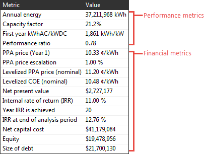

Financial Metrics
=================

The financial metrics are the selection of single-value results from the financial model that appear in the Metrics table on the :doc:`Summary <../results/summary>` page. The financial metrics are calculated from values in the project :doc:`cash flow <../results/cashflow>`.

.. note:: You can find more financial metrics under **Single Value** on the :doc:`Data Tables <../results/data>` and :doc:`Graphs <../results/graphs>` tabs of the Results page.

See :doc:`Performance Metrics <../performance-metrics/mtp_overview>` for a description of results generated by the performance model.

SAM displays different metrics depending on the :doc:`financial model <../introduction/fin_overview>` for the case. For example, SAM displays the payback period for the residential and commercial financial model, but  not for the PPA models.

For tips on interpreting financial metrics, see :ref:`Interpreting the NPV <interpreting>`.

Additional Resources
....................

You can explore the methodology for some of SAM's financial models by downloading the spreadsheets from the `SAM website <https://sam.nrel.gov/financial-models>`__. Each of the spreadsheets duplicates SAM's cash flow equations using Excel formulas. 

For the residential, commercial, and single owner financial models, you can also use the **Send to Excel** button from the :doc:`Cash Flow <../results/cashflow>` on the Results page to export your project's financial inputs to an Excel workbook with the SAM financial model implemented using Excel formulas. 

For more information about the levelized cost of energy (LCOE) and other economic metrics for renewable energy projects, see *Manual for the Economic Evaluation of Energy Efficiency and Renewable Energy Technologies*. (Short 1995) https://docs.nrel.gov/docs/legosti/old/5173.pdf.