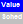

Community Solar
===============

The Community Solar financial model is for a project that earns revenue from payments by subscribers for a share of the project. The model is from the project owner's perspective. The project owner is a single entity that owns, operates, and maintains the system, and benefits from any tax credits or or cash incentives. Cost and financial assumptions for the community solar project are on the following input pages:

* Cost of installing the system, including equipment purchases, labor, permitting etc. on the :doc:`Installation costs <../installation-costs/cc_pv>` page.

* Cost of operating the system including maintenance, equipment replacements, and land lease costs on the :doc:`Operating costs <../operating-costs/oc_operating>` page.

* Financial assumptions including analysis period, inflation and discount rates, state and federal income tax rates, project term debt, construction financing interest, and reserve account funding on the :doc:`Financial Parameters <fin_single_owner>` page.

* Tax credits and tax incentives on the :doc:`Incentives <../incentives-and-depreciation/incentives>` page.

* Depreciation on the :doc:`Depreciation <../incentives-and-depreciation/depreciation>` page.

* costs associated with managing the community solar project itself are on the Community Solar page.

* Subscriber payments are defined on the Community Solar page.

.. note:: This initial implementation of the Community Solar model is only available with the PVWatts performance model. It will be made available with the Detailed PV, PV Battery, and PVWatts Battery models in a future version or update to this version.

The community solar financial model is based on annual cash flows, so be sure to convert monthly amounts to annual as appropriate

SAM displays results of the financial model in the :doc:`cash flow <../results/cashflow>`.

SAM can model a community solar project with up to four subscriber classes. Each subscriber class pays to participate in the community solar project. For each subscriber class, SAM can model a one-time up-front payment, annual fixed payments, or annual payments per unit of electricity generated by the system. The project earns revenue from these payments to cover the cost of installing and operating the system and of managing the community solar project.

Subscriber Share
................

The subscriber share is the portion of the project subscribed by an entire subscriber class. A subscriber class may consist of a single subscriber or a group of subscribers that pay the same subscription rates and get the same benefit from the project. 

For each of up to four subscriber classes, assign a name, share of the system, and optional growth rate.

The **Subscriber x Share of generation** variable shows the resulting subscription rate for each subscriber in the results. SAM also lists the subscriber share in the project cash flow.

**Subscriber Name**
  SAM uses numbers to keep track of the subscriber classes (Subscriber 1, Subscriber 2, Subscriber 3, and Subscriber 4). You can assign a name to each subscriber class to help you keep track of your inputs, but only the subscriber class number appears in variable names in the results.

  For example, for a project with two subscriber classes, you could name Subscriber 1 "Anchor," and Subscriber 2  "General." The rows on the Community Solar input page will show the names you assigned, but the variable names in results will use "Subscriber 1" in anchor subscriber variables, and "Subscriber 2" for general subscriber variables. The "Subscriber Metrics By Class" table on the Summary tab of the Results page shows the subscriber name and number.

  .. image:: ../images/ss-communitsolar-classnames.png
     :align: center
     :alt: ss-communitsolar-classnames.png

**% of system**
  The subscriber share is a percentage of the total system capacity in kW representing the share of the project for each subscriber class in Year 1 when the system starts generating electricity. The sum of subscriber shares may not exceed 100%.

  If the sum of subscriber shares is less than 100%, SAM treats the remaining capacity as unsubscribed. If the project receives payments for unsubscribed generation, assign the unsubscribed generation rate under **Subscription Revenue**.

  You can specify the subscriber share as a single percentage with an optional growth rate, or as a table of percentages by year. Click the |SS_AnnSched-valschedbutton|   button to switch between a single value and an :doc:`annual schedule <../window-reference/win_edit_data_table_column>`  .

 .. note:: For any year that the total subscription rate exceeds 100%, SAM adjusts the subscription rates so that the total is 100% for the remainder of the analysis period, assuming that the subscription rates do not change once the project is completely subscribed.

**kW in first year**
  The subscriber share expressed in kW of system capacity. This is a calculated value that you cannot change. SAM calculates the value by multiplying the subscriber share percentage by the **Total system capacity**. 

**Total system capacity**
  The system's nameplate capacity from the System Design page. For photovoltaic systems, the nameplate capacity is in DC kW.

**Growth %/yr**
  The subscriber share annual growth rate. Use a positive value for an annual increase in subscriptions, and a negative value for an annual decrease in subscriptions. SAM disables the growth rate input when you enter the subscriber share as a table of annual percentages.

**Total unsubscribed capacity**
  The difference between the total system capacity and the total subscribed capacity in Year 1. If you specify subscription rates that change from year to year, the unsubscribed capacity changes accordingly.

Subscriber Bill Credits
.......................

Subscriber bill credits represent the value of each subscriber class's share of the electricity generated by the system at the bill credit rate. SAM uses this value to calculate the :ref:`subscriber net present value (NPV) <communitysolar>`. You can ignore subscriber bill credits if your analysis does not involve evaluating the subscriber class NPV.

The **Bill credit for Subscriber x class** and **Subscriber x Bill credit rate** variables show the bill credit rates in the results. SAM also lists the bill credit rate and amount in the project cash flow.

**$/kWh**
  The subscription rate in $/kWh of the subscriber class's share annual electricity generated by the system. You can specify the bill credit rate as a single value with an optional annual escalation rate, or as a table of percentages by year. Click the |SS_AnnSched-valschedbutton|   button to switch between a single value and an :doc:`annual schedule <../window-reference/win_edit_data_table_column>`  .

**Escalation (%/yr**)

  SAM assumes that the bill credit rate increases annually at the inflation rate from the :doc:`Financial Parameters <fin_single_owner>` page. You can specify an additional increase using the annual escalation rate, or remove the effect of inflation by setting the escalation rate to the negative value of the inflation rate. SAM disables the bill credit rate input when you enter the rate as a table of annual values instead of a single value.

Subscription Revenue
....................

Subscription revenue is revenue earned by the community solar project from payments made by subscribers to the project.

The **Revenue from Subscriber x ...** variables in the results show revenue from subscription payments in the results and in the project cash flow. The total revenue amounts are shown in the main part of the cash flow, and the detail by subscriber class is shown at the bottom of the cash flow table.

.. note:: SAM allows the community solar project to earn subscription revenue from combinations of different types of payments. For example, it allows the project to earn revenue from both an annual fixed payment and an annual generation payments even when that might not be realistic. Be careful to choose the subscription revenue options that best represent the project you are modeling.

**Up-front, Year Zero $**
  A payment made by subscribers in Year zero of the project, before the system starts generating electricity. SAM treats this payment as a reduction in the total purchase of property value in the cash flow.

**Annual, $/yr**
  Annual fixed payments made by subscribers to the project in Years one through the analysis period.

**Generation, $/kWh**
  Annual rate in $/kWh of the subscriber class's share of annual electricity generated by the system for payments by subscribers to the project.

**Escalation, $/yr**
  SAM assumes that annual payments increase annually at the inflation rate from the :doc:`Financial Parameters <fin_single_owner>`   page. You can specify an additional increase using the annual escalation rate, or remove the effect of inflation by setting the escalation rate to the negative value of the inflation rate. SAM disables the escalation rate input as appropriate when you enter annual or generation rates as tables of annual values instead of single values.

**Unsubscribed, $/kWh**
  Annual rate in $/kWh of the unsubscribed share of annual electricity generated by the system for payments received by the project by the utility company, often at the utility's avoided cost rate. Set this value to zero if the project does not receive payments for unsubscribed generation.

Up-front and Recurring costs
............................

Up-front and recurring costs are costs for managing the community solar project. These costs are in addition to the installation, operating, and debt-related costs.

The following variables in the results show the community solar costs: **Community solar recurring total fixed cost**, **Community solar total recurring cost by capacity**, **Community solar total recurring cost by generation**, **Community solar total up-front fixed cost**.

**Up-front fixed cost, $**
  A one time cost to the project that is included to the project's total purchase of property in Year zero of the cash flow.

**Up-front cost by capacity, $/kW**
  A cost per unit of total system capacity. It is a one time cost to the project that is included to the project's total purchase of property in Year zero of the cash flow.

**Recurring annual fixed cost, $/yr**
  A fixed annual cost that is treated as an operating expense in the project cash flow. You can specify any of the recurring costs either as a single value with an optional escalation rate, or as a table of percentages by year. Click the |SS_AnnSched-valschedbutton|   button to switch between a single value and an :doc:`annual schedule <../window-reference/win_edit_data_table_column>`  .

**Recurring annual cost by capacity, $/kW-yr**
  A fixed annual cost that scales with the total system capacity. It is treated as an operating expense in the project cash flow.

**Recurring annual cost by generation, $/MWh**
  An annual cost that varies with the system's total annual generation. It is treated as an operating expense in the project cash flow.

**Escalation, $/yr**
  SAM assumes that recurring costs increase annually at the inflation rate from the :doc:`Financial Parameters <fin_single_owner>`   page. You can specify an additional increase using the annual escalation rate, or remove the effect of inflation by setting the escalation rate to the negative value of the inflation rate. SAM disables the escalation rate input as appropriate when you enter the cost as a table of annual values instead of single values.

