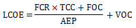
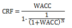
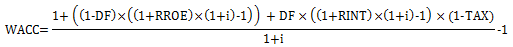
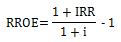
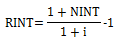
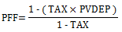
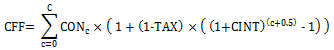

LCOE Calculator
===============

The LCOE Calculator uses a simple method to calculate a project's levelized cost of energy (LCOE) using only the following inputs:

* Capital cost, $ (TCC), or installed capital costs.

* Fixed annual operating cost, $ (FOC), or operations and maintenance costs.

* Variable operating cost, $/kWh (VOC), or operations and maintenance costs per unit of annual electricity production.

* Fixed charge rate (FCR)

* Annual electricity production, kWh (AEP)

The LCOE Calculator uses the following simple equation:

The fixed charge rate is the revenue per amount of investment required to cover the investment cost. For details, see pp. 22-24 of Short W et al, 1995.* Manual for the Economic Evaluation of Energy Efficiency and Renewable Energy Technologies*. National Renewable Energy Laboratory. NREL/TP-462-5173. (`PDF 6.6 MB) <https://www.osti.gov/biblio/35391>`__

To include the effect of incentives in this simple fixed charge rate method, reduce the TTC, FOC, or VOC as appropriate. For example, you could account for a 30% investment tax credit by reducing the TCC by 30%.

This method is an alternative to the cash flow method used by SAM's other financial models. The fixed charge method is appropriate for very preliminary stages of project feasibility analysis before you have many details about the project's costs and financial structure. It also useful for large-scale studies of market trends, such as those used for the NREL `Annual Technology Baseline (ATB) <https://atb.nlr.gov/>`__ study.

Capital and Operating costs
~~~~~~~~~~~~~~~~~~~~~~~~~~~

You can enter the capital and fixed operating cost either as dollar amounts or in dollars per kilowatt of system capacity.

.. note:: For the marine energy models, enter the capital and operating costs on the Capital costs pages. SAM calculates the total capital cost and operating cost from the values on the Capital costs pages.

**System capacity**
  The renewable energy system's nameplate capacity. Its value depends on the performance model you use for the simulation, and is shown here for reference when you enter costs in $/kW.

**Enter costs in $**
  Choose this option to enter the capital cost and annual fixed operating costs as dollar amounts. Not available for marine energy models.

**Enter costs in $/kW**
  Choose this option to enter the capital cost and annual fixed operating costs in dollars per kilowatt of system capacity. The system capacity depends on the performance model you choose. Not available for marine energy models.

**Capital cost**
  The project's total investment cost, or installed capital costs. For the marine energy models, this is the sum of the costs on the Capital costs pages.

**Fixed operating cost**
  Annual operating and maintenance costs that do not vary with the amount of electricity the system generates. For the marine energy models, this is the sum of the costs on the Capital costs pages.

**Variable operating cost**
  Annual operating and maintenance costs in dollars per kilowatt-hour that vary with the amount of electricity the system generates.

Summary
~~~~~~~

The Summary values are the inputs to the LCOE equation shown above. SAM calculates these values from the inputs you specify. You cannot edit these values directly.

**Fixed charge rate**
  The project fixed charge rate is an annual return as a fraction of the capital cost, or revenue per amount of investment required to cover the investment cost. It is either the value you enter under **Financial Assumptions**, or the value SAM calculates from the financial details you enter.

**Capital cost**
  The total investment cost in dollars. It is either the value you entered or a value that SAM calculates based on the value you enter in dollars per kilowatt.

**Fixed operating cost**
  The fixed annual operating cost in dollars. It is either the value you enter or a value that SAM calculates based on the value you enter in dollars per kilowatt.

**Variable operating cost**
  The variable annual operating cost in dollars per kilowatt-hour that you enter.

Financial Assumptions
~~~~~~~~~~~~~~~~~~~~~

The fixed charge rate represents details of the project's financial structure. You can either enter the value directly, or enter project financial details and SAM calculates the value.

**Enter fixed charge rate**
  Choose this option to enter the fixed charge rate.

**Calculate fixed charge rate**
  Choose this option to have SAM calculate the fixed charge rate from a set of financial assumptions. The SAM uses the following equation to calculate the value from the capital recovery factor, project financing factor, and construction financing factor (see below for all equations):

  .. image:: ../images/EQ_FCR.png
     :align: center
     :alt: EQ_FCR.png

**Fixed charge rate**
  The project's fixed charge rate. Note that the value is a factor (between 0 and 1) rather than a percentage.

**Analysis period**
  The number of years that the project will generate electricity and earn revenue.

**Inflation rate**
  The annual inflation rate over the analysis period. To exclude inflation from the analysis, set the inflation rate to zero.

**Internal rate of return**
  The project's annual nominal rate of return on equity requirement.

**Project term debt**
  The size of debt as a percentage of the capital cost.

**Nominal debt interest rate**
  The annual nominal debt interest rate. SAM assumes that the debt period is the same as the analysis period.

**Effective tax rate**
  The total income tax rate. For a project that pays both federal and state income taxes, where the state income tax is deducted from the federal tax, you can calculate the effective tax rate as:

  .. image:: ../images/EQ_TAX.png
     :align: center
     :alt: EQ_TAX.png

  To exclude income tax from the analysis, set the effective tax rate to zero.

**Depreciation schedule**
  The annual depreciation schedule. The depreciation basis equals the project's capital cost.

  To enter a depreciation schedule, click the small blue and grey button next to the **Edit** button so that the button becomes active. Then click **Edit** to open the Edit Schedule window. In the Edit Schedule window, for **Number of values**, enter the number of years in the depreciation schedule, and then enter the depreciation percentage for each year in the Value table.

  For MACRS 5-yr depreciation the table should look like this:

  .. image:: ../images/SS_AnnSched-Depreciation.png
     :align: center
     :alt: SS_AnnSched-Depreciation.png

To exclude depreciation from the analysis, set the depreciation percentage(s) to zero.

**Annual cost during construction**
  The annual construction cost as a percentage of the project's capital cost. If the construction period is one year or less, enter a single value. If it is more than one year, enter a schedule of annual percentages.

  To enter a construction cost schedule, click the small blue and grey button next to the **Edit** button so that the button becomes active. Then click **Edit** to open the Edit Schedule window. For **Number of values**, enter the number of years in the construction period, and then enter a cost (as a percentage of the capital cost) for each year in the Value table.

  To exclude construction financing costs from the analysis, set the annual cost during construction to 100%, and the nominal construction interest rate to zero.

**Nominal construction interest rate**
  The annual interest rate on construction financing.

**Capital recovery factor (CRF)**
  SAM calculates this value from the inputs you specify as described below.

**Project financing factor (PFF)**
  Factor to account for project financing costs. SAM calculates this value from the effective tax rate and depreciation schedule, as described below.

  A value of "NaN" (not a number) indicates that the effective tax rate is 100%. Change the tax rate to something less than 100% to correct the problem.

**Construction financing factor (CFF)**
  Factor to account for construction financing costs. SAM calculates the value from the construction cost schedule, effective tax rate, and construction interest rate, as described below.

  A value of zero will cause the FCR to be zero, and is caused by setting the annual cost during construction to zero. If you want to exclude construction financing (CFF = 1), you should set the annual cost during construction to 100%, and the nominal construction interest rate to zero.

Equations for FCR Calculation
.............................

When you use the **Calculate fixed charge rate** option, SAM uses the following equations to calculate the financing factors.

**Nomenclature**
  c = Construction year

  C = Construction period in years

  CON = Construction schedule

  DF = Project term debt fraction

  i = Inflation rate

  n = Analysis year

  N = Analysis period

  IRR = Nominal return on investment

  NINT = Nominal debt interest rate

  PVDEP = Present value of depreciation

  RINT = Real debt interest rate

  RROE = Real return on investment

  TAX = Effective tax rate

  WACC = Weighted average cost of capital (real)

The capital recovery factor (CRF) is a function of the weighted average cost of capital (WACC) and analysis period (N):

Where:

The project financing factor (PFF) is a function of the effective tax rate and depreciation schedule:

Where:

  .. image:: ../images/EQ_PVDEP.png
     :align: center
     :alt: EQ_PVDEP.png

The construction financing factor (CFF) is a function of the construction cost schedule, effective tax rate, and nominal construction financing interest rate:

