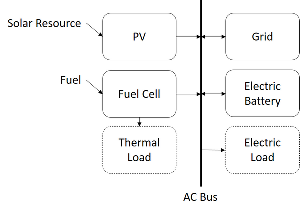

Fuel Cell
=========

SAM's Fuel Cell model is based on the `Fuel Cell Power Model <https://www.nrel.gov/hydrogen/fuel-cell-power-model.html>`__ initially released in 2012 and designed to model molten carbonate, phosphoric acid, and solid oxide fuel cells for "tri-generation" systems that provide heat and electricity to a commercial building or facility and hydrogen for vehicles or for storage to generate electricity. The Fuel Cell Power model was originally implemented in Microsoft Excel workbooks with one workbook for each of the three types of fuel cell. These workbooks and their documentation are available for download from the Fuel Cell Power Model website linked above.

The model is implemented in SAM as the Fuel Cell performance model, available with either the Commercial or PPA Single Owner :doc:`financial model <../introduction/fin_overview>`. The fuel cell converts natural gas, hydrogen, or another fuel into electricity and heat. The commercial model is for a commercial building or facility that uses electricity and heat from the system to reduce energy costs for the commercial operation. The PPA single owner model is for a revenue-generating power generation project.

The fuel cell performance model uses the following input pages to describe the components of a grid-connected tri-generation system:

* :doc:`Fuel cell <fuelcell_fuel_cell>` model that converts a fuel into electricity, heat, and hydrogen.

* :doc:`PVWatts <fuelcell_pv_system>` for a photovoltaic (PV) system.

* Optional :doc:`battery storage <../battery-storage/battery_storage>` model for an electric storage system.

* A :doc:`dispatch <fuelcell_dispatch>` model to determine how to operate the combined system.

When you combine the fuel cell model with the Commercial financial model, you must also provide information about the electricity and thermal loads and retail rates for electricity and heat: retail electricity and heat costs:

* An :doc:`electric load <../electricity-rates-and-load/electric_load>` hourly or subhourly profile.

* A :doc:`thermal load <../thermal-rates-and-load/thermal_load>` (heat) hourly or subhourly profile.

* :doc:`Electricity rates <../electricity-rates-and-load/electricity_rates>` are retail rates for fixed, energy, and demand charges with optional time-of-use and tiered rates.

* :doc:`Thermal rates <../thermal-rates-and-load/thermal_rates>` are flat retail rates for heat purchases and sales.

For the PPA single owner model with battery storage, there is no electric or thermal load because the system is not for a commercial building or facility, but you can specify retail rates to account for the cost of electricity to charge the battery.