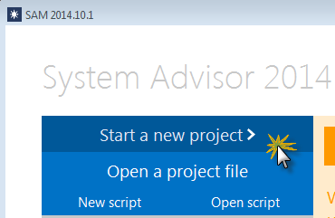
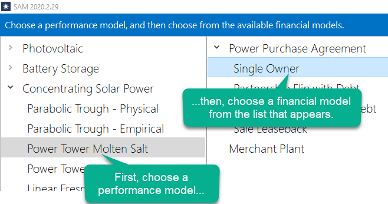
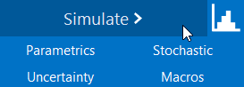

Getting Started
===============

The following procedure describes the basic steps to set up and run a simulation of a project.

See also:

* :doc:`Financial Models <../introduction/fin_overview>`

* :doc:`Performance Models <../introduction/technology_options>`

1. Create a project
...................

When you start SAM, it displays the :doc:`Welcome page <welcome_page>` with several options for creating or opening a file.

To :doc:`create a project <create_project>`, **Start a new project**.

2. Choose models
................

Your project is made up of a :doc:`performance model <../introduction/technology_options>` for the power system and an optional :doc:`financial model <../introduction/fin_overview>` for the project's financial structure.

To :doc:`choose models <../getting-started/choose_models>`, click the performance model name in the list, and then click the financial model that appears in the list to the right:

When you choose a financial model, and click **OK**, SAM creates a new file and populates all of the input variables with values from the default values database.

3. Review inputs
................

After creating your file, open each input page and review the default assumptions.

See :doc:`Input Pages <input_pages>` for details.

4. Run a simulation
...................

To run a simulation, click **Simulate** at the bottom left of the main window.

See :doc:`Run Simulation <../getting-started/run_simulations>` for details.

5. Review results
.................

When simulations are complete, SAM displays a summary of results in the Metric table.

.. image:: ../images/SS_MetricsTable.png
   :align: center
   :alt: SS_MetricsTable.png

You can display graphs and tables of detailed results data on the :doc:`Results page <results_page>`.