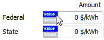

Incentives
==========

The Incentives page allows you to define the parameters for the following types of tax credits and cash incentives.

A tax credit is an amount that is deducted from the project's income tax:

* :ref:`Investment tax credits <itc>` (ITC)

* :ref:`Production tax credits <ptc>` (PTC)

A cash incentive is an amount paid to the project that contributes to the project's annual cash flow:

* :ref:`Investment-based incentive <ibi>` (IBI)

* :ref:`Capacity-based incentive <cbi>` (CBI)

* :ref:`Production-based incentive <pbi>` (PBI)

After running a simulation, you can display incentive amounts in the project :doc:`cash flow <../results/cashflow>` and in results :doc:`graphs <../results/graphs>` and :doc:`tables <../results/data>`.

.. note:: You can also model projects that qualify for an accelerated depreciation tax benefit using options on the :doc:`Depreciation <depreciation>` page.

Investment Tax Credit (ITC)
~~~~~~~~~~~~~~~~~~~~~~~~~~~

.. _itc:

An investment tax credit (ITC) reduces the project's annual tax liability, and is calculated based on the project's initial investment cost. SAM allows the ITC to be expressed either as a fixed amount or as a percentage of the project investment cost with a maximum limit.

To see the effect of the ITC on the :doc:`cash flow <../results/cashflow>`, for the Residential and Commercial financial models, see the federal and state income sections of the cash flow. For the Single Owner and other front-of-meter financial models, see the After-tax Returns section of the cash flow. For the calculated ITC amounts, see the Tax Credits section of the project cash flow.

**Amount, $**
  The fixed dollar amount of the tax credit. A value of zero indicates no tax credit.

**Percentage, %**
  The amount of the tax credit expressed as a percentage. A value of zero indicates no tax credit.

  For the residential and commercial models, SAM applies the ITC percentage to the total installed cost.

.. note:: If you want to model a situation where the percentage applies to a different value, you can either modify the ITC percentage accordingly, or calculate the ITC amount outside of SAM and enter it as a fixed amount. For example, for a project with a $10,000 cost where 95% of this cost is eligible for a 30% ITC, you could either enter an ITC percentage of 95% × 35% = 28.5%, or an ITC amount of 30% × 95% × $10,000 = $2,850.

For the PPA, Community Solar, Merchant Plant, and Third Party Ownership Host / Developer models, the ITC percentage applies to the portion of each depreciation class that you specify as qualifying for the ITC on the :doc:`Depreciation <depreciation>` page. See the ITC Qualifying costs column in the Depreciation and ITC table table in the project :doc:`cash flow <../results/cashflow>`. By default, the ITC percentage applies only to the basis for the portion of project costs that qualifies for 5-yr MACRS depreciation. For example, for a project with qualifying costs of $1,000,000, ITC percentage of 30%, and 90% of the depreciation basis qualifies for the ITC, the ITC amount would be $1,000,000 × 30% × 90% = $270,000.

**Maximum, $**
  The upper limit of the tax credit in dollars. For tax credits with no limits, type the value 1e+038.

**Reduces Depreciation Basis**
  Available for non-residential projects when one of the depreciation options is active on the :doc:`Depreciation <../financial-parameters/fin_residential>`   page. 

  The check boxes determine whether the basis used to calculate federal depreciation, state depreciation, or both should be reduced by the tax credit amount. When you check the box for an ITC, SAM reduces the depreciable basis by 50% of the ITC amount as specified by U.S. Internal Revenue Service rules.

Specifying Annual ITC Values
............................

You can specify ITC amounts and percentages either as a single value for an ITC that only applies in Year 1, or as annual values that applies over multiple years. By default, you enter the ITC amount or percentage as a single value. The blue "Value" label on the blue and gray button next to the input variable indicates the single value mode is active for the variable:

Dollar values in the annual schedule are in nominal or current dollars. SAM does not apply inflation and escalation rates to values in annual schedules.

If you specify an ITC as annual percentages with a single maximum value, the maximum value applies to all years.

To specify a ITC using an annual schedule:

.. include:: ../includes/snip_annual_values.rst

Production Tax Credit (PTC)
~~~~~~~~~~~~~~~~~~~~~~~~~~~

.. _ptc:

A production tax credit (PTC) reduces the project's annual tax liability in Year One of the cash flow and subsequent years up to and including the year specified in the term variable. The PTC is a dollar amount per unit of annual electric (or thermal) output. If you specify an escalation rate, SAM increases the annual tax credit amount in years 2 and later in the cash flow by a percentage of the previous year's credit amount.

To see the effect of the PTC on the :doc:`cash flow <../results/cashflow>`, for the Residential and Commercial financial models, see the federal and state income sections of the cash flow. For the Single Owner and other front-of-meter financial models, see the After-tax Returns section of the cash flow. For the calculated PTC amounts, see the Tax Credits section of the project cash flow.

**Amount, $/kWh ($/MMBtu for IPH)**
  The amount of the production tax credit as a function of the system's total electrical output in the first year expressed in dollars per kilowatt-hour of AC output. A zero indicates no tax credit.

**Term, years**
  The number of years, beginning with year 1 on the project cash flow, that the tax credit applies. For example, a credit with a 10-year term would apply to years 1 through 10 of the project cash flow. A zero indicates no tax credit.

**Escalation, %/year**
  The annual escalation rate that applies to the tax credit. SAM applies the escalation rate to years 2 and later of the project :doc:`cash flow <../results/cashflow>`  . SAM does not apply the inflation rate that you specify on the :doc:`Financial Parameters <../financial-parameters/fin_overview>`   page to the PTC. For example, for a tax credit with a ten year term and two percent escalation rate, the tax credit in year 2 would be 2% greater than in year 1, and in year 3, 2% greater than in year 2, and so on.

  For both the state and federal PTC, SAM rounds the annual PTC rate in cents/kWh to the nearest 0.1 cent as described in Notice 2010-37 of `IRS Bulletin 2010-18 <https://www.irs.gov/irb/2010-18_IRB/ar11.html>`__  .

Specifying Annual PTC Tax Credit Values
.......................................

For the PTC, you can specify the tax credit as either a single value (amount or percentage) that applies to all years in the analysis period defined on the Financial Parameters page, or you can assign a different value to each year in the analysis period using an annual schedule.

Dollar values in the annual schedule are in nominal or current dollars. SAM does not apply inflation or escalation rates to values in annual schedules.

By default, you enter the PTC as a single value. The blue "Value" label on the blue and gray button next to the input variable indicates the single value mode is active for the variable.

To specify a PTC using an annual schedule:

.. include:: ../includes/snip_annual_values.rst

Investment Based Incentive (IBI)
~~~~~~~~~~~~~~~~~~~~~~~~~~~~~~~~

.. _ibi:

An investment-based incentive (IBI) is a cash payment to the project in Year One of the project cash flow. SAM allows the IBI to be expressed either as a fixed amount or as a percentage of the project's total installed cost with a maximum limit.

Note that if you specify two incentives from the same source (federal, state, utility, other) as both a fixed amount and a percentage of the total installed cost, SAM includes both amounts in the total incentive amount.

For the Residential and Commercial financial models, you can see the effect of the IBI in the after-tax :doc:`cash flow <../results/cashflow>` for Year 0. Note that if the project is financed with 100% debt, the IBI reduces the size of debt, but is not visible because the Year 0 cash flow is zero.

For the Single Owner and other front-of-meter financial models the effect of the IBI is shown in the Investing Activities section of the :doc:`cash flow <../results/cashflow>`.

**Amount, $**
  The fixed dollar amount of the incentive. A zero indicates no incentive.

**Percentage, %**
  The amount of the investment tax credit expressed as a percentage of the total installed cost displayed on the Installation costs page. A zero indicates no incentive.

**Maximum, $**
  The upper limit of the incentive in dollars. For incentives with no limits, type the value 1e+099.

Tax Implications
................

The check boxes in the Taxable Incentive and Reduces Depreciation and ITC Bases columns determine whether each IBI qualifies as income for tax purposes, reduces the basis used to calculate the ITC, or reduces the basis used to calculate the depreciation amount, respectively.

**Taxable Incentive**
  Determines whether the incentive payment is subject to federal or state income tax.

  When you check a Taxable Incentives check box for an incentive, SAM multiplies the applicable federal and state tax rate by the incentive amount and adds it to the income tax amount in the appropriate years of the project :doc:`cash flow <../results/cashflow>`  .

  The state and federal tax rates are inputs on the :doc:`Financial Parameters <../financial-parameters/fin_overview>`   page.

**Reduces Depreciation and ITC Basis**
  Determines whether the incentive reduces the basis used to calculate depreciation for commercial and PPA projects, and whether it reduces the basis used to calculate the ITC amount for projects with an investment tax credit.

  The options only apply to projects with one or more ITCs specified on the :doc:`Tax Incentives <depreciation>`   page. 

  When you check **Reduces Depreciation and ITC Basis** for an incentive, SAM subtracts the amount of the IBI from the depreciation and ITC bases.

.. note:: You can see the depreciation and ITC amounts in the project :doc:`cash flow <../results/cashflow>`.

Capacity Based Incentive (CBI)
~~~~~~~~~~~~~~~~~~~~~~~~~~~~~~

.. _cbi:

A capacity-based incentive (CBI) is a payment to the project in Year One of the project cash flow. SAM allows the CBI to be expressed as a function of the system's rated capacity in watts. The system's rated capacity depends on the technology:

* Photovoltaic systems with and without battery storage: DC watts of array capacity.

* Concentrating solar power systems: AC watts of power block nameplate capacity.

* Custom generation profile: AC watts of system nameplate capacity.

* Standalone battery: Maximum AC discharge power.

* Hybrid systems: Sum of DC Watts of photovoltaic capacity, AC Watts of wind, fuel cell and/or custom generation profile capacity, and battery maximum AC discharge power.

.. note:: For hybrid systems, the CBI is based on the photovoltaic subsystem nameplate capacity, which is defined as the DC capacity of the array rather than the AC capacity of the inverter(s).

For the Residential and Commercial financial models, you can see the effect of the CBI in the after-tax :doc:`cash flow <../results/cashflow>` for Year 0. Note that if the project is financed with 100% debt, the CBI reduces the size of debt, but is not visible because the Year 0 cash flow is zero.

For the Single Owner and other front-of-meter financial models the effect of the CBi is shown in the Investing Activities section of the :doc:`cash flow <../results/cashflow>`.

Check an option for each capacity based incentive that applies to the project, and enter values to specify the credit amount, percentage, term, and annual escalation rate as applicable.

**Amount, $/W ($/(Btu/hr) for IPH)**
  The amount of the incentive as a function of the system's nameplate electric capacity expressed in dollars per watt. A zero indicates no incentive.

**Maximum, $**
  The upper limit of the incentive in dollars. For incentives with no limits, type the value 1e+099.

Tax Implications
................

The check boxes in the Taxable Incentive and Reduces Depreciation and ITC Bases columns determine whether each CBI qualifies as income for tax purposes, reduces the basis used to calculate the ITC, or reduces the basis used to calculate the depreciation amount, respectively.

**Taxable Incentive**
  Determines whether the incentive payment is subject to federal or state income tax.

  When you check a Taxable Incentives check box for an incentive, SAM multiplies the applicable federal and state tax rate by the incentive amount and adds it to the income tax amount in the appropriate years of the project :doc:`cash flow <../results/cashflow>`  .

  The state and federal tax rates are inputs on the :doc:`Financial Parameters <../financial-parameters/fin_overview>`   page.

**Reduces Depreciation and ITC Basis**
  Determines whether the incentive reduces the basis used to calculate depreciation for commercial and PPA projects, and whether it reduces the basis used to calculate the ITC amount for projects with an investment tax credit.

  The options only apply to projects with one or more ITCs specified on the :doc:`Tax Incentives <depreciation>`   page. 

  When you check **Reduces Depreciation and ITC Basis** for an incentive, SAM subtracts the amount of the CBI from the ITC and depreciation bases.

.. note:: You can see the depreciation and ITC amounts in the project :doc:`cash flow <../results/cashflow>`.

Production Based Incentive (PBI)
~~~~~~~~~~~~~~~~~~~~~~~~~~~~~~~~

.. _pbi:

A production-based incentive (PBI) is a cash payment to the project specified as a dollar amount per kilowatt-hour of annual electric output.

.. note:: For the :ref:`Single Owner <so-debtservice>` and :ref:`Leveraged Partnership Flip <lpf-projecttermdebt>` financial models, you can specify whether the PBI payments are available for debt service.

For the Residential and Commercial financial models the PBI increases the project's after-tax cash flow.

For the Single Owner and other front-of-meter financial models, you can see the effect of the PBI in the Operating Activities section of the :doc:`cash flow <../results/cashflow>`.

**Amount, $/kWh**
  The amount of the incentive as a function of the system's total electrical output in the first year expressed in dollars per kilowatt-hour of AC output. A zero indicates no incentive.

**Term, years**
  The number of years, beginning with Year One of the project cash flow, that the incentive applies. For example, an incentive with a 10-year term would apply to years one through 10 of the project cash flow. A zero indicates no incentive.

**Escalation, %/year**
  The annual escalation rate that applies to the incentive. SAM applies the escalation rate to years two and later in the cash flow. For example, for an incentive with a ten year term and two percent escalation rate, the incentive in year two would be two percent greater than in Year One, and in year three, two percent greater than in year two, and so on.

.. note:: If you use an annual schedule to assign PBI amounts to specific years, SAM ignores the escalation rate.

Tax Implications
................

The check boxes in the Taxable Incentive column determine whether each PBI qualifies as income for tax purposes, reduces the basis used to calculate the PBI, or reduces the basis used to calculate the depreciation amount, respectively.

.. note:: For the Partnership Flip with Debt and Sale Leaseback financial models, the PBI is included in the total project revenue, so is considered taxable income by default. If you clear the Taxable Incentive box for these models to model the PBI as non-taxable income, SAM makes the taxable PBI amount negative so that it is not included in the total income tax.

**Taxable Incentive**
  Determines whether the incentive payment is subject to federal or state income tax.

  When you check a Taxable Incentives check box for an incentive, SAM multiplies the applicable federal and state tax rate by the incentive amount and adds it to the income tax amount in the appropriate years of the project :doc:`cash flow <../results/cashflow>`  .

  The state and federal tax rates are inputs on the :doc:`Financial Parameters <../financial-parameters/fin_overview>`   page.

PBI and  Debt Service
.....................

For financial models with debt, you can specify whether the PBI is available for debt service. If the PBI is available for debt service, SAM includes it in the total revenue as taxable income, otherwise it is included in the total pre-tax cash flow as part of the cash flow from from operating activities.

**PBI available for debt service**
  When you check the option for a PBI, SAM includes the PBI amount in the cash available for debt service (CAFDS).

Specifying Annual for PBI Values
................................

You can specify each PBI as either a single value (amount or percentage) that applies to all years in the analysis period defined on the Financial Parameters page, or you can assign a different value to each year in the analysis period using an annual schedule.

Dollar values in the annual schedule are in nominal or current dollars. SAM does not apply inflation and escalation rates to values in annual schedules.

By default, you enter the PBI as a single value. The blue "Value" label on the blue and gray button next to the input variable indicates the single value mode is active for the variable.

To specify a PBI using an annual schedule:

.. include:: ../includes/snip_annual_values.rst

