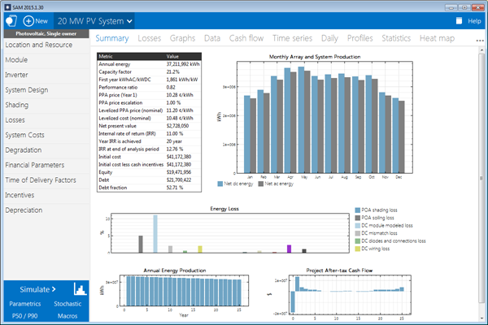
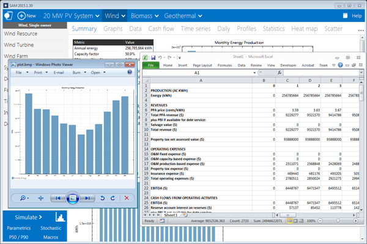
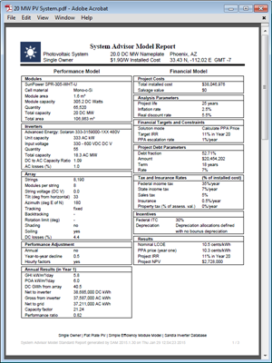
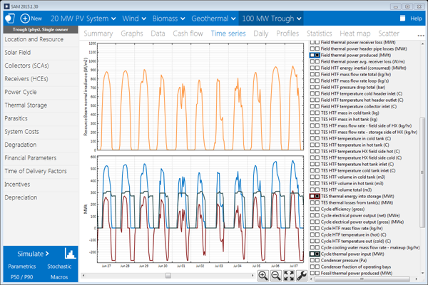
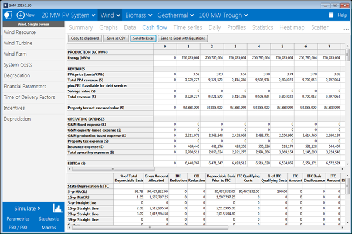
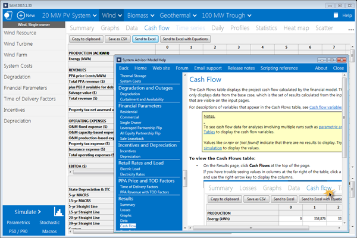

About SAM
=========

This Help system describes  and was last revised on .

The System Advisor Model™ (SAM™) is a performance and financial model designed to facilitate decision making for people involved in the renewable energy industry:

* Project managers and engineers

* Policy analysts

* Technology developers

* Researchers

SAM makes performance predictions and cost of energy estimates for grid-connected power projects based on installation and operating costs and system design parameters that you specify as inputs to the model.

Projects can be either behind the meter (on the customer side of the utility meter), buying and selling electricity at retail rates, or front of meter (on the utility side of the meter), selling electricity at a price negotiated through a power purchase agreement (PPA) or at market prices.

For videos demonstrating how to use SAM for different kinds of projects, see Video pages on the `SAM website <https://sam.nrel.gov>`__.

The following image shows SAM's main window showing monthly electricity generation and the annual cash flow for a photovoltaic system.

The first step in creating a SAM file is to choose a performance and financial model for your project. SAM automatically populates input variables with a set of default values for the type of project. It is your responsibility as an analyst to review and modify all of the input data as appropriate for each analysis.

Next, you provide information about a project's location, the type of equipment in the system, the cost of installing and operating the system, and financial and incentives assumptions. 

SAM Models and Databases
........................

SAM represents the cost and performance of renewable energy projects using computer models developed at NREL, Sandia National Laboratories, the University of Wisconsin, and other organizations. Each performance model represents a part of the system, and each financial model represents a project's financial structure. The models require input data to describe the performance characteristics of physical equipment in the system and project costs. SAM's user interface makes it possible for people with no experience developing computer models to build a model of a renewable energy project, and to make cost and performance projections based on model results.

SAM requires a weather file describing the renewable energy resource and weather conditions a the project location. Depending on the kind of system you are modeling, you either choose a resource data file from a list, download one from the internet, or create the file using your own data.

SAM can automatically download data from the following online databases:

* `OpenEI U.S. Utility Rate Database <http://en.openei.org/wiki/Utility_Rate_Database>`__  for retail electricity rate structures for U.S. utilities

* `NREL National Solar Radiation Database <https://nsrdb.nrel.gov/>`__  for solar resource data and ambient weather conditions.

* `NREL WIND Toolkit <https://www.nrel.gov/grid/wind-toolkit.html>`__  for wind resource data.

* `Hindcast Wave Data <https://developer.nrel.gov/docs/wave/hindcast/>`__  for marine energy wave resource data.

SAM includes several databases of performance data and coefficients for system components such as photovoltaic modules and inverters, batteries, parabolic trough receivers and collectors, wind turbines, or biopower combustion systems. For those components, you simply choose an option from a list.

For the remaining input variables, you either use the default value or change its value. Some examples of input variables are:

* Installation costs including equipment purchases, labor, engineering and other project costs, land costs, and operation and maintenance costs.

* Numbers of modules and inverters, tracking type, derating factors for photovoltaic systems.

* Battery capacity and dispatch option.

* Collector and receiver type, solar multiple, storage capacity, power block capacity for parabolic trough systems.

* Analysis period, real discount rate, inflation rate, tax rates, internal rate of return target or power purchase price for PPA financial models.

* Building load and time-of-use retail rates for commercial and residential financial models.

* Tax and cash incentive amounts and rates.

Once you are satisfied with the input variable values, you run a simulation, and then examine results. A typical analysis involves running simulations, examining results, revising inputs, and repeating that process until you understand and have confidence in the results.

Results: Tables, Graphs, and Reports
~~~~~~~~~~~~~~~~~~~~~~~~~~~~~~~~~~~~

SAM displays simulation results in tables and graphs, ranging from the metrics table displaying the project's net present value (NPV), first year annual production, and other single-value metrics, to the detailed annual cash flow and hourly performance data that can be viewed in tabular or graphical form.

A built-in graphing tool displays a set of default graphs and allows for creation of custom graphs. All graphs and tables can be exported in various formats for inclusion in reports and presentations, and also for further analysis with spreadsheet or other software.

The Results page displays graphs of results that you can easily export to your documents:

SAM's report generator allows you to create custom reports to include SAM results in your project proposals and other documents:

Performance Models
~~~~~~~~~~~~~~~~~~

SAM's performance models make hour-by-hour calculations of a power system's electric output, generating a set of 8,760 hourly values that represent the system's electricity production over a single year. Some performance models also support subhourly simulations. You can explore the system's performance characteristics in detail by viewing tables and graphs of the hourly and monthly performance data, or use performance metrics such as the system's total annual output and capacity factor for more general performance evaluations.

The Time Series graph on the Results page showing hourly electricity generation for a 100 MW parabolic trough system with 6 hours of storage in Tucson, Arizona:

The current version of the SAM includes performance models for the following types of systems:

* Photovoltaic systems (flat-plate and concentrating)

* Battery storage

* Hybrid power systems combining photovoltaic, wind, fuel cell, and battery storage.

* Parabolic trough concentrating solar power

* Power tower concentrating solar power (molten salt)

* Linear Fresnel concentrating solar power (heat transfer fluid and direct steam)

* Industrial process heat models for parabolic troughs and linear collectors

* Conventional fossil-fuel thermal

* Solar water heating for residential or commercial buildings

* Wind power (large and small)

* Marine energy wave and tidal converters

* Geothermal power

* Biomass combustion

Financial Models
~~~~~~~~~~~~~~~~

SAM's financial models calculate financial metrics for various kinds of power projects based on a project's cash flows over an analysis period that you specify. The financial models use the system's electrical output calculated by the performance model to calculate the series of annual cash flows.

SAM includes financial models for the following kinds of projects:

* Residential (retail electricity rates)

* Commercial (retail rates)

* Third party ownership from host or developer perspective

* Community solar

* Power purchase agreement, PPA (utility-scale or power generation project)

  * Single owner

  * Leveraged partnership flip

  * All equity partnership flip

  * Sale leaseback

* Merchant plant

* Simple LCOE calculator using fixed charge rate method

Residential and Commercial Projects
...................................

Residential and commercial projects are financed through either a loan or cash payment, and recover investment costs by selling electricity through either a net metering or time-of-use pricing agreement. For these projects, SAM reports the following financial metrics in addition to a detailed annual cash flow:

* Levelized cost of energy (LCOE)

* Electricity bill with and without the power system

* After-tax net present value (NPV)

* Payback Period

Power Purchase Agreement (PPA), Merchant Plant, and Community Solar Projects
............................................................................

PPA projects are assumed to sell electricity through a power purchase agreement at a fixed price with optional annual escalation and time-of-delivery (TOD)  factors. For these projects, SAM calculates a detailed annual cash flow and the following metrics:

* Levelized cost of energy (LCOE)

* PPA price (electricity sales price)

* Internal rate of return

* Net present value (NPV)

* Debt percent or debt service coverage ratio

SAM can either calculate the internal rate of return based on a power price you specify, or calculate the power price based on the rate of return you specify.

Project Cash Flow
.................

SAM calculates financial metrics from project cash flows representing the value of energy savings for projects using retail electricity rates, and the value of revenue from electricity sales for projects selling electricity under a power purchase agreement. For the PPA partnership models, SAM calculates cash flows from the project perspective and from the perspective of each partner.

The following image shows several rows of the cash flow table for a PPA project:

The project annual cash flows include:

* Value of electricity sales (or savings)  and incentive payments

* Installation costs

* Operating, maintenance, and equipment replacement costs

* Debt principal and interest payments

* Tax benefits and liabilities (accounting for any tax credits for which the project is eligible)

* Incentive payments

* Project and partner's internal rate of return requirements (for PPA projects)

Incentives
..........

The financial model can account for a wide range of incentive payments and tax credits: 

* Investment based incentives (IBI)

* Capacity-based incentives (CBI)

* Production-based incentives (PBI)

* Investment tax credits (ITC)

* Production tax credits (PTC)

* Depreciation (MACRS, Straight-line, custom, bonus, etc.)

Analysis Options
~~~~~~~~~~~~~~~~

In addition to simulating a system's performance over a single year and calculating a project cash flow over a multi-year period, SAM's analysis options make it possible to conduct studies involving multiple simulations, linking SAM inputs to a Microsoft Excel workbook, and working with custom simulation modules.

The following options are for analyses that investigate impacts of variations and uncertainty in assumptions about weather, performance, cost, and financial parameters on model results:

* Parametric Analysis: Assign multiple values to input variables to create graphs and tables showing the value of output metrics for each value of the input variable. Useful for optimization and exploring relationships between input variables and results.

* Stochastic: Assign multiple values to input variables using parameters for statistical distributions.

* Uncertainty or P50/P90: For locations with weather data available for many years, calculate the probability that the system's total annual output will exceed a certain value.

Finally, SAM's scripting language LK allows you to write your own scripts within the SAM user interface to control simulations, change values of input variables, and write data to text files. SAM macros are LK scripts that come with the software and can be run with no knowledge of scripting. SAM macros include a weather file checker, multiple subsystems, photovoltaic system sizing assistant, and tornado plot generator.

SAM also makes it possible to work with external models developed in Excel with Excel Exchange, which allows Excel to calculate the value of input variables, and automatically pass values of input variables between SAM and Excel.

Software Development History and Users
~~~~~~~~~~~~~~~~~~~~~~~~~~~~~~~~~~~~~~

SAM, originally called the "Solar Advisor Model" was developed by the National Renewable Energy Laboratory in collaboration with Sandia National Laboratories in 2005, and at first used internally by the U.S. Department of Energy's Solar Energy Technologies Program for systems-based analysis of solar technology improvement opportunities within the program. The first public version was released in August 2007 as Version 1, making it possible for solar energy professionals to analyze photovoltaic systems and concentrating solar power parabolic trough systems in the same modeling platform using consistent financial assumptions. Since 2007, two new versions have been released each year, adding new technologies and financial models. In 2010, the name changed to "System Advisor Model" to reflect the addition of non-solar technologies.

The DOE, NREL, and Sandia continue to use the model for program planning and grant programs. Since the first public release, over 35,000 people representing manufacturers, project developers, academic researchers, and policy makers have downloaded the software. Manufacturers are using the model to evaluate the impact of efficiency improvements or cost reductions in their products on the cost of energy from installed systems. Project developers use SAM to evaluate different system configurations to maximize earnings from electricity sales. Policy makers and designers use the model to experiment with different incentive structures.

Downloading SAM and User Support
~~~~~~~~~~~~~~~~~~~~~~~~~~~~~~~~

SAM is free software and runs on Windows, MacOS, and Linux. It requires about 500 MB of storage space on your computer. See :doc:`Software Installation <../reference/installation>` for details.

To run SAM, you must register your copy of SAM by providing NREL with a valid email address.

SAM's website includes software descriptions, links to publications about SAM and other resources:

The following resources are available for learning to use SAM and for getting help with your analysis:

* The built-in Help system (also available on the website as a PDF from the Download page)

* User support forum: https://sam.nrel.gov/forum

* Webinars and demonstration videos: https://sam.nrel.gov

You can contact the SAM support team by emailing `sam.support@nrel.gov <mailto:sam.support@nrel.gov?subject=Query%20from%20SAM%20Help>`__.

SAM's help system includes detailed descriptions of the user interface, modeling options, and results:

Model Structure
~~~~~~~~~~~~~~~

SAM consists of a graphical user interface, SAM Simulation Core (SSC), and an application programming interface (API). The graphical user interface is the part of SAM that you see, and provides access to input variables and simulation controls, and displays tables and graphs of results. SSC performs a time-step-by-time-step simulation of a power system's performance, and financial calculations to generate a project cash flow and financial metrics. The API allows programs to interact with SSC. You can write software to interact with the API using the :doc:`software development kit (SDK) <../reference/sdk>`, which includes a Python package called `PySAM <https://nrel-pysam.readthedocs.io/en/main/>`__.

SAM's :doc:`scripting language <../reference/macros>`, called LK, allows you to automate certain tasks from inside the graphical user interface. If you have some experience writing computer programs, you can easily learn to write LK scripts to set the values of input variables by reading them from a text file or based on calculations in the script, run simulations, and write values of results to a text file. You can also use LK to automatically run a series of simulations using different weather files.

:doc:`Excel Exchange <../reference/excel_exchange>` allows you to use Microsoft Excel to calculate values of input variables. With Excel Exchange, each time you run a simulation, SAM opens a spreadsheet and, depending on how you've configured Excel Exchange, writes values from SAM input pages to the spreadsheet, and reads values from the spreadsheet to use in simulations. This makes it possible to use spreadsheet formulas to calculate values of SAM input variables.

Each renewable energy technology in SAM has a corresponding performance model that performs calculations specific to the technology. Similarly, each financial model in SAM is also associated with a particular financial model with its own set of inputs and outputs. The financial models are as independent as possible from the performance models to allow for consistency in financial calculations across the different technologies.

A performance simulation consists of a series of many calculations to emulate the performance of the system over a one year period in time steps of one hour for most simulations, and shorter time steps for some technologies.

A typical simulation run consists of the following steps:

#. After starting SAM, you select a combination of technology and financial models for a case in the user interface.

#. Behind the scenes, SAM chooses the proper set of simulation and financial models in SSC.

#. You specify values of input variables in the user interface. Each variable has a default value, so it is not necessary to specify a value for every variable.

#. When you click the Simulate button, SAM runs the SSC performance and financial models. For advanced analyses, you can configure simulations for :doc:`optimization <../simulation-options/parametrics>` or :doc:`sensitivity analyses <../simulation-options/stochastic>` before running a simulation.

#. SAM displays graphs and tables of :doc:`results <../getting-started/results_page>` in the user interface.