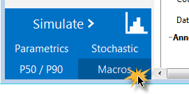
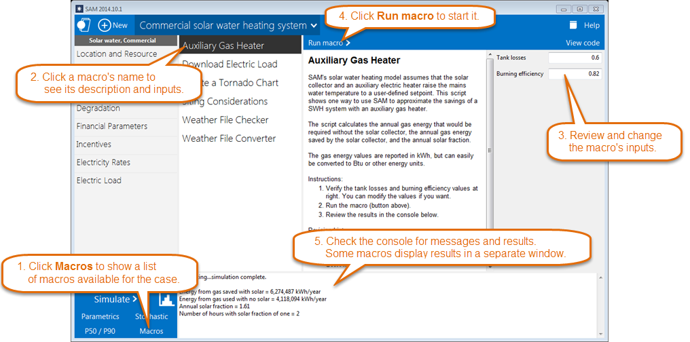
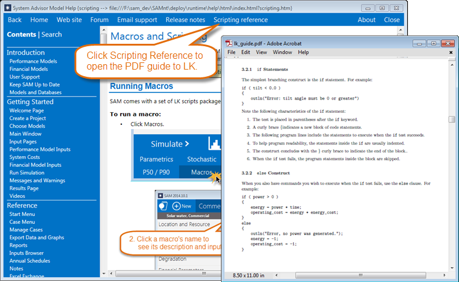
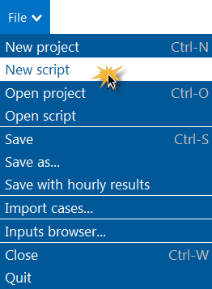
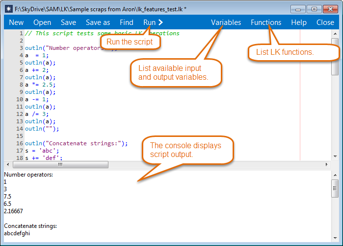

Macros and Scripting
====================

An LK script is code that you write in a SAM file to automate assigning values to SAM inputs, running simulations, and reading and writing SAM results. A macro is an LK script packaged with SAM that you run from the Macros page.

Running Macros
~~~~~~~~~~~~~~

SAM comes with a set of LK scripts packaged as macros. Macros are designed to allow you to run scripts without having to write it.

To run a macro:

* Click Macros.

Creating and Editing Scripts
~~~~~~~~~~~~~~~~~~~~~~~~~~~~

You can write your own LK scripts to automate SAM analysis tasks:

* Set values of inputs.

* Run simulations.

* Read results.

* Read and write data from text files.

* Create Microsoft Excel objects to exchange data with Excel workbooks.

* Create graphs.

* Interact with the internet.

* Run SSC modules directly. (See :doc:`Software Development Kit <sdk>`.)

For a complete reference to the LK scripting language, click **Scripting reference** above:

LK Script notes:

* When you save the script, SAM stores it in a text file with the .lk extension.

* LK script files are separate from SAM files.

* The LK scripting language is also part of the :doc:`SAM software development kit (SDK) <sdk>`.

* For examples of LK scripts, see `LK Scripts for SAM <https://github.com/NREL/SAM/tree/develop/samples/LK%20Scripts%20for%20SAM>`__ on the SAM GitHub repository.

To create or open an LK script:

* On the File menu click **New script** or **Open script**.

Running Scripts from the Command Line 
~~~~~~~~~~~~~~~~~~~~~~~~~~~~~~~~~~~~~~

You can run a script from the command line in a Command or Terminal window. The syntax is:

[path to SAM executable] [any string] [path to .lk script file]

Note the spaces between each parameter.

For example, in Windows, the command might look like this:

c:/sam/2021.12.02/x64/sam.exe not-a-sam-file c:/test.lk

The command starts the SAM desktop application, opens the .lk file in a script editor and runs the script (equivalent to clicking the Run button in the script editor). The middle parameter is required (it can be any string), but does not do anything. You have to manually close SAM when you are finished.

You can also use the following to open a .sam file from the command line:

[path to SAM executable] [path to .sam file]