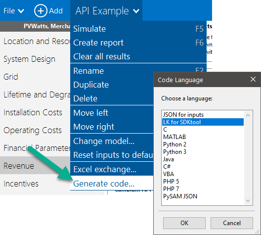

Software Development Kit
========================

The SAM software development kit (SDK) is a collection of developer tools for creating renewable energy system models using an application programming interface (API) that  provides access to the SAM Simulation Core (SSC):

* The SSC API provides access to SSC, which is a library of modules for modeling renewable energy projects.

* SDKtool is a program that comes with your SAM installation to explore SSC. It includes a module browser that can run individual SSC modules, a data container that displays editable lists of module inputs and outputs, and a script editor where you can test your algorithms in the LK scripting language.

* The SSC Guide is a user manual for the SDK.

* SAM's code generator generates creates a ready-to-run program written in one of various languages with supporting libraries and data files from the information in a SAM case.

To get started with the SDK:

#. Download the SSC Guide from the `SDK page <https://sam.nrel.gov/software-development-kit-sdk>`__ on the SAM website.

#. In your SAM installation folder, find the SDKtool application. It should be in the same folder as the SAM application (for example, in Windows, c:/SAM/.

#. Start SAM, and create or open a project for the kind system you would like to model.

#. On the :doc:`Case menu <case_menu>`, click **Generate Code**, or press Shift+F5.

#. Choose a language to export the code.

#. Navigate to the folder where you want to save the file(s). For some cases or languages, SAM will save a set of files, so you may want to create a new folder to make it easier to find the files.