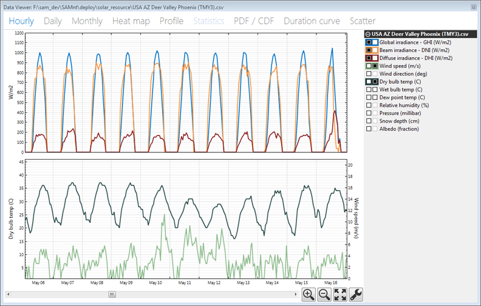
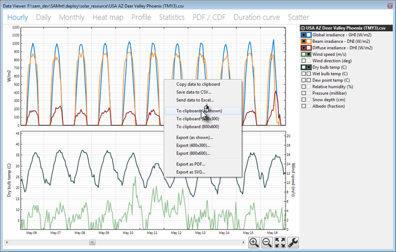

Time Series Data Viewer
=======================

The time series data viewer displays graphs of time series data.

.. note:: SAM's data viewer is also available as a standalone application called DView. You can download it from NREL at https://beopt.nrel.gov/downloadDView.

The data viewer is available in SAM from the following input pages:

* Location and Resource for all solar performance models.

* :doc:`Electric Load <../electricity-rates-and-load/electric_load>` for the residential and commercial financial models.

* The viewer is also integrated into the :doc:`Results <../getting-started/results_page>` page.

To open the time series data viewer:

* Click **View data**.

To export data or a graph image from the data viewer:

* Right-click the graph.

Data Viewer Quick Tips
~~~~~~~~~~~~~~~~~~~~~~

* For graphs with two columns of check boxes, click a box in the left column of the variable list to display a variable in the top graph. Use the right column to display variables in the bottom graph.

* Each graph can display two types of units, on each on the left y-axis and right y-axis.

* The colors in variable list indicate the line colors in the graph.

* Select a segment of the graph to zoom in. 

* Use the controls at the bottom right of the graph to zoom in and out, and to set graph properties like scale limits and line shapes.

Data Viewer Graph and Table Descriptions
~~~~~~~~~~~~~~~~~~~~~~~~~~~~~~~~~~~~~~~~

* **Hourly:** Time series data. 

* **Daily:** Daily totals

* **Monthly:** Monthly totals

* **Heat map:** Entire time series for a single variable

* **Profile:** Daily averages by month

* **Statistics:** Table of statistics calculated from time series data

* **PDF / CDF:** Histogram showing distribution of time series values for a variable, probability distribution function (PDF) and cumulative distribution function (CDF)

* **Duration Curve:** Graph of time steps equaled or exceeded for a single variable.

* **Scatter:** An x-y scatter plot of two variables in the weather file.