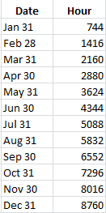

Spatial
=======

The Spatial tab displays graphs of albedo and ground irradiance data based on the options you specify for albedo on the :ref:`Location and Resource <albedo>` page for the Detailed Photovoltaic model. It displays a graph for each subarray defined on the :doc:`System Design <../detailed-photovoltaic-model/pv_system_design>` page.  This data may be useful for agrivoltaic projects as an estimate of solar energy available for growing crops under and between rows of modules.

.. note:: The data displayed in the graphs is also available on the Data Tables tab under **Matrix Data**.

The spatial array graphs are plots of solar irradiance in W/m² on the ground and on the rear of modules in the array over Year 1, assuming that modules are arranged in uniform, rectangular rows. The X axis shows the distance from the edge of modules at the front of the row in meters. The Y axis shows time in hours:

The Ground Albedo graph for each subarray shows an estimate of the solar resource available on the ground under the photovoltaic modules in the array, assuming a rectangular array with dimensions defined on the :doc:`Shading and Layout <../detailed-photovoltaic-model/pv_shading>` page.

The Ground Irradiance Between Rows graph for each  shows an estimate of the solar resource available on the ground in in the space between rows of photovoltaic modules, assuming a rectangular array with row spacing determined by the ground coverage ratio (GCR) on the System Design page.

The Module Rear Irradiance graph for each subarray shows the distribution of irradiance on the back of rows of modules available for bifacial modules based on the spatial albedo inputs on the Location and Resource page.