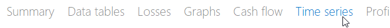
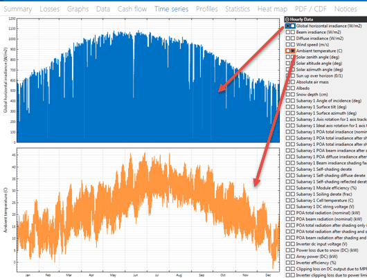
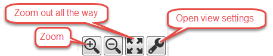
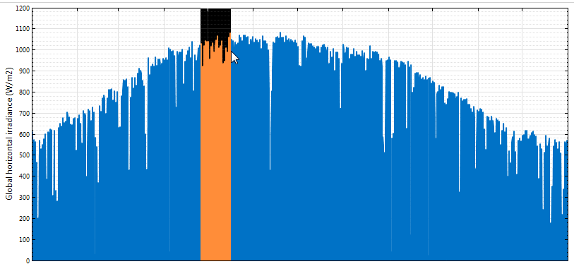
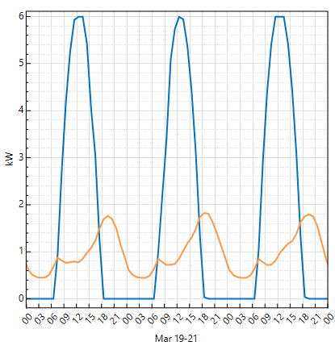
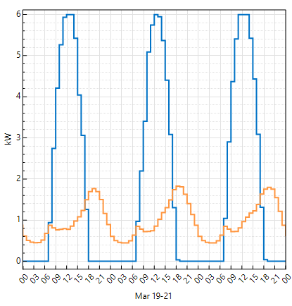

Time Series
===========

The Time Series tab displays the same data shown in tables on the :doc:`Data Tables <data>` tab in graphical form. It includes time series data from the performance model, and time-dependent pricing data from the financial model.

 

When you run a simulation for the first time after opening or creating a .sam file, SAM automatically displays either system power generated for most configurations, or battery state of charge with electricity to load from battery, system, and grid for behind-the-meter battery configurations. To change the graph, use the check boxes to add and remove variables and buttons in the toolbar at the bottom right of the graph to control stacked graphs, axis scale, and other settings.
 
.. note:: SAM's time series data viewer is also available as a standalone application. For details, see `BEopt Download DView <https://beopt.nrel.gov/downloadDView>`__.

To view the Time Series graphs:

#. On the Results page, click the **Time series** tab.

#. Choose variables to display in the graph by checking boxes or choosing from lists as appropriate.

The left column of check boxes displays data in the main graph. The right column of check boxes displays data in a secondary graph below the main graph.

The tool bar below the graphs provides tools for zooming and changing graph :ref:`settings <viewsettings>`:

Use your mouse to zoom in to a section of the graph:

Graph Controls:
...............

* Drag the mouse – zoom in

* Ctrl + Drag – zoom in x direction only by dragging (where applicable)

* Shift + Drag – Pan plot

* Mouse Wheel – zoom plot

* Shift + Mouse Wheel – Scroll plot horizontally

* Ctrl + Mouse Wheel – Scroll plot vertically (where applicable)

.. _viewsettings:

View Settings
.............

Click |ss-icon-wrench| at the bottom right of the graph to open the View Settings window.

**Stepped lines**
  By default, time series plots represent each value as a point connected by a line. This results in a smooth line, but makes it difficult to see the exact value of each point. The Stepped Lines option represents each value as a horizontal line with the length of a single time step. This makes it possible to see the actual value over the time step. For example, the following shows the effect of the Stepped Lines option for a graph of the AC output of a residential photovoltaic system (blue) and the building's electric load (orange)  over a period of three days.

**Stacked area on left Y axis**

  The Stacked Area option fills the area under the line for each variable in the graph and stacks the filled areas. For example, this graph for a residential PV-battery system shows the electricity to load in kilowatts from grid (blue), photovoltaic system (orange), and battery (red). The plots are stacked so that you can see the total load and how the grid, photovoltaic system, and battery meet the load. The graph also shows the battery state of charge, which appears as a line instead of part of the stacked plot because it has different units (% instead of kilowatts).

  .. image:: ../images/SS_TimeSeries_stacked.png
     :align: center
     :alt: SS_TimeSeries_stacked.png

**Graph scale**
  By default, the graph y-axis scales automatically based on the minimum and maximum values of the data in the graph over the year or lifetime. In some cases, when you zoom in to a few days or hours, you may want to adjust the y-axis scale. For a graph with two y-axes, you can change the scale of each axis independently by typing values in the **Y Min** and **Y Max** columns. Click **Autoscale** to automatically scale the axis. **Top right axis** only appears when your graph has two y-axes to display variables with different units.

  .. image:: ../images/SS_TimeSeries_axisscale.png
     :align: center
     :alt: SS_TimeSeries_axisscale.png

