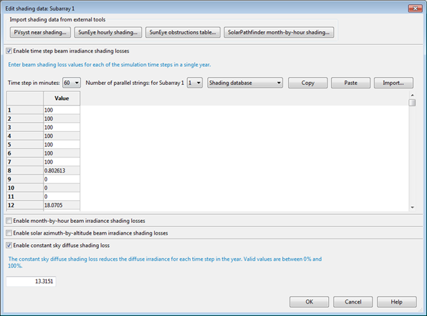

Generate shade data
===================

Once you have created a scene with shading objects and active objects, you can generate tables of shade loss percentages:

* Diurnal table (24 hour x 12 month) of 288 beam shade loss percentages: Entire array and separate active surfaces.

* Diurnal table (24 hour x 12 month) of 288 beam shade loss percentages: Entire array and separate active surfaces.

* CSV file of time series beam shade loss percentages (8,760 values for hourly simulations).

* A single sky diffuse shade loss percentages.

.. _sam:

Generating Shade Data to use In SAM
...................................

When you :doc:`close <../shade-calculator-reference/sc-save-close>` the shade calculator, it automatically applies shading losses to SAM's :doc:`../detailed-photovoltaic-model/pv_soiling_shading_snow` inputs.

To apply shading data to SAM's shading inputs:

#. Click **Save and Close**. 

#. To see the shade data in SAM, on the :doc:`../detailed-photovoltaic-model/pv_soiling_shading_snow` page (or :doc:`System Design <../pvwatts/pvwatts_system_design>` page for PVWatts), click **Edit Shading**. The 3D shade calculator populates the time step beam irradiance shading losses table and assigns a constant sky diffuse shading loss value.

Generating Shade Data to use Outside of SAM
...........................................

You can generate diurnal or hourly shade data to either use outside of SAM, or to import into SAM later.

To generate diurnal shade tables for a single array

#. Click **Location**, and confirm that the :doc:`latitude, longitude, and time zone <sc-define-location>` are correct for your scene.

#. Click **3D scene**, and confirm that objects in your scene have the correct size and position.

#. Click **Analyze**.

#. Click **Diurnal analysis**.

A set of 288 beam shade loss values appear in the hour-by-month table.

To generate hourly shade tables for a single array

#. Click **Location**, and confirm that the :doc:`latitude, longitude, and time zone <sc-define-location>` are correct for your scene.

#. Click** 3D scene**, and confirm that objects in your scene have the correct size and position.

#. Click **Analyze**.

#. Click **Hourly analysis**.

#. Save the resulting CSV file containing 8,760 hourly shade loss values.

To generate diurnal shade tables for multiple active surfaces

#. Click **Location**, and confirm that the :doc:`latitude, longitude, and time zone <sc-define-location>` are correct for your scene.

#. Click **3D scene** or **Bird's eye** to show the scene.

#. For each active surface in the scene:

Click the surface to select it.

In the property table, type a name for the **Group** property and press Tab or Enter.

If you want the calculator to generate a single diurnal shade table for two or more active surfaces, give them each the same group name. See :ref:`Group <group>` for details.

#. Click **Analyze**.

#. Click **Diurnal analysis**.

An  hour-by-month table appears for each group.