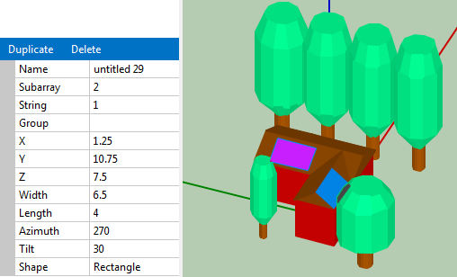

Active surfaces
===============

An active surface is a surface that is shaded by the shading objects. For photovoltaic systems, the active surface is the photovoltaic array. Active surfaces can be rectangular or triangular in shape.

A Building with Two Rectangular Active Surfaces in 3D Scene View 
 and Properties of the South Facing Surface

**Name**
  Descriptive name for the active surface to help you identify it. Does not affect shade analysis.

**Subarray**
  The subarray number (1-4) for the active surface. Each active surface in the shading scene should correspond to a subarray defined on the :doc:`System Design <../detailed-photovoltaic-model/pv_system_design>`   page. You can assign more than one active surface to a single subarray.

**String**
  The string number (1-8) for the active surface. The 3D shade calculator can generate shade factors for up to eight strings, so the number of strings in parallel on the :doc:`System Design <../detailed-photovoltaic-model/pv_system_design>`   page must be 8 or less.

 

.. note:: If your system consists of more than one subarray, define an active surface for each subarray, and use the Subarray property to assign each active surface to a subarray using the subarray number (1-4).

.. note:: If the subarray consists of more than one electrical string, use the String property name to assign each active surface to a string, and use Subarray property to assign each active surface to a subarray.

.. _group:

**Group**
  Descriptive name for a group of active surfaces when the scene has more than one active surface.

**X, Y, Z**
  The X, Y, and Z coordinates of the bottom left corner of the active surface.

**Width**
  The length of the active surface in the X dimension when the azimuth angle is 180 degrees.

**Length**
  The length of the active surface in the Y dimension when the azimuth angle is 180 degrees.

.. note:: The measurements for the size properties of objects (length, width, height, diameter) in the scene can be in any units, as long as you use the same units for all measurements to ensure that the relative size and position of the objects is consistent.

**Azimuth**
  The angle formed by a line in the X-Y plane perpendicular to the bottom of the array and the X axis. An active surface facing due South has an azimuth angle of 180 degrees.

**Shape**
  Rectangle or triangle. The triangle shape has a base equal to Width and a height equal to Length.