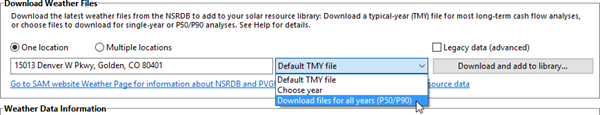
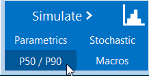

P50/P90 Simulations
===================

The P50/P90 simulation option is available for performance models other than Detailed PV and PVWatts, which use the :doc:`Uncertainty <pvuncertainty>` option instead.

A P90 value is a value that is expected to be met or exceeded 90% of the time. SAM can generate P50 and P90 values for a system's annual electricity to grid output and other metrics by running hourly simulations over a multi-year period.

For a video demonstrating the P50/P90 capability, see `Parametric and Statistical Analysis in SAM <https://sam.nrel.gov/simulation-options.html>`__.

SAM's P50/P90 simulations require at least 10 weather files of consecutive single-year data. The files must be in one of the :doc:`weather file formats <../weather-file-formats/weather_format>` that SAM can read and use the naming convention described below.

.. note:: P50/P90 simulations and results are separate from the case simulation and results. It is not possible to display hourly results from P50/P90 simulations.

.. note:: The **degradation rate** on the :doc:`Degradation <../degradation/degradation>` page does not affect the annual energy values that SAM reports in the P50/P90 analysis results. However it does affect the LCOE value because SAM calculates the LCOE over the analysis period for each weather file year and applies the degradation rate to calculate the annual system output over the analysis period.

.. note:: For a description of SAM's P50/P90 methodology, see Dobos, A. P.; Gilman, P.; Kasberg, M. (2012). P50/P90 Analysis for Solar Energy Systems Using the System Advisor Model: Preprint. 8 pp.; NREL Report No. CP-6A20-54488. (`PDF 372 KB <http://www.nrel.gov/docs/fy12osti/54488.pdf>`__) Before running P50/P90 simulations:

* If you have your own set of weather files to use for the P50/P90 simulations, put them all in a single folder with no other files, and make sure that each file name ends with an underscore followed by the year as follows: *<file name>_<year>.<extension>*. For example, *portland_psm_1998.csv*, *portland_psm_1999.csv*, etc.

* If you are downloading files from the National Solar Radiation Database (NSRDB), use the **Download files for all years (P50/P90)** option to download multiple single-year files for P50/P90 simulations. SAM will create a folder based on the location name in your weather file download folder, and place the files in the folder with names that follow the *<file name>_<year>.<extension>* convention.

To run a P50/P90 simulation:

#. On the main window, click Configure Simulations to view the Configure Simulations page.

#. On the P50/P90 Simulations page, for **Select weather file folder**, click **...** and navigate to the folder containing the series of single-year weather files.

#. Click **Run P50/P90 analysis**.

SAM displays a table of P50/90 metrics for the results variables available for the case.