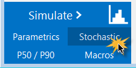
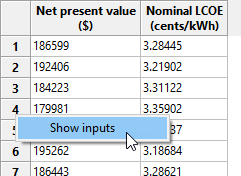
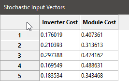
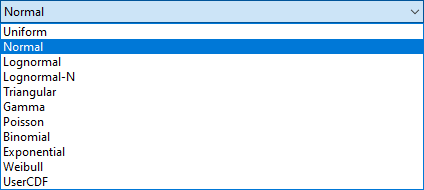
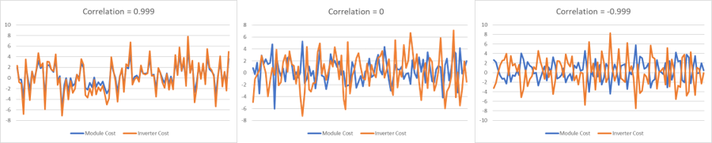

Stochastic Simulations
======================

The Stochastic Simulations page provides tools you can use to generate distributions of input values for statistical and sensitivity analysis. For example, you could explore how uncertainty in the installation cost of one or more system components might affect a project's net present value and levelized cost of energy (LCOE) over the project life.

Click **Stochastic** in the lower left corner of the main window to display the Stochastic Simulations page:

SAM uses the Latin Hypercube Sampling (LHS) and STEPWISE packages from Sandia National Laboratories to generate distributions for stochastic simulations. For information about these packages, see:

* Wyss, G; Jorgensen, K. (1998). "A User's Guide To LHS: Sandia's Latin Hypercube Sampling Software." Sandia National Laboratories. SAND98-0210. 140 pp. (`PDF 15 MB <https://doi.org/10.2172/573301>`__) 

* Helton, J.; Davis, F.; (2000). "Sampling-Based Methods for Uncertainty and Sensitivity Analysis." SAND99-2240. 121 pp. (`PDF 5 MB <https://doi.org/10.2172/760743>`__)

* SAM's LHS implementation is here: https://github.com/NatLabRockies/lhs.

* For the stochastic simulation regression results, SAM uses the STEPWISE package, https://github.com/sandialabs/stepwise/.

SAM's :doc:`LK scripting language <../reference/macros>` includes LHS functions so you can create input distributions from your LK scripts. See the `LK samples on the SAM GitHub.com <https://github.com/NatLabRockies/SAM/tree/develop/samples/LK%20Scripts%20for%20SAM>`__ repository for an example.

For a video demonstration of stochastic simulations in SAM, see `Parametric and Statistical Analysis in SAM <https://sam.nlr.gov/simulation-options.html>`__.

To run stochastic simulations:

#. For **Input variables**, click **Add** to display a list of available input variables.

#. Check the variables in the list that you want to assign a distribution of values and click **OK**. You can choose one or more variables.

#. For each variable in the list of stochastic input variables, either double-click the variable name, or click the variable and then click **Edit**.

#. Choose a :ref:`distribution <distributions>`, enter parameter values for the distribution and click **OK**.

For example, if you choose a Normal distribution, enter a mean value for the input and a standard deviation. SAM shows the variable's name and its value from the SAM inputs for reference.

#. If you chose more than one variable and want to assign a :ref:`correlation <correlations>` between two of those variables, click **Add** under **Correlations** and choose a pair of variables to correlate with a correlation value between -1 and 1.

#. Under **Outputs**, click **Add** to choose the output variables for the stochastic simulations. For example, if you want to see how the net present value varies for a given distribution of installation costs, choose the net present value output variable.

#. Click **Run simulations** to generate a table of input values based on the distributions you defined and a table of results corresponding to the inputs along with the coefficient of determination R² and Beta coefficient ß for each output.

 
.. note:: When you click **Run simulations** after changing inputs, correlations, or outputs, SAM automatically generates a new set of samples and displays them in the Stochastic Input Vectors window.

.. note:: You can click **Compute samples** to generate a new set of samples based on the same inputs and correlations. When you click **Run simulations** after generating samples, SAM runs the simulations without regenerating the samples so the results will match the samples you generated.

.. note:: If you run stochastic simulations after closing the Stochastic Input Vectors window without changing the inputs, correlations, or outputs, the results are based on the samples that were in the closed window. SAM only generates new samples when you change the inputs, correlations, or outputs or generate a new set of samples.

.. note:: Stochastic simulation inputs, simulations and results are separate from the case simulation and results that you get by clicking the Simulate button.

Tips for Exporting Stochastic Simulation Data
.............................................

SAM displays stochastic simulation inputs and outputs in separate tables, which makes it difficult to interpret the results. There are two ways to work around this limitation. You can use Show Inputs to see all of the inputs for a given row in the outputs table, or you can copy and paste data from the inputs and outputs table to a spreadsheet or text file.

To use Show Inputs to display all inputs for a row in the outputs table:

#. Click **Run simulations** to generate a table of outputs.

#. Right-click the row heading for the row whose inputs you want to see, and click **Show inputs**. For example, here we right-clicked the row heading "4" to show inputs corresponding to the results in Row 4:

This opens the inputs browser so you can see all of the inputs used to generate the results. You can use the Export functions of the inputs browser to export the data to a CSV file or Excel (Windows only).

To copy and paste data from the inputs and outputs table to a spreadsheet or text file:

#. Click **Run simulations** to generate tables of stochastic inputs and outputs.

#. Click the cell above the row headers and to the left of the column headers to select the entire table. (You can click a column or row header to select a single column or row instead of the entire table. (Selecting more than one column or row header only selects a single column or row in spite of the highlighted cells.)

#. Press Ctrl-C (Command-C on a Mac) to copy the selected table

#. In your spreadsheet or text file, press Ctrl-V (Command-V) to paste the table. SAM omits column headings, so you will have to type those by hand.

#. Repeat this process with the stochastic results table to copy and paste the data.

.. _distributions:

Distributions
~~~~~~~~~~~~~
The distributions available in SAM correspond to the distributions described in Section 4.2 of Wyss (1998).

To define the distribution for an input variable, either double-click the variable's name in the list of input variables, or click the name and then click **Edit**. 

.. note:: It is possible to define a distribution that results in invalid input values, so be careful to choose parameters that result in a valid range of values. For example, if the example shown in the graph below for the Normal distribution was for a cost input, the negative cost values would cause simulation errors.

**Normal**
  The normal distribution is defined by the mean (μ) and standard deviation (σ), where μ is any real number and σ > 0. The distribution is not bounded or truncated.

  .. image:: ../images/IMG_Stochastic-normal.png
     :align: center
     :alt: IMG_Stochastic-normal.png

**Uniform**
  Uniform samples values uniformly between a minimum value A and maximum value B where A and B are real numbers and B > A.

  .. image:: ../images/IMG_Stochastic-uniform.png
     :align: center
     :alt: IMG_Stochastic-uniform.png

**Lognormal**
  The logarithm of the lognormal distribution is a normal distribution defined by an input mean and error factor, where input mean > 0 and error factor > 1. The mean (μ) and standard deviation (σ) of the underlying normal distribution are related to the parameters of the lognormal distribution as follows:

*σ = ln( error factor ) / 1.65*

*μ = ln( input mean ) - 0.5 σ²*

  .. image:: ../images/IMG_Stochastic-lognormal.png
     :align: center
     :alt: IMG_Stochastic-lognormal.png

**Lognormal-N**
  A Lognormal-N option results in the same distribution as the Lognormal option, but instead of specifying the input mean and error factor, you provide the mean (μ) and standard deviation (σ) of the underlying normal distribution, where μ is any real number and σ > 0.

**Triangular**
  The triangular distribution has a probability density function in the shape of a triangle with a distribution minimum at A, maximum at C, and the most likely value at the apex B, where A, B, and C are real numbers, and A ≤ B and B ≤ C.

  .. image:: ../images/IMG_Stochastic-triangular.png
     :align: center
     :alt: IMG_Stochastic-triangular.png

**Gamma**
   The gamma distribution is defined by the parameter α and the scaling factor β with a resulting mean of α/β, where both parameters are real numbers.

  .. image:: ../images/IMG_Stochastic-gamma.png
     :align: center
     :alt: IMG_Stochastic-gamma.png

**Poisson**
  The Poisson distribution is a discrete distribution of integer values defined by the frequency Lambda λ, a positive real number.

  .. image:: ../images/IMG_Stochastic-poisson.png
     :align: center
     :alt: IMG_Stochastic-poisson.png

**Binomial**
  The binomial distribution is a discrete distribution defined by the failure probability P, where 0 < P < 1, and the number of tests N, where N > 1.

  .. image:: ../images/IMG_Stochastic-binomial.png
     :align: center
     :alt: IMG_Stochastic-binomial.png

**Exponential**
  The exponential distribution is a discrete distribution defined by the parameter Lambda (λ), where λ > 0.

  .. image:: ../images/IMG_Stochastic-exponential.png
     :align: center
     :alt: IMG_Stochastic-exponential.png

**Weibull**
  The Weibull distribution is defined by the shape parameter α and scale parameter β, where both parameters are greater than zero.

**UserCDF**
  The UserCDF option is for input variables that cannot be represented as one of the above distributions. For example, variables that are a choice such as photovoltaic array tracking, or variables that are arraysdoes not work.

Distributions for Solar Resource Data
~~~~~~~~~~~~~~~~~~~~~~~~~~~~~~~~~~~~~
The solar resource data in a weather file consists of hourly or subhourly values for several different parameters. For example, an hourly weather file has 8,760 values for DHI (diffuse horizontal irradiance), DNI (direct normal irradiance), ambient temperature and ambient wind speed data. Because the data in the weather file is not represented as a single number, it is not possible to define distributions for weather data using the :ref:`distributions <distributions>` described below.

If you have a set of weather files spanning multiple years, you can use the **Include normal distribution of weather files** option to have SAM select files from different years using a normal distribution based on the sum of average annual DNI or DHI for each file divided by the number of weather files. These weather files should be single-year weather files rather than typical-year files that combine data from different years: Each file should contain data for a specific year.

.. note:: The weather file distribution option is only available for the solar performance models. It does not work for the wind power or other performance models.

To include weather files in stochastic simulations:

#. Set up distributions and correlations for the input variables you want to include in the stochastic simulations, if any.

#. If you do not have a set of weather files, use the **Choose year** option on the Location and Resource page to download weather files.

#. Click **Choose folder** to choose the folder that contains the weather files. The folder must contain only valid weather files.

#. Check **Include weather file normal distribution based on DNI or DHI**.

#. Click **Show CDF** to see the cumulative distribution function (CDF) of annual average DNI. Click the top left corner of the table to select the data to copy and paste into a spreadsheet or text file.

#. Choose **DNI** or **DHI** to determine whether the distribution is based on the annual avearage direct normal irradiance (DNI) or diffuse horizontal irradiance (DHI) in each weather file. The DNI option is appropriate for most solar analysis.

#. Click **Compute samples** to show a list of inputs for the stochastic simulations. The Stochastic Inputs table shows the weather files that will be used for each simulation along with either the average annual DHI or DNI for each file.

#. Click **Run simulations** to generate a table of results. Remember not to compute samples after running simulations if you want the input and output tables to match.

.. _correlations:

Correlations
~~~~~~~~~~~~
When you choose more than one input variable for stochastic simulations, SAM assumes by default that the variables are not related and assigns values to each variable independently. If you want to create a relationship between a pair of inputs, you can define a correlation.

The LHS correlation function SAM uses is described in Chapter 2 and Section 4.4.3 of Wys (1998).

A correlation can only be defined between one pair of variables at a time. To correlate more than two variables, define a correlation between all of the variables in pairs. For example, to define a correlation between three variables A, B, and C, you could first define a correlation between A and B, and then a separate correlation between B and C.

To define a correlation between two variables:

#. Under **Correlations**, click **Add** to display a list of stochastic input variables.

#. Check the two variables in the list that you want to correlate and click **OK**.

#. Type the correlation between -1 and 1 and click **OK**:

#. Values near the absolute value of one result in closer correlation than values near zero.

Zero is equivalent to no correlation between the values in the two variables.

Negative correlation values cause small values of one variable to be paired with large values of the other variable.

Positive correlation causes larger values of both variables to be paired, and smaller values of both variables to be paired.

The following graphs are of samples generated by SAM for two inputs with normal distributions to show how correlations work. The example correlations are -0.999 (very close negative correlation), 0 (no correlation), and 0.999 (very close positive correlation) 

Create a Tornado Chart Macro
~~~~~~~~~~~~~~~~~~~~~~~~~~~~
SAM's Create Tornado Chart macro in an LK script that you can use to generate a tornado graph given a set of statistical distributions and input variables. See the `Parametric and Statistical Analysis videos <https://sam.nlr.gov/simulation-options.html>`__ for a video demonstration.

To run the Create Tornado Chart Macro:

#. Start SAM and open a project file or create a new case.

#. Click **Macros** in the lower left corner of the Main window.

#. Click **Create Tornado Chart** in the list of Macros available for the case.

#. Follow the instructions to create the chart.