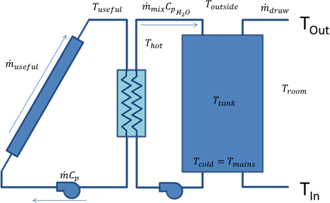
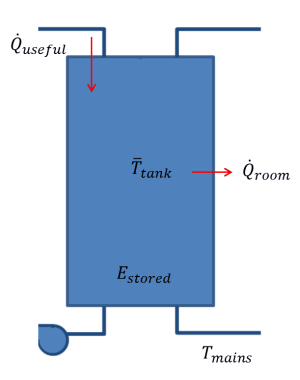
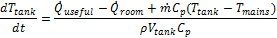
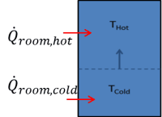
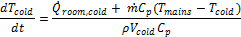
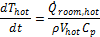

Solar Water Heating
===================

The solar water heating (SWH) model represents flat-plate solar collectors with a one tank water or glycol storage system and a auxiliary electric heater. The solar water heating performance model works with either the residential or commercial :doc:`financial model <../introduction/fin_overview>`, and  assumes that the solar water heating system displaces purchases of electricity for an electric water heater. Installation and operating costs, financial assumptions, and retail electricity prices determine the value of the energy delivered by the solar water heating system.

The SWH model allows you to vary the location, hot water load profiles, mains and set temperature profiles, and characteristics of the collector, heat exchanger, and solar tanks. The model was developed at the National Renewable Energy Laboratory for SAM.

See the `SAM website <https://sam.nrel.gov/solar-water-heating>`__ for additional documentation.

Solar Water Heating Model Notes
...............................

* SAM calculates the water mains inlet temperature based on the correlation to local air temperature used in the Building America Benchmark. The algorithm is described in Burch and Christensen (2007) `Towards Development of an Algorithm for Mains Water Temperature <https://research-hub.nrel.gov/en/publications/towards-development-of-an-algorithm-for-mains-water-temperature/>`__. SAM reports the hourly water mains temperatures on :doc:`Tables <../results/data>` on the :doc:`Results <../results/results>` page as **T mains (C)**. If you have your own mains temperature data, you can override the mains inlet temperature calculation import an 8,760 hourly mains profile on the :doc:`SWH System <swh_system>` page.

* SAM assumes that the flow rate is constant over each hour, using values from the hourly hot water draw profile that you specify. SAM calculates the flow rate in kg/hr as the draw volume converted to kg for a given hour divided by one hour.

* Collectors are assumed to be flat plate collectors plumbed in parallel, with uniform flow through each collector at the tested flow rate.

* Collectors are characterized by the linear form of the collector efficiency and IAM (incident angle modifier) equations with parameters available from test data such as those available at `www.solar-rating.org <https://www.solar-rating.org/>`__.

* The collector loop is assumed to be charged with water having *Cp = 4.18 kJ/kG-ºC* or glycol having *Cp = 3.4 kJ/kG-ºC*. You can specify which fluid to use.

* Collector parameters are corrected for the flow rate, heat exchanger, and pipe losses using relations in Duffie and Beckman, *Solar Engineering of Thermal Processes*, 3rd. Edition. Specifically, see p. 307 for the flow rate corrections, p. 430 for pipe-loss adjustment, and p. 427 for heat exchanger adjustment.

* The heat exchanger is external to the solar tank, has no thermal losses, and is assumed to have the constant effectiveness that you specify on the :doc:`SWH System <swh_system>` page.

* A standard differential controller controls the collector loop pump. Pump power is input and assumed totally lost.

* The energy balance differential equations are approximated with the implicit-Euler method.

The Solar Water Heating model topics are:

* :doc:`Location and Resource <swh_location_and_resource>`

* :doc:`Solar Water Heating <swh_system>`

* :doc:`Installation costs <../installation-costs/cc_swh>`

* :doc:`Operating costs <../operating-costs/oc_operating>`

* :doc:`Results <swh_results>`

* :doc:`Solar Fraction <../performance-metrics/mtp_solar_fraction>`

Solar Water Heating Model Description
~~~~~~~~~~~~~~~~~~~~~~~~~~~~~~~~~~~~~

SAM models a closed-loop flat plate collector which transfers solar energy from the working fluid to the water in an external heat exchanger. This setup is often used in climates where freezing temperatures occur, because the collector working fluid can be different than water. Water from the solar tank is typically used to preheat water in an auxiliary water tank and reduce the amount of heat needed to bring the delivered water to the set point desired by the user. In the model used here, the solar tank is filled with water from the mains, pumped through the heat exchanger, and returned to the top of the tank.

The specific equations solved depend on whether useful solar energy is being collected or not. Below is a system diagram for when energy is being collected.

During solar collection, the tank is assumed to be fully mixed. This assumption is made because hot water continually is entering the top of the tank and mixing with cooler water underneath. A simple energy balance is performed on the tank to solve for the mean tank temperature each hour. Note that energy is added from the solar collector loop, energy is lost to the environment, mass enters the tank at the mains temperature and exits the tank at the mean tank temperature. Making an assumption that the mass in the tank is constant results in the differential equation:

Where the value for the useful energy delivered is derived using relations from the third edition of *Solar Engineering of Thermal Processes* by John Duffie and William Beckman. 

When useful solar energy is not being collected, the tank is assumed to be stratified into one hot node and one cold node.

This stratification occurs because user draws reduce the volume of hot water in the tank, and cold water from the mains is input to replace that water. Gradually, the cold volume will increase until solar collection begins again. In the stratified discharging mode, variable volume energy balances are performed on both the hot and cold nodes. The only heat transfer modeled is transfer to the environment which is drawn in a positive sense above. The heat transfer direction is usually reversed for the hot node. The mass coming into the cold node is at the mains temperature, and no mass is assumed to leave. The variable volume nature of each node means that mass cannot be assumed constant, resulting in the following differential equation for the cold node:

The mass leaving the hot node at the hot-node temperature, and no mass is assumed to enter.

These three differential equations are approximated for each hour, with the express interest of determining how much energy is saved by using solar water heating.