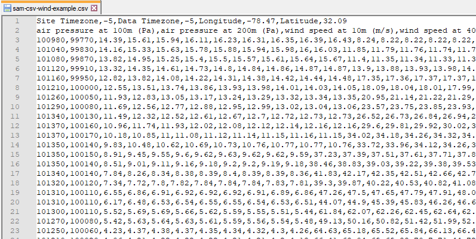

SAM CSV Format for Wind
=======================

The SAM CSV Format for Wind is a comma-delimited text format for SAM's wind power performance model. This is the format for files from the `NLR WIND Toolkit API <https://developer.nlr.gov/docs/wind/wind-toolkit/wtk-download/>`__ and `NLR RE Explorer <https://www.re-explorer.org/>`__.

 
.. note:: SAM 2022.11.21 r1 is the first version of SAM to support this new format. We are transitioning away from the :doc:`SRW format <weather_format_srw_wind>` to this format to make SAM more compatible with the WIND Toolkit API and NLR RE Explorer.

.. note:: Some WIND Toolkit endpoints return files in a slightly different format. For example, offshore-hawaii-download and offshore-mid-atlantic-download are in a different format than the one described here.

The format allows you to use wind resource data at one or more heights above the ground, and is designed to be flexible enough to handle a range of data. To work with SAM's Wind Power model, the file must meet the following requirements:

* The file stores four data types: wind speed, wind direction, air temperature, and atmospheric pressure.

* The file must contain a least one complete set of the four data types.

* The data can be for one measurement height above the ground or multiple heights.

* The measurement heights can be different for the different types of data.

  * Air temperature, atmospheric pressure, and wind direction data can be at one height with wind speed data at multiple heights.

  * The direction measurement height must be within 10 meters of the nearest wind speed measurement height.

* The file must contain a wind speed measurement height within 35 meters of the turbine hub height.

* The file must contain data for a single year.

* The Wind Power model determines the simulation time step from the number of resource data rows in the weather file, so time stamps are not required.

  * The first row of data is in the hour ending at 1 a.m on January 1 local time.

  * The number of data rows must be an integer multiple of 8760 hours/year.

  * Time steps can be hourly or subhourly.

* SAM requires a valid value for all time steps for each data element. It does not fill data gaps. It does perform some checks on the weather data before running a simulation, and displays messages about problems with the data in the simulation notices.

Header Row 1
............

The first row of the file stores information about the location as a label/value pair, separated by commas: Each label is followed by its value. The label/value pairs can be in any order. 

Required header items are:

* Latitude

* Longitude

* Site Timezone

* Data Timezone

Optional items are:

* Elevation

* SiteID

 

.. note:: If elevation data is not provided in the weather file, SAM's Wind Power model sets it to zero. If your weather file does not include elevation data, you can add it by editing the file and adding it to Row 1. The elevation data is used when you choose the **Define turbine design characteristics** option on the :doc:`Wind Turbine <../wind-power/wind_turbine>` page to calculate the turbine power curve from design parameters. SAM uses the air temperature and atmospheric pressure data for each time step to adjust the turbine power curve. It does not use the elevation above sea level for this purpose. If you are using the **Select a turbine from the library** option, SAM does not use the elevation value from the weather file.

.. note:: The site time zone and data time zone values must be the same. SAM assumes that the time stamps in the resource data rows are in local time.

.. note:: Row 1 items can be in any order, but the each item's value must immediately follow its label.

Here is an example of a valid Row 1:

  *SiteID,2226728,Site Timezone,-5,Data Timezone,-5,Longitude,-78.5,Latitude,32.1,Elevation,0*

Example of a valid Row 1 with only required data:

  *Site Timezone,-5,Data Timezone,-5,Longitude,-78.5,Latitude,32.1*

.. list-table::
   :width: 100%
   :align: center
   :header-rows: 1

   * - Header Field
     - Units
     - Description (Examples)
     - Accepted Labels for Row 1
   * - Latitude
     - degrees
     - Latitude of the site (32.1, -20.6)
     - *latitude, lat*
   * - Longitude
     - degrees
     - Longitude of the site (-78.5, 35.1)
     - *longitude, lon, long, lng*
   * - Site timezone
     - hours offset from UTC
     - Time zone of the site (-8, 5)
     - *site timezone*
   * - Data timezone
     - hours offset from UTC
     - Time zone of the data time stamps in each row. Must be equal to the site time zone. (-8, 5)
     - *data timezone*
   * - Elevation
     - meters above sea level
     - Site elevation above sea level in meters. (900, 1235.6)
     - *el, elev, elevation, site elevation*
   * - SiteID
     - n/a
     - Text description of the site or data. SAM does not use this information. (2226728, Site Name)
     - *siteid, id, location, location id, station, station id, wban, wban#*

Header Row 2
............

SAM determines the type of data for each column based on the labels in Row 2. Row 2 must have the same number of columns as the resource data rows.

Row 2 must contain at least one column label for wind speed, wind direction, ambient temperature, and atmospheric pressure. For a weather file with data at more than one height above the ground, Row 2 must contain a set of columns for each height.

Required columns are:

* wind speed for at least one height above the ground

* wind direction for at least one height above the ground

* temperature for at least one height above the ground

* atmospheric pressure for at least one height above the ground

 
.. note:: Columns do not have to be in any particular order, and can be in a different order for each hub height.

.. note:: Columns can be for data that SAM does not use. SAM ignores any column labels it does not recognize.

.. note:: SAM's wind power model does not require year, month, day, or minute time stamps. It ignores any time stamp data in the file.

Example of a valid Row 2 for a file with data at two measurement heights:

  *air pressure at 100m (Pa),air pressure at 200m (Pa),wind speed at 100m (m/s),wind speed at 200m (m/s),wind direction at 100m (deg),wind direction at 200m (deg),,air temperature at 100m (C),air temperature at 200m (C)*

.. list-table::
   :width: 100%
   :align: center
   :header-rows: 1

   * - Data Field
     - Units
     - Accepted Labels for Row 2
   * - Wind speed
     - m/s
     - *must contain "speed"*
   * - Wind direction
     - degrees east of north (degrees), with zero degrees indicating wind from the north, and 90 degrees indicating wind from the east
     - *must contain "dir"*
   * - Atmospheric pressure
     - atm or Pa (SAM's Wind Power model assumes values greater than 1.1 are in Pa and converts them to atm)
     - *must contain "pres", must not contain "surface"*
   * - Ambient temperature
     - °C
     - *must contain "temp"*

Data Rows 3 and higher
......................

The data rows must contain columns of wind resource data in the order defined by the labels in Row 2.

SAM's wind power model assumes the data are in the units described in the table above. It does not read units from the column labels.