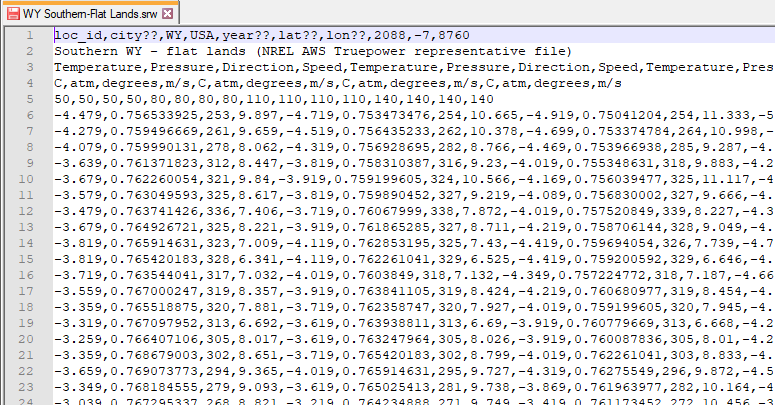

SRW Format for Wind
===================

The SRW format is a comma-delimited text format with the extension .srw for the wind power performance model. 

**Note.** As of SAM 2022.11.21 r1, SAM works with the new :doc:`SAM CSV Format for Wind <weather_format_srw_wind>`, which is compatible with wind resource data from the `NREL WIND Toolkit API <https://developer.nrel.gov/docs/wind/wind-toolkit/wtk-download/>`__ and `NREL RE Explorer <https://www.re-explorer.org/>`__. If you are creating wind resource files to use with SAM, we recommend you use this new format instead of the SRW format.

The format allows you to use wind resource data at one or more heights above the ground, and is designed to be flexible enough to handle a range of data.

* The file stores four data types: wind speed, wind direction, air temperature, and atmospheric pressure.

* The data can be for one measurement height or multiple heights. The measurement heights can be different for the different types of data. The file can contain air temperature, atmospheric pressure, and wind direction data at one height, and wind speed data at multiple heights.

* The file must contain a least one complete set of the four data types.

* The file stores data for a single year.

* Time steps can be hourly or subhourly. SAM determines the simulation time step from the number of resource data rows in the weather file. The number of data rows must be an integer multiple of 8760 hours/year.

* The direction measurement height must be within 10 meters of the nearest wind speed measurement height.

* For the file to work with a SAM Wind Power model simulation, the file must contain a wind speed measurement height within 35 meters of the turbine hub height.

* The file does not contain time zone information. The NREL WIND Toolkit data assumes data time steps are in UTC, where Row 1 is the hour ending at 1 a.m.

Header Rows 1 and 2
...................

The first two rows of the file store information about the location, and descriptive text that you can use for any purpose. SAM displays some of this information in the fields on the Wind Resource page, but does not use any of this information in simulation calculations.

**Row 1**
  <location id>,<city>,<state>,<country>,<year>,<latitude>,<longitude>,<elevation>

  Row 1 must have at least 8 columns. You must provide a value for each column: If you do not have a value for a column, you can use an indicator like n/a or ?? for the missing value.

  SAM displays the eight location-related values on the Wind Resource page, but does not use these values in calculations.

  SAM ignores the extra commas at the end of the row that your spreadsheet software may insert.

 

.. note:: SAM uses the air temperature and atmospheric pressure data for each time step to adjust the turbine power curve. It does not use the elevation above sea level for this purpose.

.. note:: SAM reads the first 8 columns and ignores any additional columns. For example, it ignores the time zone in Column 9 and number of data rows in Column 10.

**Row 2**
  <data source>

  One line of descriptive text that SAM displays on the Wind Resource page. You may leave this line blank.

  SAM ignores the extra commas at the end of the row that your spreadsheet software may insert.

Header Rows 3 - 5
.................

Rows 3 and 4 tell SAM what data each column contains. SAM determines the type of data for each column based on the information in Rows 3 and 4. Rows 3 and 4 must have the same number of columns as the resource data rows.

**Row 3**
  The label for each data column. Row 3 must contain at least one column for wind speed, wind direction, ambient temperature, and atmospheric pressure. For a weather file with data at more than one height above the ground, Row 3 must contain a set of columns for each height.

  Acceptable labels are not case sensitive:

* *temperature*   or *temp*

* *pressure*   or *pres*

* *speed*   or *velocity*

* *direction*   or *dir*

  The columns do not have to be in any particular order, and can be in a different order for each hub height.

**Row 4**
  Measurement units for the resource data in each column corresponding to the resource data type in Row 3. Each column in Row 4 must contain a text value describing the measurement units. SAM displays this text in graphs and tables. For example: atm, m/s, degrees, Celsius, etc.

.. note:: SAM assumes that the resource data are in the units described below regardless of the values you specify in Row 4.

**Row 5**
  Measurement height above the ground in meters for the resource data for each column defined in Row 3. Each column in Row 5 must contain an integer or decimal value.

Resource Data Rows 6 and Higher
...............................

The resource data rows store the wind speed, wind direction, ambient temperature, and atmospheric pressure values.

Row 6 should contain data for the hour ending at 1 am on January 1. (For time-dependent pricing calculations, SAM's financial models assume that January 1 is a Monday.)

The resource data rows store integers or decimal values with the following units:

* Wind speed in meters per second (m/s).

* Wind direction in degrees east of north (degrees), with zero degrees indicating wind from the north, and 90 degrees indicating wind from the east.

* Atmospheric pressure in in atmospheres.

* Ambient temperature in degrees Celsius.