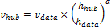
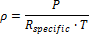
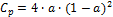
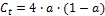
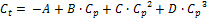
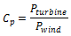
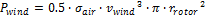
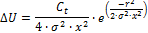

Wind
====

The Wind Power model is for projects involving one or more large or small turbines with any of the financial models for residential, commercial, or utility-scale PPA projects.

For a technical description of the wind power model, see Freeman, J.; Gilman, P.; Jorgenson, J.; Ferguson, T. (2014). "Reference Manual for the System Advisor Model's Wind Performance Model." National Renewable Energy Laboratory, NREL/TP-6A20-60570. (`PDF 738 KB <https://docs.nlr.gov/docs/fy14osti/60570.pdf>`__)

.. note:: If you are new to SAM, you can use the Wind Wizard to create a wind case. The Wizard steps you through the inputs you need to create a basic case. To run the Wind Wizard, either start SAM and click **Quick start for new users** at the bottom left corner of the Welcome page, and then click **Wind Wizard**. If SAM is running, on the File menu, click **Close** to return to the Welcome page.

Wind Power Model Algorithm
~~~~~~~~~~~~~~~~~~~~~~~~~~

SAM's wind power model uses wind resource data that you specify on the :doc:`Wind Resource <wind_resource>` page to calculate the electricity delivered to the grid by a wind farm that consists of one or more wind turbines.

SAM can either read wind resource data from a time series data file in the :doc:`SRW <../weather-file-formats/weather_format_srw_wind>` format, or make calculations based on an estimate of the wind resource specified using a Weibull distribution.

SAM calculates the wind farm's output over a single year in hourly time steps. It uses the following algorithm to calculate the wind farm output for each time step of the simulation:

#. Determine the wind data height, and adjusts the wind resource data to account for differences between the turbine hub height and the wind resource data height. See :ref:`Hub Height and Wind Shear <shear>` below for details.

#. Calculate output of a single turbine, accounting for the turbine's height above the ground.

On the :doc:`Turbine <wind_turbine>` page, you choose to represent the turbine's performance characteristics either as a turbine power curve from the turbine library, or by specifying values for a set of turbine design parameters. For both options, you also specify a turbine hub height and shear coefficient.

#. Calculate output of wind farm, accounting for wake effects.

On the :doc:`Wind Farm <wind_farm>` page, you specify the number of turbines and wind farm layout geometry for a simple representation of a wind farm on a flat surface, and a value for the ambient turbulence intensity. See :ref:`Wake Effect Model <wakeeffect>` below for details.

#. Adjust wind farm output.

You can account for additional losses by specifying a value for a wind farm loss factor on the :doc:`Wind Farm <wind_farm>` page.

#. Calculate electricity delivered to the grid.

SAM adjusts the wind farm's output using the losses you specify for system availability or other operating losses.

.. _shear:

Hub Height and Wind Shear
~~~~~~~~~~~~~~~~~~~~~~~~~

SAM makes wind shear adjustments to account for variation in wind speed with height above the ground.

When you choose the **Wind Resource by Location** option (time series data from a wind data file) on the :doc:`Wind Resource <wind_resource>` page, SAM ignores the value of the **Shear Coefficient** on the :doc:`Turbine <wind_turbine>` page when the data file contains wind speed data columns for more than one height and the turbine hub height is between the minimum and maximum wind data heights in the file. SAM looks for the data column with the measurement height closest to the hub height. If it finds an exact match, it uses that data column. If it does not find an exact match, SAM finds the two measured heights on either side of the hub height and uses linear interpolation to estimate the wind speed at the hub height.

For wind direction data, SAM interpolates to estimate wind direction at different hub heights when the wind direction for two neighboring measurement heights differ by less than 90 degrees. Otherwise it uses the direction measured closest to the hub height.

.. note:: SAM stops the simulation and reports a simulation error if either of the following is true:

.. note:: The hub height is more than 35 meters above the highest measurement height or more than 35 meters below the lowest measurement height.

.. note:: The measurement height used for the wind speed is more than 10 meters from the measurement height used for direction.

Wind Power Law
..............

SAM uses the value of the **Shear Coefficient** on the :doc:`Turbine <wind_turbine>` page to estimate the wind speed at the hub height instead of the method described above under the following conditions:

* The wind speed data in the wind data file is measured at more than one height, and the turbine hub height is above the maximum height or below the minimum height in the file.

* The wind data file with contains wind speed data measured at a single height.

* You choose the **Wind Resource Characteristics** option on the :doc:`Wind Resource <wind_resource>` page to specify a Weibull distribution instead of a wind data file.

The wind power law equation to estimate the wind speed at the turbine height *v*\:sub:`hub`\, using the wind speed *v*\:sub:`data`\  and wind measurement height *h*\ :sub:`data`\  from the data file, and the turbine hub height *h*\ :sub:`hub`\  and shear coefficient *α* is:

For data from a wind file with more than one column of wind speed data, *h*\ :sub:`data`\  is either the lowest or highest wind speed data height, whichever is closest to the hub height. For a wind data file with wind speed data measured at one height, *h*\ :sub:`data`\  is the that height. For wind resource that you specify using a Weibull distribution, *h*\ :sub:`data`\  = 50 meters.

.. _elevation:

Elevation above Sea Level
~~~~~~~~~~~~~~~~~~~~~~~~~

SAM assumes that the wind turbine power curve on the :doc:`Turbine <wind_turbine>` page represents the turbine's performance at sea level. How SAM adjusts the turbine power curve to represent its performance at the project elevation above sea level depends on the options you choose to model the wind resource and turbine.

When you choose the **Wind Resource by Location** option (time series data from a wind data file) on the :doc:`Wind Resource <wind_resource>` page, SAM does not use the elevation above sea level value. Instead, it uses the ideal gas law with values from the wind resource file to calculate the air density *ρ*, in each hour, and adjusts the hourly turbine output by the ratio of air density to the air density at sea level: *ρ* ÷ 1.225 kg/m\ :sup:`3`\ . The air density is a function of the air temperature *T* (converted to Kelvin) and atmospheric pressure *P* from the wind resource file, and the gas constant *R*\ :sub:`specific`\  = 287.058 J/kg͘·K:

When you choose the **Wind Resource Characteristics** option (Weibull distribution) with:

* The **Select a turbine from the list** option on the :doc:`Turbine <wind_turbine>` page, SAM does not adjust the power curve, effectively modeling the turbine as if it were installed at sea level.

* The **Define the turbine characteristics below** option, SAM uses the **Wind farm elevation** value that you provide to calculate the air density for the turbine power output calculations.

.. _wakeeffect:

Wake Effect Model
~~~~~~~~~~~~~~~~~

As wind passes through a wind turbine rotor, its speed and turbulence characteristics change. For wind farms with more than one turbine, the spacing of turbines affects the wind farm output because upwind turbines can reduce the energy in the wind available for downwind turbines. 

SAM allows you to choose from three different wake effect models to estimate the effect of upwind turbines on downwind turbine performance:

* **Simple Wake Model** is described below, and in more detail in Chapter 3 of Quinlan P (M.S., 1996), *Time Series Modeling of Hybrid Wind Photovoltaic Diesel Power Systems,* University of Wisconsin-Madison. (`ZIP 2.1 MB <http://sel.me.wisc.edu/publications/theses/quinlan_updated_96.zip>`__).

* **Park (WAsP)** is described in `Open Wind Theoretical Basis and Validation <https://www.google.com/url?sa=t&source=web&rct=j&opi=89978449&url=https://collateral-library-production.s3.amazonaws.com/uploads/asset_file/attachment/51094/OpenWind_Theory_and_Validation-v3_HH_ULSolutions.pdf>`__ (Version 1.3, April 2010), 2.1 Park Model, p. 6.

* **Eddy-Viscosity** is described in `Open Wind Theoretical Basis and Validation <https://www.google.com/url?sa=t&source=web&rct=j&opi=89978449&url=https://collateral-library-production.s3.amazonaws.com/uploads/asset_file/attachment/51094/OpenWind_Theory_and_Validation-v3_HH_ULSolutions.pdf>`__ (Version 1.3, April 2010), 2.3 Eddy-Viscocity Wake Model, p. 7.

Simple Wake Model
.................

The model makes the following simplifying assumptions:

* All turbines in the wind farm have the same hub height and height above sea level.

* The wind farm terrain is uniform with a single ambient turbulence coefficient

The wake model uses wind direction data from the wind data and information about the relative position of turbines from the inputs you specify on the :doc:`Wind Farm <wind_farm>` page to calculate the distance between neighboring downwind turbines and neighboring crosswind turbines. It then calculates a set of coefficients representing the effects of the turbine on the wind speed:

* Power coefficient, *C*\ :sub:`p`\ 

* Thrust coefficient, *C*\ :sub:`t`\ 

* Turbulence coefficient, *σ*

The power and thrust coefficients are related by the axial induction factor, *a*:

The resulting relationship between *C*\ :sub:`p`\  and *C*\ :sub:`t`\  for 0 < *C*\ :sub:`p`\  < 0.6 is:

Where *A* = -0.01453989, *B* = 1.473506, *C* = -2.330823, and *D* = 3.885123.

The power coefficient is a function of the turbine power *P*\ :sub:`turbine`\  that SAM calculates from the power curve and the theoretical power in the wind *P*\ :sub:`wind`\ :

The theoretical power in the wind *P*\ :sub:`wind`\  depends on the air density *σ*\ :sub:`air`\ , wind speed *v*\ :sub:`wind`\ , and rotor radius, *r*\ :sub:`rotor`\ :

The difference in wind speed *ΔU* between an upwind and downwind turbine is then:

Where *σ* is the local turbulence coefficient at the turbine, and *x* and *r* are, respectively, the downwind and crosswind distance between turbines expressed as a number of rotor radii.

The local turbulence coefficient calculation is beyond the scope of this description. For the first turbine, the value is equal to the turbulence coefficient on the Wind Farm page. For downwind turbines, see Quinlan (1996) p 55-57.