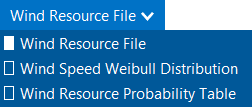
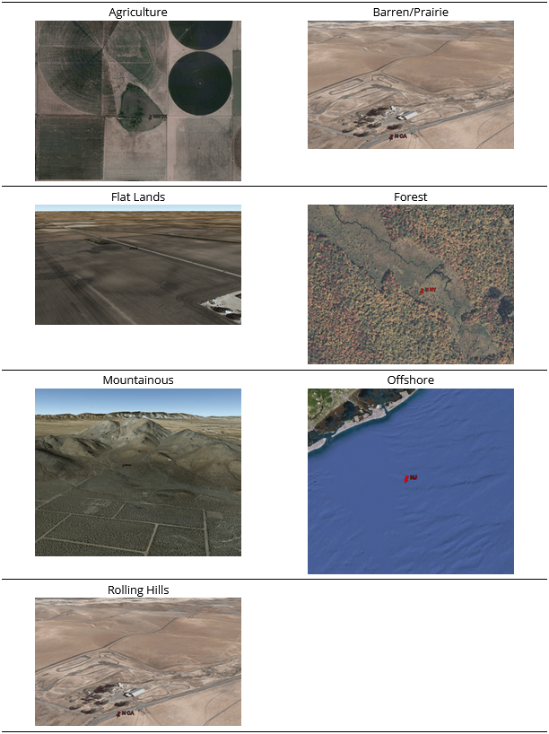
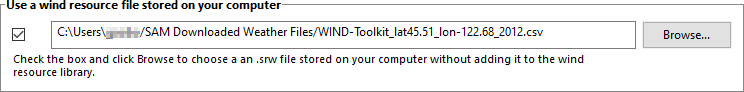
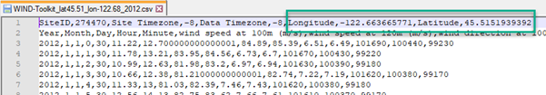
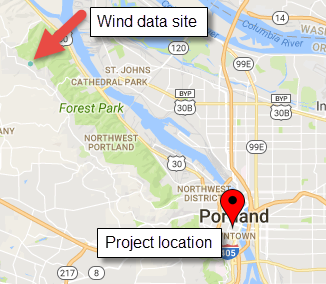

Wind Resource
=============

Use the Wind Resource page to define the wind resource at the project site for a :doc:`wind power project <wind_power>`. There are several options for defining the wind resource:

* Wind resource file: Use a :doc:`properly formatted wind resource file <../weather-file-formats/weather_format_csv_wind>` containing hourly or subhourly data for one year, including wind speed, direction, atmospheric pressure and ambient temperature data at one or more measurement heights.

  * :ref:`Choose a representative wind resource <filerepresentative>` file to use a file in SAM's wind resource library.

  * :ref:`Download a wind resource file <filedownload>` from the NREL WIND Toolkit.

  * :ref:`Use a wind resource file stored on your computer <fileoncomputer>`.

* :ref:`Wind speed Weibull distribution <weibulldistribution>`: Specify the average annual wind speed, measurement height, and Weibull K factor to model the wind resource as a constant value over the year.

* :ref:`Wind resource probability table <probabilitytable>`: Populate a table of probabilities for a range of wind speed and direction values to model the wind resource as a constant value over the year.

.. note:: The Weibull distribution and probability table options are suitable for estimating the total annual output of a turbine or wind farm for cash flow calculations. They are not suitable when you need estimates of output on an hourly or subhourly basis for projects with time-of-use retail electricity rates or time-varying power pricing.

For a description of how SAM determines wind speed at hub height, see :ref:`Hub Height and Wind Shear <shear>`. For a description of how SAM uses temperature and pressure data from the weather file, see :ref:`Elevation above Sea Level <elevation>`.

Choose a representative typical wind resource file
--------------------------------------------------

.. _filerepresentative:

SAM comes with a set of representative typical wind resource files that are appropriate for very preliminary studies to explore the feasibility of potential projects, or for policy studies. The files were developed in 2012 for NREL by `AWS Truepower <http://www.awstruepower.com/>`__. Each file contains simulated hourly resource data and includes wind speed, wind direction, ambient temperature, and atmospheric pressure data at 50, 80, and 110 meters above the ground.

Choose a representative typical wind resource file:

#. In the list of files, choose the name of the file. You can type a few letters of a location name to filter the list.

The file may be one of the typical wind data files included with SAM, a wind data file you downloaded, or a file that you created with your own data.

.. note:: To view the wind resource data in SAM's time series data viewer, run a simulation, and click the **Time Series** tab on Results page. 

SAM displays information that describes the location represented by the data from the file for your information. This information is stored in the file header. SAM does not use any of this information or data in the simulation.

**Description**
  A text description of where the data in the file came from.

**Latitude / Longitude**
  If you use the Download Weather File feature to download a file, this is the latitude and longitude in decimal degrees of the location represented by the data. (It may differ from the latitude of the location you requested.)

  If the wind data file does not have a value for the latitude and longitude, SAM displays "N/A."

**Elevation above sea level**
  The location's height above sea level. 

  SAM does not use this value in calculations. It uses the temperature and atmospheric pressure data from the file to calculate the air density.

**City / State / Country**
  The city, state, and country names stored in the file.

**Refresh Library**
  Refreshes the list of files in the location list. SAM automatically refreshes the list each time you visit the Wind Resource page. If you add a file to one of the folders in the search list, you may need to refresh the list for the file to be visible in the location list.

The files are for 39 representative locations, and use the following naming convention: *[State] [Region]-[Terrain Description].srw* to help you choose an appropriate file. For example, the file *AZ Eastern-Rolling Hills.srw* contains data appropriate for a location in eastern Arizona with rolling hills.

* *State* indicates where the data in the file was measured.

* *Region* is the part of the state where the data was measured.

* *Terrain Description* describes the type of terrain at the measurement site. See the table below for Google Earth images of the different terrain types.

Each file contains typical month data for a single year selected from the 14 years between 1997 and 2010. See :doc:`Typical Year and Single Year Weather Data <../weather-data/weather_typical_single>` for a brief description of typical year data.

When you use one of these files, you should examine the data with SAM's :doc:`Weather Data Viewer <../reference/time_series_viewer>` to make sure it is appropriate for your analysis. You may want to compare the data in the file to data from nearby meteorological stations or other data. Some things to look for are:

* The annual average wind speed is close to what you expect.

* The prevailing wind direction is similar to what you would expect at the site you are investigating. (This only matters if you are modeling a wind farm with more than one turbine.)

* The annual diurnal wind speed pattern is similar to what you would expect at the site.

Using data with similar terrain type as the site under investigation may help ensure that the wind shear profile (variation of the wind with height above the ground) of the data is reasonable for the site.

If you want to use one of the representative typical wind data files for a location that is not among the 39 representative locations, you can try to find a file with characteristics similar to those of your site.

You can use the images below to help choose a typical file with terrain characteristics similar to your site.

Download a file from the online NREL WIND Toolkit
~~~~~~~~~~~~~~~~~~~~~~~~~~~~~~~~~~~~~~~~~~~~~~~~~
.. _filedownload:

NREL's Wind Integration National Dataset (WIND) Toolkit provides wind speed and direction, ambient temperature, and atmospheric pressure at 100 m above the ground data for 126,692 sites in the continental United States and parts of Central America and the Caribbean. Of those sites, 112,471 are on land, and 14,221 are offshore in coastal areas. The WIND Toolkit provides historical :ref:`single-year <singleyear>` data for the time period between 2007 and 2014 for measurement heights between 10 and 200 meters above the ground.

.. note:: Wind resource data for locations outside of the U.S. are available from `RE Data Explorer <https://www.re-explorer.org/>`__ and from the `WIND Toolkit API <https://developer.nrel.gov/docs/wind/wind-toolkit/>`__. Files from these resources are in a file format that is compatible with SAM, except for some WIND Toolkit API endpoints that use a different format. Please `let us know <mailto:sam.support@nrel.gov>`__ if you need help using files from one of these resources.

For a description of the WIND Toolkit and links to publications:

* `Wind Integration National Dataset Toolkit website <https://www.nrel.gov/grid/wind-toolkit.html>`__

The WIND Toolkit data downloads on the NREL Developer Network:

* `WIND Toolkit API <https://developer.nrel.gov/docs/wind/wind-toolkit/>`__

Each wind data site is represented in the WIND Toolkit as a 2 km by 2 km grid cell. When you use SAM to request wind data for a project location, SAM sends the location's latitude and longitude to the `WIND Toolkit Data API <https://developer.nrel.gov/docs/wind/wind-toolkit/wtk-download/>`__. The toolkit finds the wind data grid cell nearest the project location and returns a weather file that SAM stores on your computer. SAM names the file using the latitude and longitude of the project location you provided. You can find the latitude and longitude of the wind data grid cell in the header of the weather file. When you use a street address in SAM to describe the project location, SAM translates the street address to a latitude and longitude using the Google Maps Geolocation API.

To download a weather file from the NREL WIND Toolkit:

#. Click **Download**.

#. Choose the **Street address or zip code** or **Location coordinates (deg)** option and type a latitude and longitude, street address, or zip code for the wind turbine or wind farm location.

#. Choose a time step in minutes. Available time steps are 5,  15, 30, and 60 minutes. Files with a smaller time steps will be larger.

#. Choose a year.

#. Choose one or more measurement heights above the ground. Downloads with multiple measurement heights and/or shorter time steps may take a long time to download. To minimize download times, choose measurement heights near the turbine hub height you plan to model.

#. Click **OK**.

SAM displays a message when the download is complete, and checks the box under **Use a wind resource file stored on your computer** and shows the path of the downloaded file.

SAM downloads a file in the :doc:`SAM CSV format for wind data <../weather-file-formats/weather_format_srw_wind>` from the WIND Toolkit for the site nearest the location you request, and stores in the folder indicated on the Wind Resource page under **Use a wind resource file stored on your computer**.

The latitude and longitude in the file name was translated from the street address above using the Google Maps Geolocation API. SAM includes the coordinates for the location you requested in the file name:

You can see the latitude and longitude of the WIND Toolkit data site by opening the weather file in a text editor or spreadsheet program:

The requested latitude and longitude in the file name is different from the latitude and longitude in the file itself because the nearest data location is at a distance from the requested location:

.. _fileoncomputer:

Use a file stored on your computer
~~~~~~~~~~~~~~~~~~~~~~~~~~~~~~~~~~

You can use a :doc:`properly formatted weather file <../weather-file-formats/weather_format_csv_wind>` stored on your computer without adding it to the library.

To use a weather file on disk:

#. Check the box under **Use a specific weather file on disk**.

#. Click **Browse** to navigate to the file

Wind Speed
~~~~~~~~~~

.. _weibulldistribution:

Weibull Distribution
---------------------

Define the wind resource using an annual wind speed and Weibull K factor. Use this option for wind turbine design studies when you want to examine the performance of a wind turbine under different wind resource regimes.

.. note:: When you choose the **Wind Resource Characteristics** option, you can only model a project with a single wind turbine. SAM disables the inputs on the :doc:`Wind Farm <wind_farm>` page because there is no data describing wind direction that SAM requires to model systems with more than one turbine.

**Average Annual Wind Speed (@ 50 meters)**
  The average annual wind speed at the turbine location at 50 meters above the ground.

**Weibull K Factor**
  The wind resource's Weibull K factor, describing the annual distribution of wind speeds at the turbine site.

**Elevation Above Mean Sea Level**
  The height of the ground at the turbine site above mean sea level. This variable is active only when you choose the **Define turbine characteristics below** option on the :doc:`Turbine <wind_turbine>`   page.

SAM displays a graph of probability distribution functions for of the wind resource that you specify. The graph shows the Weibull and Rayleigh probability distribution of the wind speed data, and the Weibull Betz probability distribution of energy over a range of wind speeds.

After running a simulation, you can display :doc:`tables <../results/data>` of the 160 data bins on the Results page for the annual electricity to grid, hub efficiency, and turbine power curve values.

.. _probabilitytable:

Wind Resource Probability Table
~~~~~~~~~~~~~~~~~~~~~~~~~~~~~~~

Use a table of annual average wind speed and direction probabilities to represent the wind resource as constant values. SAM determines an average annual wind speed and direction from the table and models the wind turbine output as a constant output.

The table must meet the following requirements:

* Contain at least one row of valid wind speed and direction values.

* Sum of probabilities must be 1.

To specify the wind resource using the Wind Resource Probability table by hand:

#. For **Rows**, type the number of rows in the table.

#. For each row, type a wind speed in m/s and a wind direction in degrees.

To paste table data:

#. Create a table of tab-delimited wind speed and direction data in a text file or spreadsheet program.

#. Select and copy the table. Do not include column headings in the selection.

#. In SAM, click **Paste**.

To import table data from a file:

#. Create a table of comma-delimited wind speed and direction data in a text file or spreadsheet program. Do not include column headings in the file.

#. In SAM, click **Import** to load the data from the file into the table.