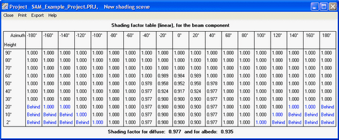
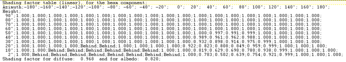

Edit Shading Data
=================

The Edit Shading Data window is where you define beam and sky diffuse shading losses. To open the window, click **Edit Shading** from either the Detailed Photovoltaic Model's :doc:`../detailed-photovoltaic-model/pv_soiling_shading_snow` page, or from the PVWatts model :doc:`System Design <../pvwatts/pvwatts_system_design>` page.

.. note:: For more information about the Detailed PV model's shading options, see :doc:`../detailed-photovoltaic-model/pv_soiling_shading_snow`.

Each shading loss is a percentage that represents the portion of the solar radiation component (either beam or diffuse) that is prevented from reaching the array by a nearby shading object:

* SAM reduces the plane-of-array beam irradiance (direct normal irradiance) in each hour by the beam shading loss for that hour. Beam irradiance is solar energy that reaches the array in a straight line from the sun.

For example, for a beam shading loss of 10% for the 8 a.m. hour of December 20, SAM would reduce the beam radiation value in the weather file by 10% for that hour, and use that reduced value to calculate the total incident radiation on the array for that hour.

* If you use the :ref:`time series beam shading loss table <timeseriesbeamshading>`, you can enable the partial shading model that will estimate the reduction in the subarray's DC output due to partial shading of the subarray. You should use this option only for subarrays with crystalline Silicon modules, and with up to 8 strings of modules.

* SAM reduces the incident sky diffuse irradiance for each hour by the sky diffuse shading loss. Sky diffuse radiation is radiation that reaches the array from the sun indirectly after being reflected by clouds and particles in the atmosphere. Sky diffuse radiation does not include diffuse radiation reflected from the ground. Note that you can only specify a single constant value that applies to all hours of the year for the sky diffuse shading loss.

.. _importshadingdata:

Import Shading Files
~~~~~~~~~~~~~~~~~~~~
SAM allows you to import shading data from the following software:

* PVsyst, photovoltaic system design software, https://www.pvsyst.com

* Solmetric SunEye, shading analysis device, https://www.solmetric.com

* Solar Pathfinder, shading analysis device, https://www.solarpathfinder.com

Importing Data from PVsyst
~~~~~~~~~~~~~~~~~~~~~~~~~~

You can import a "Near Shadings" table generated by PVsyst into SAM. SAM automatically imports data from the text file generated by PVsyst into the Solar Azimuth by Altitude Shading loss table and the diffuse shading loss value.

.. note:: We have tested the following procedure with Version 5 of PVsyst.

The "Near Shadings" table in PVsyst looks like this:

The "Near Shadings" data exported to a text file looks like this (in this example with semicolon delimiters):

To import a "Near Shadings" table from PVsyst:

#. In PVsyst, follow the procedure to create and export a "Near Shadings" table. The table in PVsyst should look similar to the one below. SAM will recognize any of the delimiter options: tab, comma, or semicolon.

#. In SAM, click **Edit shading** (on the :doc:`../detailed-photovoltaic-model/pv_soiling_shading_snow` page or :doc:`PVWatts System Design <../pvwatts/pvwatts_system_design>` page) to open the Edit Shading Data window, and click the **PVsyst near shading** and navigate to the folder containing the shading file.

When SAM imports data from the file, it displays the message "Azimuth-Altitude Table and Diffuse loss update" and populates the azimuth-altitude shading table, the sky diffuse shading loss, and enables both options.

#. Disable any shading options that do not apply to your analysis.

Importing from Solmetric SunEye
~~~~~~~~~~~~~~~~~~~~~~~~~~~~~~~

The Solmetric SunEye software generates shading data in two formats: The obstruction table, which characterizes shading using an altitude-azimuth angle table to indicate solar positions that are blocked by nearby obstructions, and the hourly shading file, which lists hourly beam radiation shading factors. SAM can read data from both tables.

Use the obstruction table if you plan to model the system for different locations (assuming the same shading obstructions). Use the hourly shading loss table if you plan to model the system for a single location.

.. note:: If you use the hourly shading loss table, be sure that the weather data specified on the Location and Resource page is for the same location as the one where the SunEye measurements were made.

To import a SunEye obstruction table:

#. In the Solmetric SunEye software (not the PV Designer software), on the **File** menu, click **Export Session Report and Data**.

The SunEye software creates a set of files, and assigns a default name like *Sky01ObstructionElevations.csv* to the obstruction data file. By default, the files are in a folder named *ExportedFiles* in the exported report folder.

#. In SAM, click **Edit shading** (on the Detailed Photovoltaic model's :doc:`../detailed-photovoltaic-model/pv_soiling_shading_snow` page or the PVWatts :doc:`System Design <../pvwatts/pvwatts_system_design>` page) to open the Edit Shading Data window, and click **Suneye obstructions table**, and navigate to the folder containing the file you want to import.

#. Open the obstruction data file for any of the available skies (Sky01ObstructionElevations, Sky02ObstructionElevations, etc.). 

If the average or worst case obstruction data from multiple skylines will be used, then an extra step is required. In a spreadsheet program, open the ObstructionElevation file containing the average and maximum values as well as all skylines in the SunEye session. Make sure that the desired data (average or maximum) is in the third column, delete the other columns, and save the file as .csv with a name like ObstructionElevationsAVG.csv. Use this file as the obstruction data file in SAM.

SAM displays the message "Azimuth-Altitude Table updated," populates the azimuth-altitude shading loss table, and enables the **Enable solar azimuth by altitude beam irradiance shading loss** option.

#. Be sure to enable and disable the other shading options as appropriate.

To import a SunEye hourly shading file:

#. In the Solmetric SunEye software (not the PV Designer software), on the **File** menu, click **Export Session Report and Data**.

The SunEye software creates a set of files, and assigns a default name like *Sky01Shading.csv* to the hourly shading file. By default, the files are in a folder named *ExportedFiles* in the exported report folder.

#. In SAM, click **Edit shading** (on the Detailed Photovoltaic model :doc:`../detailed-photovoltaic-model/pv_soiling_shading_snow` page or PVWatts :doc:`System Design <../pvwatts/pvwatts_system_design>` page) to open the Edit Shading Data window, and click **Suneye hourly shading**, and navigate to the folder containing the shading file.

#. Open the shading file for any of the available skies (Sky01Shading, Sky02Shading, etc.). To use average shading for multiple skylines, open AverageShading.csv.

SAM displays the message "Hourly Shading Factors for Beam Radiation updated," populates the hourly shading loss table, and enables the **Enable Hourly Beam Shading Factors** option.

#. To see the hourly data, click **Edit Data** under **Hourly Shading Factors for Beam Radiation**.

#. Be sure to enable and disable the other shading options as appropriate.

#. On the Location and Resource page, choose a weather file for the same location represented by the SunEye shading data.

Importing from SolarPathfinder Assistant
~~~~~~~~~~~~~~~~~~~~~~~~~~~~~~~~~~~~~~~~

The SolarPathfinder Assistant software generates shading data in two formats: The obstruction table, which characterizes shading using an altitude-azimuth angle table to indicate solar positions that are blocked by nearby obstructions, and the hourly shading file, which lists hourly beam radiation shading factors. SAM can read data from both tables.

Use the obstruction table if you plan to model the system for different locations (assuming the same shading obstructions). Use the hourly shading loss table if you plan to model the system for a single location.

.. note:: If you use the month-by-hour shading loss table, be sure that the weather data specified on the Location and Resource page is for the same location as the one where the Solar Pathfinder measurements were made.

To import a Solar Pathfinder obstruction table:

#. In SolarPathfinder Assistant, on the File menu, click **Export**, **Horizon Angles**.

#. In the Save window, specify the location and name of the data file.

#. In SAM, click **Edit shading** (on the Detailed Photovoltaic model :doc:`../detailed-photovoltaic-model/pv_soiling_shading_snow` page or PVWatts :doc:`System Design <../pvwatts/pvwatts_system_design>` page) to open the Edit Shading Data window, and click **Solar Pathfinder obstructions**, and navigate to the folder containing the file you want to import.

#. Open the obstruction data file you saved in Step 2. 

SAM displays the message "Azimuth-Altitude Table updated," populates the azimuth-altitude shading loss table, and enables the Enable Azimuth-Altitude Shading Factors for Beam Radiation option.

#. Be sure to enable and disable the other shading options as appropriate.

**To import a Solar Pathfinder Month by Hour shading file:**

#. In SolarPathfinder Assistant, on the File menu, click **Export**, **Shading Data**.

#. In the Save window, specify the location and name of the data file.

#. In SAM, click **Edit shading** (on the Detailed Photovoltaic model :doc:`../detailed-photovoltaic-model/pv_soiling_shading_snow` page or PVWatts :doc:`System Design <../pvwatts/pvwatts_system_design>` page) to open the Edit Shading Data window, and click **Solar Pathfinder month by hour shading**, and navigate to the folder containing the shading file.

#. Open the shading file you saved in Step 2.

SAM displays the message "Hourly Shading Factors for Beam Radiation updated," populates the hourly shading loss table, and enables the Enable Hourly Beam Irradiance Shading Losses option.

#. To see the hourly data, click **Edit Data** under **Enable hourly beam irradiance shading losses**.

#. Be sure to enable and disable the other shading options as appropriate.

#. On the Location and Resource page, choose a weather file for the same location represented by the Solar Pathfinder shading data.

.. _beamshadelosstables:

Beam Irradiance Shade Loss Tables
~~~~~~~~~~~~~~~~~~~~~~~~~~~~~~~~~
SAM provides the three options described below to specify beam irradiance shading loss: Time series, month by hour, and solar azimuth by solar altitude.

Typically, you would enable only one of the three options. However, if you enable more than one option, SAM combines the losses you enabled for each hour to calculate a total shading loss.

.. note:: If you plan to import time series, month-by-hour, or azimuth-by-altitude shading data from text files, you can see the correct file format by exporting existing data (even if it is all zeros). You can use the exported file as an example for your data.

.. _timeseriesbeamshading:

Time Series Beam Irradiance Shade Loss Table
~~~~~~~~~~~~~~~~~~~~~~~~~~~~~~~~~~~~~~~~~~~~

The time series option allows you define a beam shading loss for each simulation time step. The data's time convention should follow that of the weather file. For the standard TMY files, Hour 1 is the hour ending at 1 a.m. on Monday, January 1.

For the Detailed Photovoltaic performance model, for subarrays with crystalline Silicon modules and up to eight strings of modules, SAM provides an option to model partial shading of the subarray. For more information about the partial shading model, see MacAlpine, S.; Deline, C. (2015) Simplified Method for Modeling the Impact of Arbitrary Partial Shading Conditions on PV Array Performance. National Renewable Energy Laboratory. 8 pp.; NREL/CP-5J00-64570. (`PDF 699 KB <https://docs.nrel.gov/docs/fy15osti/64570.pdf>`__)

You can use SAM's :doc:`3D shade calculator <../shade-calculator-reference/sc-overview>` to generate loss values for the time series beam irradiance shade loss table.

To specify time series beam shading factors:

#. Check **Enable beam irradiance shading losses by time step**.

#. For **Time step in minutes**, enter the time step of the weather file. For hourly data, choose 60 minutes.

#. If you are modeling a system with crystalline silicon modules, check **Enable partial shading model (c-Si modules only)** to estimate the impact of partial shading on the subarray's DC output.

If you have separate shading data for each string in the subarray, for **Strings in Subarray [n]** enter the number of strings in parallel from the :doc:`System Size<../detailed-photovoltaic-model/pv_system_size>` page. If the subarray has more than eight strings, or you do not have shading data for individual strings, enter a one to model losses for a single string.

For thin-film modules, or to model the effect of partial shading as a linear relationship between the beam shading loss (size of shadow on subarray) and the subarray's DC output, do not enable the partial shading model.

Once you define a table of hourly shading losses, you can clear the **Enable hourly beam irradiance shading losses** check box to run a simulation with no losses without losing the shading losses data.

Month by Hour Beam Irradiance Shade Loss Table
~~~~~~~~~~~~~~~~~~~~~~~~~~~~~~~~~~~~~~~~~~~~~~

.. note:: You can use the :doc:`3D shade calculator <../shade-calculator-reference/sc-overview>` to :doc:`automatically generate month-by-hour shade factors <../shade-calculator-howto/sc-generate-data>` from a three-dimensional drawing of the array and nearby objects.

To specify month by hour shading factors:

#. Check **Enable month by hour beam irradiance shading factors**.

#. Type shading data into the table, or import it from a text file.

To the month-by-hour shading loss matrix is a 24-by-12 table containing a set of 24 hourly shading losses for each month of the year. The shading loss in a cell applies to a given hour for an entire month.

* The data's time convention should follow that of the weather file. For the standard TMY files, the value in the first row and column is for the hour ending at 1 a.m. for all days in January.

* A red cell indicates a value of 100%, or full shading (beam radiation completely blocked).

* A white cell indicates a value of zero, or no shading.

* A dark shade of red indicates more shading (less beam irradiance) than a light shade of red.

To define a shading loss for a single cell:

* Click the cell and type the shading loss percentage.

* To replace the value in a cell, click the cell and type a replacement value.

* To delete the value from a cell, double-click the cell and press the Delete key.

To define a single shading loss for multiple cells:

* Use your mouse to select the cells to which you want to apply the shading loss percentage.

* Type a value between zero and one.

* Press the Enter key or click **Apply to selected cells**.

To import or export month-by-hour beam shading factors:

SAM allows you to import and export the shading loss matrix as a comma-delimited text file that contains 12 rows of 24 hourly shading factors separated by commas. The file should not have row or column headings.

To see an example of the correct file format, export the default shading table to a text file and open it with a text editor.

* To export the shading matrix as a text file, click **Export**. SAM saves the file with the *.csv* extension.

* To import a data from a comma-delimited text file, click **Import**. You can open a correctly formatted text file with any extension, although SAM expects a *.csv* file by default.

Solar Azimuth by Altitude Beam Irradiance Shade Loss Table
~~~~~~~~~~~~~~~~~~~~~~~~~~~~~~~~~~~~~~~~~~~~~~~~~~~~~~~~~~

The solar azimuth-by-altitude table is a two-dimensional look-up table of beam irradiance shading losses. For each hour in the simulation, SAM calculates the position of the sun as a pair of solar azimuth and altitude angles and looks up the shading loss to use for that hour based on the solar position. SAM uses linear interpolation to estimate the value of the shading loss for solar angles that fall between values in the table row and column headings.

* Azimuth angle values use the following convention: 0 = north, 90 = east, 180 = south, 270 = west.

To define the azimuth-altitude shading loss table by hand:

#. Click **Enable solar azimuth by altitude beam irradiance shading loss table**.

#. In **Rows** and **Cols**, type the number of rows (solar altitude angle values) and number of columns (solar azimuth angle values) in the table.

Specify a number of rows that is one greater than the number of altitude values: For example for a table with nine rows of altitude values, specify a **Rows** value of 10. Similarly, specify a **Cols** value that is one greater than the number of azimuth values.

#. In the top row (highlighted in blue), type a set of solar azimuth angle values in degrees between zero and 360 and increasing monotonically from left to right.

#. In the leftmost column (highlighted in blue), type a set of solar altitude values in degrees between zero and 90 and increasing monotonically from top to bottom.

#. Type a beam shading loss percentage (between zero and 100%) in each cell of the table. A value of 100% indicates that beam irradiance is fully blocked by a shading object. A value of zero indicates that beam irradiance is not blocked.

To import or export azimuth-by-altitude beam shading factors:

SAM allows you to import and export the azimuth-altitude lookup table as a comma-delimited text file that contains shading percentages separated by commas. The file should also include the row and column headings indicating the solar azimuth and altitude values.

To see an example of the correct file format, export the default shading table to a text file and open it with a text editor.

* To export the shading table as a text file, click **Export.** You can save the file with any file extension, including *.txt* or *.csv*.

* To import data from a comma-delimited text file, click **Import**.

.. _skydiffuse:

Sky Diffuse Shade Loss
~~~~~~~~~~~~~~~~~~~~~~
SAM provides a single input for a constant sky diffuse loss that it applies to every hour in the year. It represents portion of the sky that is obstructed. A value of zero is for no shading loss, a value of 100% completely blocks sky diffuse irradiance from the array.

To define a sky diffuse shading loss:

#. Click **Enable sky diffuse shading loss (constant)**.

#. Type a value for the shading loss as a percentage.