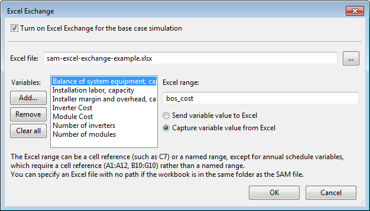

Excel Exchange
~~~~~~~~~~~~~~

The Excel Exchange window allows you to exchange data between SAM input variables and cells in an Excel spreadsheet. For instructions see :doc:`../reference/excel_exchange`.

**Turn on Excel Exchange for the base case simulation**
  Check the box to turn on the data exchange. 

  You can clear the box to keep the Excel Exchange configuration without exchanging data when you run a simulation.

**Excel file**
  The name of the Excel workbook for the data exchange.

  If you plan to keep the Excel file in the same folder as the SAM file (.sam  ), you do not need to include a path in the file name. Use this option if you plan to share the file with someone else, or copy the files to different computers.

 **Browse**
  .. image:: ../images/SS_Button-Ellipses.png
     :align: center
     :alt: SS_Button-Ellipses.png

  Browse your computer's folders to find the Excel workbook with which you want to exchange data. The workbook can be located in any folder on your computer.

**Add**
  Add one or more input variable from the input pages. You can configure each variable to either send a value to an Excel range, or "capture" a value from an Excel range.

**Remove**
  Delete the highlighted variable from the list.

**Clear All**
  Delete all variables from the list.

**Excel Range**
  The range name or cell reference identifying the cell or range of cells in the Excel workbook with which the highlighted variable will exchange data.

**Send Variable Value to Excel Range**
  Configure the highlighted variable to send its value to the specified range in the Excel workbook.

**Capture Variable Value From Excel Range**
  Configure the highlighted variable to capture its value from the specified Excel range.

